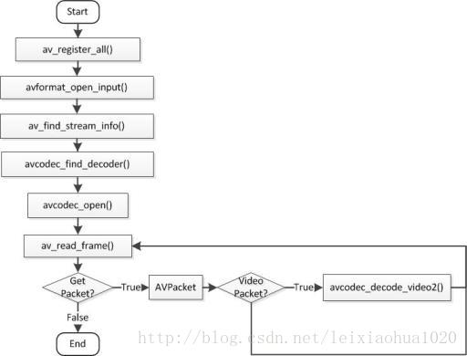
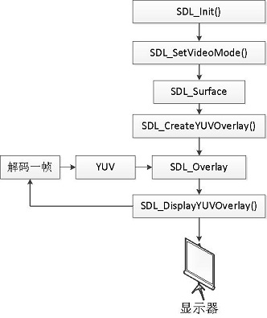
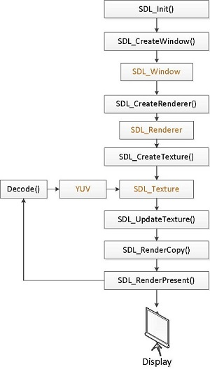
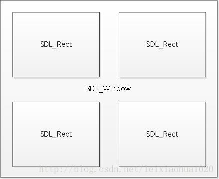
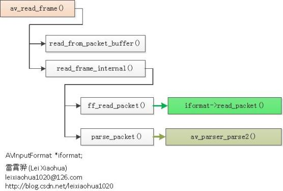

> [GitHub](<https://github.com/HatsuneMikuV/FFmpeg_Leixiaohua>)
>
> [FFmpeg](<https://blog.csdn.net/leixiaohua1020/column/info/ffmpeg-devel/7>)
>
> [ffmpeg 源代码简单分析](<https://blog.csdn.net/leixiaohua1020/article/details/12677129>)

# 1. 100行代码实现最简单的基于FFMPEG+SDL的视频播放器

> [simplest_ffmpeg_player](<https://github.com/leixiaohua1020/simplest_ffmpeg_player>)

该播放器虽然简单，但是几乎包含了使用FFMPEG播放一个视频所有必备的API，并且使用SDL显示解码出来的视频。

<!-- more -->

并且支持流媒体等多种视频输入，处于简单考虑，没有音频部分，同时视频播放采用直接延时40ms的方式







对比SDL1.2的流程图，发现变化还是很大的。几乎所有的API都发生了变化。但是函数和变量有一定的对应关系：

SDL_SetVideoMode()————SDL_CreateWindow()

SDL_Surface————SDL_Window

SDL_CreateYUVOverlay()————SDL_CreateTexture()

SDL_Overlay————SDL_Texture

简单解释各个变量的作用：

- SDL_Window就是使用SDL的时候弹出的那个窗口。在SDL1.x版本中，只可以创建一个一个窗口。在SDL2.0版本中，可以创建多个窗口。
- SDL_Texture用于显示YUV数据。一个SDL_Texture对应一帧YUV数据。
- SDL_Renderer用于渲染SDL_Texture至SDL_Window。
- SDL_Rect用于确定SDL_Texture显示的位置。注意：一个SDL_Texture可以指定多个不同的
- SDL_Rect，这样就可以在SDL_Window不同位置显示相同的内容（使用SDL_RenderCopy()函数）。

它们的关系如下图所示：


下图举了个例子，指定了4个SDL_Rect，可以实现4分屏的显示。



## 1.1 simplest_ffmpeg_player（标准版）代码

<details><summary>最基础的版本，学习的开始。</summary>

```c

/**
 * 最简单的基于FFmpeg的视频播放器 2
 * Simplest FFmpeg Player 2
 *
 * 本程序实现了视频文件的解码和显示(支持HEVC，H.264，MPEG2等)。
 * 是最简单的FFmpeg视频解码方面的教程。
 * 通过学习本例子可以了解FFmpeg的解码流程。
 * This software is a simplest video player based on FFmpeg.
 * Suitable for beginner of FFmpeg.
 *
 */

#include <stdio.h>
 
#define __STDC_CONSTANT_MACROS
 
#ifdef _WIN32
//Windows
extern "C"
{
#include "libavcodec/avcodec.h"
#include "libavformat/avformat.h"
#include "libswscale/swscale.h"
#include "libavutil/imgutils.h"
#include "SDL2/SDL.h"
};
#else
//Linux...
#ifdef __cplusplus
extern "C"
{
#endif
    
#include <libavcodec/avcodec.h>
#include <libavformat/avformat.h>
#include <libswscale/swscale.h>
#include <SDL2/SDL.h>
#include <libavutil/imgutils.h>

#ifdef __cplusplus
};
#endif
#endif
 
//Output YUV420P data as a file 
#define OUTPUT_YUV420P 0
 
int main(int argc, char* argv[])
{
	AVFormatContext	*pFormatCtx; 		// 音视频格式化上下文
	int				i, videoindex;
	AVCodecContext	*pCodecCtx;			// 音视频编解码器上下文
	AVCodec			*pCodec;			// 音视频编解码器
	AVFrame			*pFrame, *pFrameYUV;	// 音视频数据帧
	unsigned char 	*out_buffer;
	AVPacket 		*packet;			// 音视频数据包
	int 			y_size;
	int 			ret, got_picture;
	struct SwsContext *img_convert_ctx; // 视频图像转换上下文
 
	char filepath[]="bigbuckbunny_480x272.h265";
	//SDL---------------------------
	int screen_w=0, screen_h=0;
	SDL_Window 		*screen; 
	SDL_Renderer	*sdlRenderer; 		// SDL渲染器
	SDL_Texture		*sdlTexture;		// SDL纹理
	SDL_Rect 		sdlRect;			// 确定SDL_Texture显示的位置
 
	FILE *fp_yuv;
 
	av_register_all();					// 注册所有的编解码器
	avformat_network_init();
	pFormatCtx = avformat_alloc_context();
 
	if(avformat_open_input(&pFormatCtx, filepath, NULL, NULL) != 0){
		printf("Couldn't open input stream.\n");
		return -1;
	}
	if(avformat_find_stream_info(pFormatCtx,NULL) < 0){
		printf("Couldn't find stream information.\n");
		return -1;
	}
	videoindex = -1;
	for(i=0; i<pFormatCtx->nb_streams; i++) 
		if(pFormatCtx->streams[i]->codec->codec_type == AVMEDIA_TYPE_VIDEO){
			videoindex = i;
			break;
		}
	if(videoindex == -1){
		printf("Didn't find a video stream.\n");
		return -1;
	}
 
	pCodecCtx = pFormatCtx->streams[videoindex]->codec;
	pCodec = avcodec_find_decoder(pCodecCtx->codec_id);
	if(pCodec == NULL){
		printf("Codec not found.\n");
		return -1;
	}
	if(avcodec_open2(pCodecCtx, pCodec,NULL) < 0){
		printf("Could not open codec.\n");
		return -1;
	}
	
	pFrame = av_frame_alloc();
	pFrameYUV = av_frame_alloc();
	out_buffer = (unsigned char *)av_malloc(av_image_get_buffer_size(AV_PIX_FMT_YUV420P,  pCodecCtx->width, pCodecCtx->height, 1));
	av_image_fill_arrays(pFrameYUV->data, pFrameYUV->linesize,out_buffer,
		AV_PIX_FMT_YUV420P, pCodecCtx->width, pCodecCtx->height, 1);
	
	packet = (AVPacket *)av_malloc(sizeof(AVPacket));
	//Output Info-----------------------------
	printf("--------------- File Information ----------------\n");
	av_dump_format(pFormatCtx, 0, filepath, 0);
	printf("-------------------------------------------------\n");
	img_convert_ctx = sws_getContext(pCodecCtx->width, pCodecCtx->height, pCodecCtx->pix_fmt, 
		pCodecCtx->width, pCodecCtx->height, AV_PIX_FMT_YUV420P, SWS_BICUBIC, NULL, NULL, NULL); 
 
#if OUTPUT_YUV420P 
    fp_yuv=fopen("output.yuv", "wb+");  
#endif  
	
	if(SDL_Init(SDL_INIT_VIDEO | SDL_INIT_AUDIO | SDL_INIT_TIMER)) {  
		printf( "Could not initialize SDL - %s\n", SDL_GetError()); 
		return -1;
	} 
 
	screen_w = pCodecCtx->width;
	screen_h = pCodecCtx->height;
	//SDL 2.0 Support for multiple windows
	screen = SDL_CreateWindow("Simplest ffmpeg player's Window", SDL_WINDOWPOS_UNDEFINED, SDL_WINDOWPOS_UNDEFINED,
		screen_w, screen_h,
		SDL_WINDOW_OPENGL);
 
	if(!screen) {  
		printf("SDL: could not create window - exiting:%s\n",SDL_GetError()); 
		return -1;
	}
 
	sdlRenderer = SDL_CreateRenderer(screen, -1, 0);  
	//IYUV: Y + U + V  (3 planes)
	//YV12: Y + V + U  (3 planes)
	sdlTexture = SDL_CreateTexture(sdlRenderer, SDL_PIXELFORMAT_IYUV, SDL_TEXTUREACCESS_STREAMING, pCodecCtx->width, pCodecCtx->height);  
 
	sdlRect.x = 0;
	sdlRect.y = 0;
	sdlRect.w = screen_w;
	sdlRect.h = screen_h;
 
	//SDL End----------------------
	while(av_read_frame(pFormatCtx, packet)>=0){
		if(packet->stream_index == videoindex){
			ret = avcodec_decode_video2(pCodecCtx, pFrame, &got_picture, packet);
			if(ret < 0){
				printf("Decode Error.\n");
				return -1;
			}
			if(got_picture){
				sws_scale(img_convert_ctx, (const unsigned char* const*)pFrame->data, pFrame->linesize, 0, pCodecCtx->height, 
					pFrameYUV->data, pFrameYUV->linesize);
				
#if OUTPUT_YUV420P
				y_size = pCodecCtx->width*pCodecCtx->height;  
				fwrite(pFrameYUV->data[0], 1, y_size, fp_yuv);    //Y 
				fwrite(pFrameYUV->data[1], 1, y_size/4, fp_yuv);  //U
				fwrite(pFrameYUV->data[2], 1, y_size/4, fp_yuv);  //V
#endif
				//SDL---------------------------
#if 0
				SDL_UpdateTexture(sdlTexture, NULL, pFrameYUV->data[0], pFrameYUV->linesize[0]);  
#else
				SDL_UpdateYUVTexture(sdlTexture, &sdlRect,
				pFrameYUV->data[0], pFrameYUV->linesize[0],
				pFrameYUV->data[1], pFrameYUV->linesize[1],
				pFrameYUV->data[2], pFrameYUV->linesize[2]);
#endif	
				
				SDL_RenderClear(sdlRenderer);  
				SDL_RenderCopy(sdlRenderer, sdlTexture, NULL, &sdlRect);  
				SDL_RenderPresent(sdlRenderer);  
				//SDL End-----------------------
				//Delay 40ms
				SDL_Delay(40);
			}
		}
		av_free_packet(packet);
	}
	//flush decoder
	//FIX: Flush Frames remained in Codec
	while (1) {
		ret = avcodec_decode_video2(pCodecCtx, pFrame, &got_picture, packet);
		if (ret < 0)
			break;
		if (!got_picture)
			break;
		sws_scale(img_convert_ctx, (const unsigned char* const*)pFrame->data, pFrame->linesize, 0, pCodecCtx->height, 
			pFrameYUV->data, pFrameYUV->linesize);
#if OUTPUT_YUV420P
		int y_size = pCodecCtx->width*pCodecCtx->height;  
		fwrite(pFrameYUV->data[0], 1, y_size, fp_yuv);    //Y 
		fwrite(pFrameYUV->data[1], 1, y_size/4, fp_yuv);  //U
		fwrite(pFrameYUV->data[2], 1, y_size/4, fp_yuv);  //V
#endif
		//SDL---------------------------
		SDL_UpdateTexture(sdlTexture, &sdlRect, pFrameYUV->data[0], pFrameYUV->linesize[0]);  
		SDL_RenderClear(sdlRenderer);  
		SDL_RenderCopy(sdlRenderer, sdlTexture, NULL, &sdlRect);  
		SDL_RenderPresent(sdlRenderer);  
		//SDL End-----------------------
		//Delay 40ms
		SDL_Delay(40);
	}
 
	sws_freeContext(img_convert_ctx);
 
#if OUTPUT_YUV420P 
    fclose(fp_yuv);
#endif 
 
	SDL_Quit();
 
	av_frame_free(&pFrameYUV);
	av_frame_free(&pFrame);
	avcodec_close(pCodecCtx);
	avformat_close_input(&pFormatCtx);
 
	return 0;
}
```

</details>

## 1.2 simplest_ffmpeg_player_su（SU版）代码

标准版的基础之上引入了 SDL 的 Event。

效果如下：

- SDL弹出的窗口可以移动了
- 画面显示是严格的40ms一帧

<details><summary>代码：</summary>

```c

/**
 * 最简单的基于FFmpeg的视频播放器2(SDL升级版)
 * Simplest FFmpeg Player 2(SDL Update)
 *
 * 本程序实现了视频文件的解码和显示(支持HEVC，H.264，MPEG2等)。
 * 是最简单的FFmpeg视频解码方面的教程。
 * 通过学习本例子可以了解FFmpeg的解码流程。
 * 本版本中使用SDL消息机制刷新视频画面。
 * This software is a simplest video player based on FFmpeg.
 * Suitable for beginner of FFmpeg.
 *
 * 备注:
 * 标准版在播放视频的时候，画面显示使用延时40ms的方式。这么做有两个后果：
 * （1）SDL弹出的窗口无法移动，一直显示是忙碌状态
 * （2）画面显示并不是严格的40ms一帧，因为还没有考虑解码的时间。
 * SU（SDL Update）版在视频解码的过程中，不再使用延时40ms的方式，而是创建了
 * 一个线程，每隔40ms发送一个自定义的消息，告知主函数进行解码显示。这样做之后：
 * （1）SDL弹出的窗口可以移动了
 * （2）画面显示是严格的40ms一帧
 */
#include <stdio.h>
 
#define __STDC_CONSTANT_MACROS
 
#ifdef _WIN32
//Windows
extern "C"
{
#include "libavcodec/avcodec.h"
#include "libavformat/avformat.h"
#include "libswscale/swscale.h"
#include "libavutil/imgutils.h"
#include "SDL2/SDL.h"
};
#else
//Linux...
#ifdef __cplusplus
extern "C"
{
#endif 
#include <libavcodec/avcodec.h>
#include <libavformat/avformat.h>
#include <libswscale/swscale.h>
#include <libavutil/imgutils.h>
#include <SDL2/SDL.h>   
#ifdef __cplusplus
};
#endif
#endif
 
//Refresh Event
#define SFM_REFRESH_EVENT  (SDL_USEREVENT + 1)
#define SFM_BREAK_EVENT  (SDL_USEREVENT + 2)
 
int thread_exit = 0;
int thread_pause = 0;
 
int sfp_refresh_thread(void *opaque){
	thread_exit = 0;
	thread_pause = 0;
 
	while (!thread_exit) {
		if(!thread_pause){
			SDL_Event event;
			event.type = SFM_REFRESH_EVENT;
			SDL_PushEvent(&event);
		}
		SDL_Delay(40);
	}
	thread_exit = 0;
	thread_pause = 0;
	//Break
	SDL_Event event;
	event.type = SFM_BREAK_EVENT;
	SDL_PushEvent(&event);
 
	return 0;
}
 
int main(int argc, char* argv[])
{
	AVFormatContext	*pFormatCtx;
	int				i, videoindex;
	AVCodecContext	*pCodecCtx;			// 音视频编解码器上下文
	AVCodec			*pCodec;
	AVFrame			*pFrame, *pFrameYUV;
	unsigned char 	*out_buffer;
	AVPacket 		*packet;
	int 			ret, got_picture;
 
	//------------SDL----------------
	int screen_w, screen_h;
	SDL_Window 		*screen; 
	SDL_Renderer	*sdlRenderer;
	SDL_Texture		*sdlTexture;
	SDL_Rect 		sdlRect;
	SDL_Thread 		*video_tid;
	SDL_Event 		event;
 
	struct SwsContext *img_convert_ctx;
 
	//char filepath[]="bigbuckbunny_480x272.h265";
	char filepath[]="Titanic.ts";
 
	av_register_all();	// 注册所有的编解码器
	avformat_network_init();
	pFormatCtx = avformat_alloc_context(); 	// 分配内存并设置默认值
 
    // 该函数用于打开多媒体数据并且获得一些相关的信息,AVInputFormat的read_header()完成了视音频流对应的AVStream的创建
	if(avformat_open_input(&pFormatCtx, filepath, NULL, NULL) != 0){
		printf("Couldn't open input stream.\n");
		return -1;
	}
    // 该函数可以读取一部分视音频数据并且获得一些相关的信息,该函数主要用于给每个媒体流（音频/视频）的AVStream结构体赋值
	if(avformat_find_stream_info(pFormatCtx, NULL) < 0){
		printf("Couldn't find stream information.\n");
		return -1;
	}
	videoindex = -1;
	for(i=0; i<pFormatCtx->nb_streams; i++) 
		if(pFormatCtx->streams[i]->codec->codec_type == AVMEDIA_TYPE_VIDEO){
			videoindex = i;
			break;
		}
	if(videoindex == -1){
		printf("Didn't find a video stream.\n");
		return -1;
	}
	pCodecCtx = pFormatCtx->streams[videoindex]->codec; // 找到视频流编解码器
	pCodec = avcodec_find_decoder(pCodecCtx->codec_id); 
	if(pCodec == NULL){
		printf("Codec not found.\n");
		return -1;
	}
    // 该函数用于初始化一个视音频编解码器的AVCodecContext
    //（1）为各种结构体分配内存（通过各种av_malloc()实现）。
	//（2）将输入的AVDictionary形式的选项设置到AVCodecContext。
	//（3）其他一些零零碎碎的检查，比如说检查编解码器是否处于“实验”阶段。
	//（4）如果是编码器，检查输入参数是否符合编码器的要求
	//（5）调用AVCodec的init()初始化具体的解码器。
	if(avcodec_open2(pCodecCtx, pCodec,NULL) < 0){
		printf("Could not open codec.\n");
		return -1;
	}
	pFrame = av_frame_alloc();
	pFrameYUV = av_frame_alloc();
 
	out_buffer = (unsigned char *)av_malloc(av_image_get_buffer_size(AV_PIX_FMT_YUV420P, pCodecCtx->width, pCodecCtx->height, 1));
	av_image_fill_arrays(pFrameYUV->data, pFrameYUV->linesize,
                         out_buffer,AV_PIX_FMT_YUV420P, pCodecCtx->width, 
                         pCodecCtx->height, 1);
 
	//Output Info-----------------------------
	printf("---------------- File Information ---------------\n");
	av_dump_format(pFormatCtx, 0, filepath, 0);
	printf("-------------------------------------------------\n");
	
    // 初始化一个SwsContext
    // 参数说明：
    // 源图像的宽, 源图像的高, 源图像的像素格式, 
    // 目标图像的宽, 目标图像的高, 目标图像的像素格式, 设定图像拉伸使用的算法
	img_convert_ctx = sws_getContext(pCodecCtx->width, pCodecCtx->height, 
                                     pCodecCtx->pix_fmt, pCodecCtx->width, 
                                     pCodecCtx->height, AV_PIX_FMT_YUV420P, 
                                     SWS_BICUBIC, NULL, NULL, NULL); 
	
	if(SDL_Init(SDL_INIT_VIDEO | SDL_INIT_AUDIO | SDL_INIT_TIMER)) {  
		printf( "Could not initialize SDL - %s\n", SDL_GetError()); 
		return -1;
	} 
	//SDL 2.0 Support for multiple windows
	screen_w = pCodecCtx->width;
	screen_h = pCodecCtx->height;
	screen = SDL_CreateWindow("Simplest ffmpeg player's Window", 
                              SDL_WINDOWPOS_UNDEFINED,SDL_WINDOWPOS_UNDEFINED,
                              screen_w, screen_h, SDL_WINDOW_OPENGL);
 
	if(!screen) {  
		printf("SDL: could not create window - exiting:%s\n",SDL_GetError()); 
		return -1;
	}
	sdlRenderer = SDL_CreateRenderer(screen, -1, 0);  
	//IYUV: Y + U + V  (3 planes)
	//YV12: Y + V + U  (3 planes)
	sdlTexture = SDL_CreateTexture(sdlRenderer, SDL_PIXELFORMAT_IYUV, 
                                   SDL_TEXTUREACCESS_STREAMING, 
                                   pCodecCtx->width, pCodecCtx->height);  
 
	sdlRect.x = 0;
	sdlRect.y = 0;
	sdlRect.w = screen_w;
	sdlRect.h = screen_h;
 
	packet = (AVPacket *)av_malloc(sizeof(AVPacket));
 
	video_tid = SDL_CreateThread(sfp_refresh_thread, NULL, NULL);
	//------------SDL End------------
	//Event Loop	
	for (;;) {
		//Wait
		SDL_WaitEvent(&event);
		if(event.type == SFM_REFRESH_EVENT){
			while(1){
                // av_read_frame()的作用是读取码流中的音频若干帧或者视频一帧
                // 例如，解码视频的时候，每解码一个视频帧，需要先调用 av_read_frame()获得一帧视频的压缩数据，然后才能对该数据进行解码（例如H.264中一帧压缩数据通常对应一个NAL）
                // 参数说明：输入的AVFormatContext, 输出的AVPacket
				if(av_read_frame(pFormatCtx, packet)<0)
					thread_exit = 1;
 
				if(packet->stream_index == videoindex)
					break;
			}
            // 作用是解码一帧视频数据,输入一个压缩编码的结构体AVPacket，输出一个解码后的结构体AVFrame
            // avcodec_decode_video2()主要做了以下几个方面的工作：
            //（1）对输入的字段进行了一系列的检查工作：例如宽高是否正确，输入是否为视频等等。
			//（2）通过ret = avctx->codec->decode(avctx, picture, got_picture_ptr,&tmp)这句代码，调用了相应AVCodec的decode()函数，完成了解码操作。
			//（3）对得到的AVFrame的一些字段进行了赋值，例如宽高、像素格式等等。
			ret = avcodec_decode_video2(pCodecCtx, pFrame, &got_picture, packet);
			if(ret < 0){
				printf("Decode Error.\n");
				return -1;
			}
			if(got_picture){
                // sws_scale()是用于转换像素的函数
                // 参数说明：
                // 1）转换格式的上下文。也就是 sws_getContext 函数返回的结果。
                // 2）输入图像的每个颜色通道的数据指针
                // 3）输入图像的每个颜色通道的跨度
                // 4）参数int srcSliceY, int srcSliceH,定义在输入图像上处理区域，srcSliceY是起始位置，srcSliceH是处理多少行。
                // 如果srcSliceY=0，srcSliceH=height，表示一次性处理完整个图像。					// 这种设置是为了多线程并行，例如可以创建两个线程，第一个线程处理 [0, h/2-1]行，第二个线程处理 [h/2, h-1]行。并行处理加快速度。
                // 5）参数uint8_t *const dst[], const int dstStride[]定义输出图像信息（输出的每个颜色通道数据指针，每个颜色通道行字节数）
				sws_scale(img_convert_ctx, 
                          (const unsigned char* const*)pFrame->data, 
                          pFrame->linesize, 0, pCodecCtx->height, 
                          pFrameYUV->data, pFrameYUV->linesize);
				//SDL---------------------------
				SDL_UpdateTexture( sdlTexture, NULL, pFrameYUV->data[0], pFrameYUV->linesize[0] );  
				SDL_RenderClear( sdlRenderer );  
				//SDL_RenderCopy( sdlRenderer, sdlTexture, &sdlRect, &sdlRect );  
				SDL_RenderCopy( sdlRenderer, sdlTexture, NULL, NULL);  
				SDL_RenderPresent( sdlRenderer );  
				//SDL End-----------------------
			}
			av_free_packet(packet);
		}else if(event.type == SDL_KEYDOWN){
			//Pause
			if(event.key.keysym.sym == SDLK_SPACE)
				thread_pause =! thread_pause;
		}else if(event.type == SDL_QUIT){
			thread_exit = 1;
		}else if(event.type == SFM_BREAK_EVENT){
			break;
		}
	}
 
	sws_freeContext(img_convert_ctx);
 
	SDL_Quit();
	//--------------
	av_frame_free(&pFrameYUV);
	av_frame_free(&pFrame);
	avcodec_close(pCodecCtx);
	avformat_close_input(&pFormatCtx);
 
	return 0;
}
```

</details>

### 1.2.1 av_read_packet()

通过 `av_read_packet()`，读取一个包，需要说明的是此函数必须是包含整数帧的，不存在半帧的情况。

以 ts 流为例，是读取一个完整的 PES 包（一个完整 pes 包包含若干视频或音频 es 包），读取完毕后，通过 `av_parser_parse2()` 分析出视频一帧（或音频若干帧），返回，下次进入循环的时候，如果上次的数据没有完全取完，则 `st = s->cur_st` ; 不会是NULL，即再此进入 `av_parser_parse2()` 流程，而不是下面的 `av_read_packet（）` 流程.

这样就保证了，如果读取一次包含了 N 帧视频数据（以视频为例），则调用 `av_read_frame（）` N 次都不会去读数据，而是返回第一次读取的数据，直到全部解析完毕。

函数调用结构图：



## 1.3 FFmpeg 源码分析

### 1.3.1 av_register_all()

- `av_register_all()` - ffmpeg注册复用器，编码器

该函数在所有基于ffmpeg的应用程序中几乎都是第一个被调用的。只有调用了该函数，才能使用复用器，编码器等。

```c
// 可见解复用器注册都是用
REGISTER_DEMUXER  (X,x)
// 例如：
REGISTER_DEMUXER  (AAC, aac)

// 可见复用器注册都是用
REGISTER_MUXER    (X,x))
// 例如：
REGISTER_MUXER    (ADTS, adts)

// 既有解复用器又有复用器的话，可以用
REGISTER_MUXDEMUX (X,x));
// 例如：
REGISTER_MUXDEMUX (AC3, ac3);
```

看一下宏的定义，这里以**解复用器**为例：

```c
#define REGISTER_DEMUXER(X,x) { \
    extern AVInputFormat ff_##x##_demuxer; \
    if(CONFIG_##X##_DEMUXER) av_register_input_format(&ff_##x##_demuxer); }

/*
 * 注意：define 里面的##可能不太常见，它的含义就是拼接两个字符串，比如
 * #define Conn(x,y) x##y
 * 那么
 * int n = Conn(123,456);  结果就是 n = 123456;
 */
```

我们以 `REGISTER_DEMUXER  (AAC, aac)` 为例，则它等效于

```c
extern AVInputFormat ff_aac_demuxer; 
if(CONFIG_AAC_DEMUXER) av_register_input_format(&ff_aac_demuxer);
```

从上面这段代码我们可以看出，真正注册的函数是 `av_register_input_format(&ff_aac_demuxer)`，那我就看看这个和函数的作用，查看一下 `av_register_input_format()` 的代码：

```c
void av_register_input_format(AVInputFormat *format)
{
    AVInputFormat **p;
    p = &first_iformat;
    while (*p != NULL) p = &(*p)->next;
    *p = format;
    format->next = NULL;
}
```

这段代码是比较容易理解的，首先先提一点，first_iformat 是个什么东东呢？其实它是 Input Format 链表的头部地址，是一个全局静态变量，定义如下：

```c
/** head of registered input format linked list */
static AVInputFormat *first_iformat = NULL;
```

由此我们可以分析出 `av_register_input_format()` 的含义，一句话概括就是：

- 遍历链表并把当前的 Input Format 加到链表的尾部。

至此 `REGISTER_DEMUXER  (X, x)` 分析完毕。

同理，**复用器**道理是一样的，只是注册函数改为 `av_register_output_format()`；

**既有解复用器又有复用器**的话，有一个宏定义：

```c
#define REGISTER_MUXDEMUX(X,x)  REGISTER_MUXER(X,x); REGISTER_DEMUXER(X,x)
```

可见是分别注册了复用器和解复用器。

此外还有网络协议的注册，注册函数为 `ffurl_register_protocol()`，在此不再详述。

<details><summary>下面贴出它的源代码（allformats.c）</summary>

```c
#include "avformat.h"
#include "rtp.h"
#include "rdt.h"
#include "url.h"
// 定义的宏？宏的速度会快一点？注册 AVOutputFormat
// define中，#用来把参数转换成字符串，##则用来连接前后两个参数，把它们变成一个字符串。
// 感觉有点像JAva中的EL，可以随意拼接字符串
#define REGISTER_MUXER(X,x) { \
    extern AVOutputFormat ff_##x##_muxer; \
    if(CONFIG_##X##_MUXER) av_register_output_format(&ff_##x##_muxer); }
// 定义的宏？宏的速度会快一点？注册AVInputFormat
#define REGISTER_DEMUXER(X,x) { \
    extern AVInputFormat ff_##x##_demuxer; \
    if(CONFIG_##X##_DEMUXER) av_register_input_format(&ff_##x##_demuxer); }
// 注册函数 av_register_input_format
 
// 定义的宏？宏的速度会快一点？两个一起注册！
#define REGISTER_MUXDEMUX(X,x)  REGISTER_MUXER(X,x); REGISTER_DEMUXER(X,x)
// 定义的宏？宏的速度会快一点？注册URLProtocol
// extern URLProtocol ff_##x##_protocol;
// 在 librtmp 中，对应的就是 ff_rtmp_protocol
// 这样就把 librtmp 整合起来了
// 由此可见 URLProtocol 的名字是固定的
#define REGISTER_PROTOCOL(X,x) { \
    extern URLProtocol ff_##x##_protocol; \
    if(CONFIG_##X##_PROTOCOL) ffurl_register_protocol(&ff_##x##_protocol, sizeof(ff_##x##_protocol)); }
// 注册函数 ffurl_register_protocol
void av_register_all(void)
{
    static int initialized;
 
    if (initialized)
        return;
    initialized = 1;
    // 注册所有的 codec
    avcodec_register_all();
    // 注册所有的 MUXER（复用器和解复用器）
    /* (de)muxers */
    REGISTER_MUXER    (A64, a64);
    REGISTER_DEMUXER  (AAC, aac);
    REGISTER_MUXDEMUX (AC3, ac3);
    REGISTER_DEMUXER  (ACT, act);
    REGISTER_DEMUXER  (ADF, adf);
    REGISTER_MUXER    (ADTS, adts);
    REGISTER_MUXDEMUX (ADX, adx);
    REGISTER_DEMUXER  (AEA, aea);
    REGISTER_MUXDEMUX (AIFF, aiff);
    REGISTER_MUXDEMUX (AMR, amr);
    REGISTER_DEMUXER  (ANM, anm);
    REGISTER_DEMUXER  (APC, apc);
    REGISTER_DEMUXER  (APE, ape);
    REGISTER_DEMUXER  (APPLEHTTP, applehttp);
    REGISTER_MUXDEMUX (ASF, asf);
    REGISTER_MUXDEMUX (ASS, ass);
    REGISTER_MUXER    (ASF_STREAM, asf_stream);
    REGISTER_MUXDEMUX (AU, au);
    REGISTER_MUXDEMUX (AVI, avi);
    REGISTER_DEMUXER  (AVISYNTH, avisynth);
    REGISTER_MUXER    (AVM2, avm2);
    REGISTER_DEMUXER  (AVS, avs);
    REGISTER_DEMUXER  (BETHSOFTVID, bethsoftvid);
    REGISTER_DEMUXER  (BFI, bfi);
    REGISTER_DEMUXER  (BINTEXT, bintext);
    REGISTER_DEMUXER  (BINK, bink);
    REGISTER_MUXDEMUX (BIT, bit);
    REGISTER_DEMUXER  (BMV, bmv);
    REGISTER_DEMUXER  (C93, c93);
    REGISTER_MUXDEMUX (CAF, caf);
    REGISTER_MUXDEMUX (CAVSVIDEO, cavsvideo);
    REGISTER_DEMUXER  (CDG, cdg);
    REGISTER_MUXER    (CRC, crc);
    REGISTER_MUXDEMUX (DAUD, daud);
    REGISTER_DEMUXER  (DFA, dfa);
    REGISTER_MUXDEMUX (DIRAC, dirac);
    REGISTER_MUXDEMUX (DNXHD, dnxhd);
    REGISTER_DEMUXER  (DSICIN, dsicin);
    REGISTER_MUXDEMUX (DTS, dts);
    REGISTER_MUXDEMUX (DV, dv);
    REGISTER_DEMUXER  (DXA, dxa);
    REGISTER_DEMUXER  (EA, ea);
    REGISTER_DEMUXER  (EA_CDATA, ea_cdata);
    REGISTER_MUXDEMUX (EAC3, eac3);
    REGISTER_MUXDEMUX (FFM, ffm);
    REGISTER_MUXDEMUX (FFMETADATA, ffmetadata);
    REGISTER_MUXDEMUX (FILMSTRIP, filmstrip);
    REGISTER_MUXDEMUX (FLAC, flac);
    REGISTER_DEMUXER  (FLIC, flic);
    REGISTER_MUXDEMUX (FLV, flv);
    REGISTER_DEMUXER  (FOURXM, fourxm);
    REGISTER_MUXER    (FRAMECRC, framecrc);
    REGISTER_MUXER    (FRAMEMD5, framemd5);
    REGISTER_MUXDEMUX (G722, g722);
    REGISTER_MUXDEMUX (G723_1, g723_1);
    REGISTER_DEMUXER  (G729, g729);
    REGISTER_MUXER    (GIF, gif);
    REGISTER_DEMUXER  (GSM, gsm);
    REGISTER_MUXDEMUX (GXF, gxf);
    REGISTER_MUXDEMUX (H261, h261);
    REGISTER_MUXDEMUX (H263, h263);
    REGISTER_MUXDEMUX (H264, h264);
    REGISTER_DEMUXER  (ICO, ico);
    REGISTER_DEMUXER  (IDCIN, idcin);
    REGISTER_DEMUXER  (IDF, idf);
    REGISTER_DEMUXER  (IFF, iff);
    REGISTER_MUXDEMUX (IMAGE2, image2);
    REGISTER_MUXDEMUX (IMAGE2PIPE, image2pipe);
    REGISTER_DEMUXER  (INGENIENT, ingenient);
    REGISTER_DEMUXER  (IPMOVIE, ipmovie);
    REGISTER_MUXER    (IPOD, ipod);
    REGISTER_MUXER    (ISMV, ismv);
    REGISTER_DEMUXER  (ISS, iss);
    REGISTER_DEMUXER  (IV8, iv8);
    REGISTER_MUXDEMUX (IVF, ivf);
    REGISTER_DEMUXER  (JV, jv);
    REGISTER_MUXDEMUX (LATM, latm);
    REGISTER_DEMUXER  (LMLM4, lmlm4);
    REGISTER_DEMUXER  (LOAS, loas);
    REGISTER_DEMUXER  (LXF, lxf);
    REGISTER_MUXDEMUX (M4V, m4v);
    REGISTER_MUXER    (MD5, md5);
    REGISTER_MUXDEMUX (MATROSKA, matroska);
    REGISTER_MUXER    (MATROSKA_AUDIO, matroska_audio);
    REGISTER_MUXDEMUX (MICRODVD, microdvd);
    REGISTER_MUXDEMUX (MJPEG, mjpeg);
    REGISTER_MUXDEMUX (MLP, mlp);
    REGISTER_DEMUXER  (MM, mm);
    REGISTER_MUXDEMUX (MMF, mmf);
    REGISTER_MUXDEMUX (MOV, mov);
    REGISTER_MUXER    (MP2, mp2);
    REGISTER_MUXDEMUX (MP3, mp3);
    REGISTER_MUXER    (MP4, mp4);
    REGISTER_DEMUXER  (MPC, mpc);
    REGISTER_DEMUXER  (MPC8, mpc8);
    REGISTER_MUXER    (MPEG1SYSTEM, mpeg1system);
    REGISTER_MUXER    (MPEG1VCD, mpeg1vcd);
    REGISTER_MUXER    (MPEG1VIDEO, mpeg1video);
    REGISTER_MUXER    (MPEG2DVD, mpeg2dvd);
    REGISTER_MUXER    (MPEG2SVCD, mpeg2svcd);
    REGISTER_MUXER    (MPEG2VIDEO, mpeg2video);
    REGISTER_MUXER    (MPEG2VOB, mpeg2vob);
    REGISTER_DEMUXER  (MPEGPS, mpegps);
    REGISTER_MUXDEMUX (MPEGTS, mpegts);
    REGISTER_DEMUXER  (MPEGTSRAW, mpegtsraw);
    REGISTER_DEMUXER  (MPEGVIDEO, mpegvideo);
    REGISTER_MUXER    (MPJPEG, mpjpeg);
    REGISTER_DEMUXER  (MSNWC_TCP, msnwc_tcp);
    REGISTER_DEMUXER  (MTV, mtv);
    REGISTER_DEMUXER  (MVI, mvi);
    REGISTER_MUXDEMUX (MXF, mxf);
    REGISTER_MUXER    (MXF_D10, mxf_d10);
    REGISTER_DEMUXER  (MXG, mxg);
    REGISTER_DEMUXER  (NC, nc);
    REGISTER_DEMUXER  (NSV, nsv);
    REGISTER_MUXER    (NULL, null);
    REGISTER_MUXDEMUX (NUT, nut);
    REGISTER_DEMUXER  (NUV, nuv);
    REGISTER_MUXDEMUX (OGG, ogg);
    REGISTER_MUXDEMUX (OMA, oma);
    REGISTER_MUXDEMUX (PCM_ALAW,  pcm_alaw);
    REGISTER_MUXDEMUX (PCM_MULAW, pcm_mulaw);
    REGISTER_MUXDEMUX (PCM_F64BE, pcm_f64be);
    REGISTER_MUXDEMUX (PCM_F64LE, pcm_f64le);
    REGISTER_MUXDEMUX (PCM_F32BE, pcm_f32be);
    REGISTER_MUXDEMUX (PCM_F32LE, pcm_f32le);
    REGISTER_MUXDEMUX (PCM_S32BE, pcm_s32be);
    REGISTER_MUXDEMUX (PCM_S32LE, pcm_s32le);
    REGISTER_MUXDEMUX (PCM_S24BE, pcm_s24be);
    REGISTER_MUXDEMUX (PCM_S24LE, pcm_s24le);
    REGISTER_MUXDEMUX (PCM_S16BE, pcm_s16be);
    REGISTER_MUXDEMUX (PCM_S16LE, pcm_s16le);
    REGISTER_MUXDEMUX (PCM_S8,    pcm_s8);
    REGISTER_MUXDEMUX (PCM_U32BE, pcm_u32be);
    REGISTER_MUXDEMUX (PCM_U32LE, pcm_u32le);
    REGISTER_MUXDEMUX (PCM_U24BE, pcm_u24be);
    REGISTER_MUXDEMUX (PCM_U24LE, pcm_u24le);
    REGISTER_MUXDEMUX (PCM_U16BE, pcm_u16be);
    REGISTER_MUXDEMUX (PCM_U16LE, pcm_u16le);
    REGISTER_MUXDEMUX (PCM_U8,    pcm_u8);
    REGISTER_DEMUXER  (PMP, pmp);
    REGISTER_MUXER    (PSP, psp);
    REGISTER_DEMUXER  (PVA, pva);
    REGISTER_DEMUXER  (QCP, qcp);
    REGISTER_DEMUXER  (R3D, r3d);
    REGISTER_MUXDEMUX (RAWVIDEO, rawvideo);
    REGISTER_DEMUXER  (RL2, rl2);
    REGISTER_MUXDEMUX (RM, rm);
    REGISTER_MUXDEMUX (ROQ, roq);
    REGISTER_DEMUXER  (RPL, rpl);
    REGISTER_MUXDEMUX (RSO, rso);
    REGISTER_MUXDEMUX (RTP, rtp);
    REGISTER_MUXDEMUX (RTSP, rtsp);
    REGISTER_MUXDEMUX (SAP, sap);
    REGISTER_DEMUXER  (SBG, sbg);
    REGISTER_DEMUXER  (SDP, sdp);
#if CONFIG_RTPDEC
    av_register_rtp_dynamic_payload_handlers();
    av_register_rdt_dynamic_payload_handlers();
#endif
    REGISTER_DEMUXER  (SEGAFILM, segafilm);
    REGISTER_MUXER    (SEGMENT, segment);
    REGISTER_DEMUXER  (SHORTEN, shorten);
    REGISTER_DEMUXER  (SIFF, siff);
    REGISTER_DEMUXER  (SMACKER, smacker);
    REGISTER_MUXDEMUX (SMJPEG, smjpeg);
    REGISTER_DEMUXER  (SOL, sol);
    REGISTER_MUXDEMUX (SOX, sox);
    REGISTER_MUXDEMUX (SPDIF, spdif);
    REGISTER_MUXDEMUX (SRT, srt);
    REGISTER_DEMUXER  (STR, str);
    REGISTER_MUXDEMUX (SWF, swf);
    REGISTER_MUXER    (TG2, tg2);
    REGISTER_MUXER    (TGP, tgp);
    REGISTER_DEMUXER  (THP, thp);
    REGISTER_DEMUXER  (TIERTEXSEQ, tiertexseq);
    REGISTER_MUXER    (MKVTIMESTAMP_V2, mkvtimestamp_v2);
    REGISTER_DEMUXER  (TMV, tmv);
    REGISTER_MUXDEMUX (TRUEHD, truehd);
    REGISTER_DEMUXER  (TTA, tta);
    REGISTER_DEMUXER  (TXD, txd);
    REGISTER_DEMUXER  (TTY, tty);
    REGISTER_DEMUXER  (VC1, vc1);
    REGISTER_MUXDEMUX (VC1T, vc1t);
    REGISTER_DEMUXER  (VMD, vmd);
    REGISTER_MUXDEMUX (VOC, voc);
    REGISTER_DEMUXER  (VQF, vqf);
    REGISTER_DEMUXER  (W64, w64);
    REGISTER_MUXDEMUX (WAV, wav);
    REGISTER_DEMUXER  (WC3, wc3);
    REGISTER_MUXER    (WEBM, webm);
    REGISTER_DEMUXER  (WSAUD, wsaud);
    REGISTER_DEMUXER  (WSVQA, wsvqa);
    REGISTER_MUXDEMUX (WTV, wtv);
    REGISTER_DEMUXER  (WV, wv);
    REGISTER_DEMUXER  (XA, xa);
    REGISTER_DEMUXER  (XBIN, xbin);
    REGISTER_DEMUXER  (XMV, xmv);
    REGISTER_DEMUXER  (XWMA, xwma);
    REGISTER_DEMUXER  (YOP, yop);
    REGISTER_MUXDEMUX (YUV4MPEGPIPE, yuv4mpegpipe);
 
    /* external libraries */
#if CONFIG_LIBMODPLUG
    REGISTER_DEMUXER  (LIBMODPLUG, libmodplug);
#endif
    REGISTER_MUXDEMUX (LIBNUT, libnut);
    // 注册所有的 Protocol（位于 DEMUXER 之前（我的理解~~））
    // 文件也是一种Protocol
    /* protocols */
    REGISTER_PROTOCOL (APPLEHTTP, applehttp);
    REGISTER_PROTOCOL (CACHE, cache);
    REGISTER_PROTOCOL (CONCAT, concat);
    REGISTER_PROTOCOL (CRYPTO, crypto);
    REGISTER_PROTOCOL (FILE, file);
    REGISTER_PROTOCOL (GOPHER, gopher);
    REGISTER_PROTOCOL (HTTP, http);
    REGISTER_PROTOCOL (HTTPPROXY, httpproxy);
    REGISTER_PROTOCOL (HTTPS, https);
    REGISTER_PROTOCOL (MMSH, mmsh);
    REGISTER_PROTOCOL (MMST, mmst);
    REGISTER_PROTOCOL (MD5,  md5);
    REGISTER_PROTOCOL (PIPE, pipe);
    REGISTER_PROTOCOL (RTMP, rtmp);
// 如果包含了 LibRTMP
#if CONFIG_LIBRTMP
    REGISTER_PROTOCOL (RTMP, rtmpt);
    REGISTER_PROTOCOL (RTMP, rtmpe);
    REGISTER_PROTOCOL (RTMP, rtmpte);
    REGISTER_PROTOCOL (RTMP, rtmps);
#endif
    REGISTER_PROTOCOL (RTP, rtp);
    REGISTER_PROTOCOL (TCP, tcp);
    REGISTER_PROTOCOL (TLS, tls);
    REGISTER_PROTOCOL (UDP, udp);
}
```

</details>

整个代码没太多可说的，首先确定是不是已经初始化过了（initialized），如果没有，就调用 `avcodec_register_all()` 注册编解码器（这个先不分析），然后就是注册，注册，注册...直到完成所有注册。

PS：曾经研究过一阵子 RTMP 协议，以及对应的开源工程 librtmp。在这里发现有一点值得注意，ffmpeg自带了 RTMP 协议的支持，只有使用 `rtmpt://, rtmpe://, rtmpte://` 等的时候才会使用 librtmp 库。

函数调用关系图如下图所示。`av_register_all()` 调用了 `avcodec_register_all()` 。 `avcodec_register_all()` 注册了和编解码器有关的组件：硬件加速器，解码器，编码器，Parser，Bitstream Filter。`av_register_all()` 除了调用 `avcodec_register_all()` 之外，还注册了复用器，解复用器，协议处理器。


下面附上复用器，解复用器，协议处理器的代码。

注册复用器的函数是 `av_register_output_format()`。

```c
void av_register_output_format(AVOutputFormat *format)
{
    AVOutputFormat **p;
    p = &first_oformat;
    while (*p != NULL) p = &(*p)->next;
    *p = format;
    format->next = NULL;
}
```

注册解复用器的函数是 `av_register_input_format()`。

```c
void av_register_input_format(AVInputFormat *format)
{
    AVInputFormat **p;
    p = &first_iformat;
    while (*p != NULL) p = &(*p)->next;
    *p = format;
    format->next = NULL;
}
```

注册协议处理器的函数是 `ffurl_register_protocol()` 。

```c
int ffurl_register_protocol(URLProtocol *protocol)
{
    URLProtocol **p;
    p = &first_protocol;
    while (*p)
        p = &(*p)->next;
    *p = protocol;
    protocol->next = NULL;
    return 0;
}
```

### 1.3.2 avcodec_register_all()

ffmpeg注册编解码器等的函数 `avcodec_register_all()`（注意不是 `av_register_all()`，那是注册所有东西的）。该函数在所有基于ffmpeg的应用程序中几乎都是第一个被调用的。只有调用了该函数，才能使用编解码器等。

其实注册编解码器和注册复用器解复用器道理是差不多的，重复的内容不再多说。

```c
// 编码器的注册是：
REGISTER_ENCODER (X,x);		REGISTER_ENCODER (LJPEG, ljpeg);

// 解码器的注册是：
REGISTER_DECODER (X,x);		REGISTER_DECODER (H264, h264);

// 既包含编码器有包含解码器的注册是：
REGISTER_ENCDEC  (X,x);		REGISTER_ENCDEC  (BMP, bmp);

// 此外还有几种注册：
// Parser：
REGISTER_PARSER  (X,x);		REGISTER_PARSER  (H264, h264);

// BSF（bitstream filters，比特流滤镜，有一个常用：h264_mp4toannexb）：
REGISTER_BSF     (X,x);		REGISTER_BSF (H264_MP4TOANNEXB, h264_mp4toannexb);

// HWACCEL（hardware accelerators，硬件加速器）：
REGISTER_HWACCEL (X,x);		REGISTER_HWACCEL (H264_DXVA2, h264_dxva2);
```

我们来看一下宏的定义，这里以编解码器为例：

```c
#define REGISTER_ENCODER(X,x) { \
          extern AVCodec ff_##x##_encoder; \
          if(CONFIG_##X##_ENCODER)  avcodec_register(&ff_##x##_encoder); }
#define REGISTER_DECODER(X,x) { \
          extern AVCodec ff_##x##_decoder; \
          if(CONFIG_##X##_DECODER)  avcodec_register(&ff_##x##_decoder); }
#define REGISTER_ENCDEC(X,x)  REGISTER_ENCODER(X,x); REGISTER_DECODER(X,x)
```

在这里，我发现其实编码器和解码器用的注册函数都是一样的：`avcodec_register()`

以 `REGISTER_DECODER (H264, h264)` 为例，就是等效于

```c
extern AVCodec ff_h264_decoder; 
if(CONFIG_H264_DECODER)  avcodec_register(&ff_h264_decoder);
```

下面看一下 `avcodec_register()` 的源代码：

```c
//注册所有的AVCodec
void avcodec_register(AVCodec *codec)
{
    AVCodec **p;
    //初始化
    avcodec_init();
    //从第一个开始
    p = &first_avcodec;
    while (*p != NULL) p = &(*p)->next;
    *p = codec;
    codec->next = NULL;
 
    if (codec->init_static_data)
        codec->init_static_data(codec);
}
```

这段代码是比较容易理解的。首先先提一点，first_avcdec 是就是 AVCodec 链表的头部地址，是一个全局静态变量，定义如下：

```c
/* encoder management */
static AVCodec *first_avcodec = NULL;
```

由此我们可以分析出avcodec_register()的含义，一句话概括就是：遍历链表并把当前的AVCodec加到链表的尾部。

同理，**Parser，BSF（bitstream filters，比特流滤镜），HWACCEL（hardware accelerators，硬件加速器）**的注册方式都是类似的。不再详述。

<details><summary>下面贴出它的原代码：</summary>

```c
#include "avcodec.h"
// 硬件加速
#define REGISTER_HWACCEL(X,x) { \
          extern AVHWAccel ff_##x##_hwaccel; \
          if(CONFIG_##X##_HWACCEL) av_register_hwaccel(&ff_##x##_hwaccel); }
 
#define REGISTER_ENCODER(X,x) { \
          extern AVCodec ff_##x##_encoder; \
          if(CONFIG_##X##_ENCODER)  avcodec_register(&ff_##x##_encoder); }
// 定义的宏？宏的速度会快一点？注册AVCodec
// extern AVCodec ff_##x##_decoder;
// 注意：extern 表明全局唯一
// 在h264中，对应的就是 ff_h264_decoder
// 由此可见 AVCodecParser 的名字是固定的
#define REGISTER_DECODER(X,x) { \
          extern AVCodec ff_##x##_decoder; \
          if(CONFIG_##X##_DECODER)  avcodec_register(&ff_##x##_decoder); }
#define REGISTER_ENCDEC(X,x)  REGISTER_ENCODER(X,x); REGISTER_DECODER(X,x)
// 定义的宏？宏的速度会快一点？注册AVCodecParser
// extern AVCodecParser ff_##x##_parser;
// 在h264中，对应的就是ff_h264_parser
// 由此可见AVCodecParser的名字是固定的
#define REGISTER_PARSER(X,x) { \
          extern AVCodecParser ff_##x##_parser; \
          if(CONFIG_##X##_PARSER)  av_register_codec_parser(&ff_##x##_parser); }
#define REGISTER_BSF(X,x) { \
          extern AVBitStreamFilter ff_##x##_bsf; \
          if(CONFIG_##X##_BSF)     av_register_bitstream_filter(&ff_##x##_bsf); }
 
void avcodec_register_all(void)
{
    static int initialized;
 
    if (initialized)
        return;
    initialized = 1;
 
    /* hardware accelerators */
    REGISTER_HWACCEL (H263_VAAPI, h263_vaapi);
    REGISTER_HWACCEL (H264_DXVA2, h264_dxva2);
    REGISTER_HWACCEL (H264_VAAPI, h264_vaapi);
    REGISTER_HWACCEL (H264_VDA, h264_vda);
    REGISTER_HWACCEL (MPEG1_VDPAU, mpeg1_vdpau);
    REGISTER_HWACCEL (MPEG2_DXVA2, mpeg2_dxva2);
    REGISTER_HWACCEL (MPEG2_VAAPI, mpeg2_vaapi);
    REGISTER_HWACCEL (MPEG2_VDPAU, mpeg2_vdpau);
    REGISTER_HWACCEL (MPEG4_VAAPI, mpeg4_vaapi);
    REGISTER_HWACCEL (VC1_DXVA2, vc1_dxva2);
    REGISTER_HWACCEL (VC1_VAAPI, vc1_vaapi);
    REGISTER_HWACCEL (WMV3_DXVA2, wmv3_dxva2);
    REGISTER_HWACCEL (WMV3_VAAPI, wmv3_vaapi);
 
    /* video codecs */
    REGISTER_ENCODER (A64MULTI, a64multi);
    REGISTER_ENCODER (A64MULTI5, a64multi5);
    REGISTER_DECODER (AASC, aasc);
    REGISTER_ENCDEC  (AMV, amv);
    REGISTER_DECODER (ANM, anm);
    REGISTER_DECODER (ANSI, ansi);
    REGISTER_ENCDEC  (ASV1, asv1);
    REGISTER_ENCDEC  (ASV2, asv2);
    REGISTER_DECODER (AURA, aura);
    REGISTER_DECODER (AURA2, aura2);
    REGISTER_ENCDEC  (AVRP, avrp);
    REGISTER_DECODER (AVS, avs);
    REGISTER_DECODER (BETHSOFTVID, bethsoftvid);
    REGISTER_DECODER (BFI, bfi);
    REGISTER_DECODER (BINK, bink);
    REGISTER_ENCDEC  (BMP, bmp);
    REGISTER_DECODER (BMV_VIDEO, bmv_video);
    REGISTER_DECODER (C93, c93);
    REGISTER_DECODER (CAVS, cavs);
    REGISTER_DECODER (CDGRAPHICS, cdgraphics);
    REGISTER_DECODER (CINEPAK, cinepak);
    REGISTER_ENCDEC  (CLJR, cljr);
    REGISTER_DECODER (CSCD, cscd);
    REGISTER_DECODER (CYUV, cyuv);
    REGISTER_DECODER (DFA, dfa);
    REGISTER_DECODER (DIRAC, dirac);
    REGISTER_ENCDEC  (DNXHD, dnxhd);
    REGISTER_ENCDEC  (DPX, dpx);
    REGISTER_DECODER (DSICINVIDEO, dsicinvideo);
    REGISTER_ENCDEC  (DVVIDEO, dvvideo);
    REGISTER_DECODER (DXA, dxa);
    REGISTER_DECODER (DXTORY, dxtory);
    REGISTER_DECODER (EACMV, eacmv);
    REGISTER_DECODER (EAMAD, eamad);
    REGISTER_DECODER (EATGQ, eatgq);
    REGISTER_DECODER (EATGV, eatgv);
    REGISTER_DECODER (EATQI, eatqi);
    REGISTER_DECODER (EIGHTBPS, eightbps);
    REGISTER_DECODER (EIGHTSVX_EXP, eightsvx_exp);
    REGISTER_DECODER (EIGHTSVX_FIB, eightsvx_fib);
    REGISTER_DECODER (ESCAPE124, escape124);
    REGISTER_DECODER (ESCAPE130, escape130);
    REGISTER_ENCDEC  (FFV1, ffv1);
    REGISTER_ENCDEC  (FFVHUFF, ffvhuff);
    REGISTER_ENCDEC  (FLASHSV, flashsv);
    REGISTER_ENCDEC  (FLASHSV2, flashsv2);
    REGISTER_DECODER (FLIC, flic);
    REGISTER_ENCDEC  (FLV, flv);
    REGISTER_DECODER (FOURXM, fourxm);
    REGISTER_DECODER (FRAPS, fraps);
    REGISTER_DECODER (FRWU, frwu);
    REGISTER_ENCDEC  (GIF, gif);
    REGISTER_ENCDEC  (H261, h261);
    REGISTER_ENCDEC  (H263, h263);
    REGISTER_DECODER (H263I, h263i);
    REGISTER_ENCODER (H263P, h263p);
    REGISTER_DECODER (H264, h264);
    REGISTER_DECODER (H264_CRYSTALHD, h264_crystalhd);
    REGISTER_DECODER (H264_VDPAU, h264_vdpau);
    REGISTER_ENCDEC  (HUFFYUV, huffyuv);
    REGISTER_DECODER (IDCIN, idcin);
    REGISTER_DECODER (IFF_BYTERUN1, iff_byterun1);
    REGISTER_DECODER (IFF_ILBM, iff_ilbm);
    REGISTER_DECODER (INDEO2, indeo2);
    REGISTER_DECODER (INDEO3, indeo3);
    REGISTER_DECODER (INDEO4, indeo4);
    REGISTER_DECODER (INDEO5, indeo5);
    REGISTER_DECODER (INTERPLAY_VIDEO, interplay_video);
    REGISTER_ENCDEC  (JPEG2000, jpeg2000);
    REGISTER_ENCDEC  (JPEGLS, jpegls);
    REGISTER_DECODER (JV, jv);
    REGISTER_DECODER (KGV1, kgv1);
    REGISTER_DECODER (KMVC, kmvc);
    REGISTER_DECODER (LAGARITH, lagarith);
    REGISTER_ENCODER (LJPEG, ljpeg);
    REGISTER_DECODER (LOCO, loco);
    REGISTER_DECODER (MDEC, mdec);
    REGISTER_DECODER (MIMIC, mimic);
    REGISTER_ENCDEC  (MJPEG, mjpeg);
    REGISTER_DECODER (MJPEGB, mjpegb);
    REGISTER_DECODER (MMVIDEO, mmvideo);
    REGISTER_DECODER (MOTIONPIXELS, motionpixels);
    REGISTER_DECODER (MPEG_XVMC, mpeg_xvmc);
    REGISTER_ENCDEC  (MPEG1VIDEO, mpeg1video);
    REGISTER_ENCDEC  (MPEG2VIDEO, mpeg2video);
    REGISTER_ENCDEC  (MPEG4, mpeg4);
    REGISTER_DECODER (MPEG4_CRYSTALHD, mpeg4_crystalhd);
    REGISTER_DECODER (MPEG4_VDPAU, mpeg4_vdpau);
    REGISTER_DECODER (MPEGVIDEO, mpegvideo);
    REGISTER_DECODER (MPEG_VDPAU, mpeg_vdpau);
    REGISTER_DECODER (MPEG1_VDPAU, mpeg1_vdpau);
    REGISTER_DECODER (MPEG2_CRYSTALHD, mpeg2_crystalhd);
    REGISTER_DECODER (MSMPEG4_CRYSTALHD, msmpeg4_crystalhd);
    REGISTER_DECODER (MSMPEG4V1, msmpeg4v1);
    REGISTER_ENCDEC  (MSMPEG4V2, msmpeg4v2);
    REGISTER_ENCDEC  (MSMPEG4V3, msmpeg4v3);
    REGISTER_DECODER (MSRLE, msrle);
    REGISTER_ENCDEC  (MSVIDEO1, msvideo1);
    REGISTER_DECODER (MSZH, mszh);
    REGISTER_DECODER (MXPEG, mxpeg);
    REGISTER_DECODER (NUV, nuv);
    REGISTER_ENCDEC  (PAM, pam);
    REGISTER_ENCDEC  (PBM, pbm);
    REGISTER_ENCDEC  (PCX, pcx);
    REGISTER_ENCDEC  (PGM, pgm);
    REGISTER_ENCDEC  (PGMYUV, pgmyuv);
    REGISTER_DECODER (PICTOR, pictor);
    REGISTER_ENCDEC  (PNG, png);
    REGISTER_ENCDEC  (PPM, ppm);
    REGISTER_ENCDEC  (PRORES, prores);
    REGISTER_DECODER (PRORES_LGPL, prores_lgpl);
    REGISTER_DECODER (PTX, ptx);
    REGISTER_DECODER (QDRAW, qdraw);
    REGISTER_DECODER (QPEG, qpeg);
    REGISTER_ENCDEC  (QTRLE, qtrle);
    REGISTER_ENCDEC  (R10K,  r10k);
    REGISTER_ENCDEC  (R210,  r210);
    REGISTER_ENCDEC  (RAWVIDEO, rawvideo);
    REGISTER_DECODER (RL2, rl2);
    REGISTER_ENCDEC  (ROQ, roq);
    REGISTER_DECODER (RPZA, rpza);
    REGISTER_ENCDEC  (RV10, rv10);
    REGISTER_ENCDEC  (RV20, rv20);
    REGISTER_DECODER (RV30, rv30);
    REGISTER_DECODER (RV40, rv40);
    REGISTER_DECODER (S302M, s302m);
    REGISTER_ENCDEC  (SGI, sgi);
    REGISTER_DECODER (SMACKER, smacker);
    REGISTER_DECODER (SMC, smc);
    REGISTER_ENCDEC  (SNOW, snow);
    REGISTER_DECODER (SP5X, sp5x);
    REGISTER_DECODER (SUNRAST, sunrast);
    REGISTER_ENCDEC  (SVQ1, svq1);
    REGISTER_DECODER (SVQ3, svq3);
    REGISTER_ENCDEC  (TARGA, targa);
    REGISTER_DECODER (THEORA, theora);
    REGISTER_DECODER (THP, thp);
    REGISTER_DECODER (TIERTEXSEQVIDEO, tiertexseqvideo);
    REGISTER_ENCDEC  (TIFF, tiff);
    REGISTER_DECODER (TMV, tmv);
    REGISTER_DECODER (TRUEMOTION1, truemotion1);
    REGISTER_DECODER (TRUEMOTION2, truemotion2);
    REGISTER_DECODER (TSCC, tscc);
    REGISTER_DECODER (TXD, txd);
    REGISTER_DECODER (ULTI, ulti);
    REGISTER_DECODER (UTVIDEO, utvideo);
    REGISTER_ENCDEC  (V210,  v210);
    REGISTER_DECODER (V210X, v210x);
    REGISTER_ENCDEC  (V308, v308);
    REGISTER_ENCDEC  (V410, v410);
    REGISTER_DECODER (VB, vb);
    REGISTER_DECODER (VBLE, vble);
    REGISTER_DECODER (VC1, vc1);
    REGISTER_DECODER (VC1_CRYSTALHD, vc1_crystalhd);
    REGISTER_DECODER (VC1_VDPAU, vc1_vdpau);
    REGISTER_DECODER (VC1IMAGE, vc1image);
    REGISTER_DECODER (VCR1, vcr1);
    REGISTER_DECODER (VMDVIDEO, vmdvideo);
    REGISTER_DECODER (VMNC, vmnc);
    REGISTER_DECODER (VP3, vp3);
    REGISTER_DECODER (VP5, vp5);
    REGISTER_DECODER (VP6, vp6);
    REGISTER_DECODER (VP6A, vp6a);
    REGISTER_DECODER (VP6F, vp6f);
    REGISTER_DECODER (VP8, vp8);
    REGISTER_DECODER (VQA, vqa);
    REGISTER_ENCDEC  (WMV1, wmv1);
    REGISTER_ENCDEC  (WMV2, wmv2);
    REGISTER_DECODER (WMV3, wmv3);
    REGISTER_DECODER (WMV3_CRYSTALHD, wmv3_crystalhd);
    REGISTER_DECODER (WMV3_VDPAU, wmv3_vdpau);
    REGISTER_DECODER (WMV3IMAGE, wmv3image);
    REGISTER_DECODER (WNV1, wnv1);
    REGISTER_DECODER (XAN_WC3, xan_wc3);
    REGISTER_DECODER (XAN_WC4, xan_wc4);
    REGISTER_DECODER (XL, xl);
    REGISTER_ENCDEC  (XWD, xwd);
    REGISTER_ENCDEC  (Y41P, y41p);
    REGISTER_DECODER (YOP, yop);
    REGISTER_ENCDEC  (YUV4, yuv4);
    REGISTER_ENCDEC  (ZLIB, zlib);
    REGISTER_ENCDEC  (ZMBV, zmbv);
 
    /* audio codecs */
    REGISTER_ENCDEC  (AAC, aac);
    REGISTER_DECODER (AAC_LATM, aac_latm);
    REGISTER_ENCDEC  (AC3, ac3);
    REGISTER_ENCODER (AC3_FIXED, ac3_fixed);
    REGISTER_ENCDEC  (ALAC, alac);
    REGISTER_DECODER (ALS, als);
    REGISTER_DECODER (AMRNB, amrnb);
    REGISTER_DECODER (AMRWB, amrwb);
    REGISTER_DECODER (APE, ape);
    REGISTER_DECODER (ATRAC1, atrac1);
    REGISTER_DECODER (ATRAC3, atrac3);
    REGISTER_DECODER (BINKAUDIO_DCT, binkaudio_dct);
    REGISTER_DECODER (BINKAUDIO_RDFT, binkaudio_rdft);
    REGISTER_DECODER (BMV_AUDIO, bmv_audio);
    REGISTER_DECODER (COOK, cook);
    REGISTER_ENCDEC  (DCA, dca);
    REGISTER_DECODER (DSICINAUDIO, dsicinaudio);
    REGISTER_ENCDEC  (EAC3, eac3);
    REGISTER_DECODER (FFWAVESYNTH, ffwavesynth);
    REGISTER_ENCDEC  (FLAC, flac);
    REGISTER_ENCDEC  (G723_1, g723_1);
    REGISTER_DECODER (G729, g729);
    REGISTER_DECODER (GSM, gsm);
    REGISTER_DECODER (GSM_MS, gsm_ms);
    REGISTER_DECODER (IMC, imc);
    REGISTER_DECODER (MACE3, mace3);
    REGISTER_DECODER (MACE6, mace6);
    REGISTER_DECODER (MLP, mlp);
    REGISTER_DECODER (MP1, mp1);
    REGISTER_DECODER (MP1FLOAT, mp1float);
    REGISTER_ENCDEC  (MP2, mp2);
    REGISTER_DECODER (MP2FLOAT, mp2float);
    REGISTER_DECODER (MP3, mp3);
    REGISTER_DECODER (MP3FLOAT, mp3float);
    REGISTER_DECODER (MP3ADU, mp3adu);
    REGISTER_DECODER (MP3ADUFLOAT, mp3adufloat);
    REGISTER_DECODER (MP3ON4, mp3on4);
    REGISTER_DECODER (MP3ON4FLOAT, mp3on4float);
    REGISTER_DECODER (MPC7, mpc7);
    REGISTER_DECODER (MPC8, mpc8);
    REGISTER_ENCDEC  (NELLYMOSER, nellymoser);
    REGISTER_DECODER (QCELP, qcelp);
    REGISTER_DECODER (QDM2, qdm2);
    REGISTER_ENCDEC  (RA_144, ra_144);
    REGISTER_DECODER (RA_288, ra_288);
    REGISTER_DECODER (SHORTEN, shorten);
    REGISTER_DECODER (SIPR, sipr);
    REGISTER_DECODER (SMACKAUD, smackaud);
    REGISTER_ENCDEC  (SONIC, sonic);
    REGISTER_ENCODER (SONIC_LS, sonic_ls);
    REGISTER_DECODER (TRUEHD, truehd);
    REGISTER_DECODER (TRUESPEECH, truespeech);
    REGISTER_DECODER (TTA, tta);
    REGISTER_DECODER (TWINVQ, twinvq);
    REGISTER_DECODER (VMDAUDIO, vmdaudio);
    REGISTER_ENCDEC  (VORBIS, vorbis);
    REGISTER_DECODER (WAVPACK, wavpack);
    REGISTER_DECODER (WMALOSSLESS, wmalossless);
    REGISTER_DECODER (WMAPRO, wmapro);
    REGISTER_ENCDEC  (WMAV1, wmav1);
    REGISTER_ENCDEC  (WMAV2, wmav2);
    REGISTER_DECODER (WMAVOICE, wmavoice);
    REGISTER_DECODER (WS_SND1, ws_snd1);
 
    /* PCM codecs */
    REGISTER_ENCDEC  (PCM_ALAW, pcm_alaw);
    REGISTER_DECODER (PCM_BLURAY, pcm_bluray);
    REGISTER_DECODER (PCM_DVD, pcm_dvd);
    REGISTER_ENCDEC  (PCM_F32BE, pcm_f32be);
    REGISTER_ENCDEC  (PCM_F32LE, pcm_f32le);
    REGISTER_ENCDEC  (PCM_F64BE, pcm_f64be);
    REGISTER_ENCDEC  (PCM_F64LE, pcm_f64le);
    REGISTER_DECODER (PCM_LXF, pcm_lxf);
    REGISTER_ENCDEC  (PCM_MULAW, pcm_mulaw);
    REGISTER_ENCDEC  (PCM_S8, pcm_s8);
    REGISTER_DECODER (PCM_S8_PLANAR, pcm_s8_planar);
    REGISTER_ENCDEC  (PCM_S16BE, pcm_s16be);
    REGISTER_ENCDEC  (PCM_S16LE, pcm_s16le);
    REGISTER_DECODER (PCM_S16LE_PLANAR, pcm_s16le_planar);
    REGISTER_ENCDEC  (PCM_S24BE, pcm_s24be);
    REGISTER_ENCDEC  (PCM_S24DAUD, pcm_s24daud);
    REGISTER_ENCDEC  (PCM_S24LE, pcm_s24le);
    REGISTER_ENCDEC  (PCM_S32BE, pcm_s32be);
    REGISTER_ENCDEC  (PCM_S32LE, pcm_s32le);
    REGISTER_ENCDEC  (PCM_U8, pcm_u8);
    REGISTER_ENCDEC  (PCM_U16BE, pcm_u16be);
    REGISTER_ENCDEC  (PCM_U16LE, pcm_u16le);
    REGISTER_ENCDEC  (PCM_U24BE, pcm_u24be);
    REGISTER_ENCDEC  (PCM_U24LE, pcm_u24le);
    REGISTER_ENCDEC  (PCM_U32BE, pcm_u32be);
    REGISTER_ENCDEC  (PCM_U32LE, pcm_u32le);
    REGISTER_DECODER (PCM_ZORK , pcm_zork);
 
    /* DPCM codecs */
    REGISTER_DECODER (INTERPLAY_DPCM, interplay_dpcm);
    REGISTER_ENCDEC  (ROQ_DPCM, roq_dpcm);
    REGISTER_DECODER (SOL_DPCM, sol_dpcm);
    REGISTER_DECODER (XAN_DPCM, xan_dpcm);
 
    /* ADPCM codecs */
    REGISTER_DECODER (ADPCM_4XM, adpcm_4xm);
    REGISTER_ENCDEC  (ADPCM_ADX, adpcm_adx);
    REGISTER_DECODER (ADPCM_CT, adpcm_ct);
    REGISTER_DECODER (ADPCM_EA, adpcm_ea);
    REGISTER_DECODER (ADPCM_EA_MAXIS_XA, adpcm_ea_maxis_xa);
    REGISTER_DECODER (ADPCM_EA_R1, adpcm_ea_r1);
    REGISTER_DECODER (ADPCM_EA_R2, adpcm_ea_r2);
    REGISTER_DECODER (ADPCM_EA_R3, adpcm_ea_r3);
    REGISTER_DECODER (ADPCM_EA_XAS, adpcm_ea_xas);
    REGISTER_ENCDEC  (ADPCM_G722, adpcm_g722);
    REGISTER_ENCDEC  (ADPCM_G726, adpcm_g726);
    REGISTER_DECODER (ADPCM_IMA_AMV, adpcm_ima_amv);
    REGISTER_DECODER (ADPCM_IMA_APC, adpcm_ima_apc);
    REGISTER_DECODER (ADPCM_IMA_DK3, adpcm_ima_dk3);
    REGISTER_DECODER (ADPCM_IMA_DK4, adpcm_ima_dk4);
    REGISTER_DECODER (ADPCM_IMA_EA_EACS, adpcm_ima_ea_eacs);
    REGISTER_DECODER (ADPCM_IMA_EA_SEAD, adpcm_ima_ea_sead);
    REGISTER_DECODER (ADPCM_IMA_ISS, adpcm_ima_iss);
    REGISTER_ENCDEC  (ADPCM_IMA_QT, adpcm_ima_qt);
    REGISTER_DECODER (ADPCM_IMA_SMJPEG, adpcm_ima_smjpeg);
    REGISTER_ENCDEC  (ADPCM_IMA_WAV, adpcm_ima_wav);
    REGISTER_DECODER (ADPCM_IMA_WS, adpcm_ima_ws);
    REGISTER_ENCDEC  (ADPCM_MS, adpcm_ms);
    REGISTER_DECODER (ADPCM_SBPRO_2, adpcm_sbpro_2);
    REGISTER_DECODER (ADPCM_SBPRO_3, adpcm_sbpro_3);
    REGISTER_DECODER (ADPCM_SBPRO_4, adpcm_sbpro_4);
    REGISTER_ENCDEC  (ADPCM_SWF, adpcm_swf);
    REGISTER_DECODER (ADPCM_THP, adpcm_thp);
    REGISTER_DECODER (ADPCM_XA, adpcm_xa);
    REGISTER_ENCDEC  (ADPCM_YAMAHA, adpcm_yamaha);
 
    /* subtitles */
    REGISTER_ENCDEC  (ASS, ass);
    REGISTER_ENCDEC  (DVBSUB, dvbsub);
    REGISTER_ENCDEC  (DVDSUB, dvdsub);
    REGISTER_DECODER (PGSSUB, pgssub);
    REGISTER_ENCDEC  (SRT, srt);
    REGISTER_ENCDEC  (XSUB, xsub);
 
    /* external libraries */
    REGISTER_ENCODER (LIBAACPLUS, libaacplus);
    REGISTER_DECODER (LIBCELT, libcelt);
    REGISTER_ENCDEC  (LIBDIRAC, libdirac);
    REGISTER_ENCODER (LIBFAAC, libfaac);
    REGISTER_ENCDEC  (LIBGSM, libgsm);
    REGISTER_ENCDEC  (LIBGSM_MS, libgsm_ms);
    REGISTER_ENCODER (LIBMP3LAME, libmp3lame);
    REGISTER_ENCDEC  (LIBOPENCORE_AMRNB, libopencore_amrnb);
    REGISTER_DECODER (LIBOPENCORE_AMRWB, libopencore_amrwb);
    REGISTER_ENCDEC (LIBOPENJPEG, libopenjpeg);
    REGISTER_ENCDEC  (LIBSCHROEDINGER, libschroedinger);
    REGISTER_ENCDEC  (LIBSPEEX, libspeex);
    REGISTER_DECODER (LIBSTAGEFRIGHT_H264, libstagefright_h264);
    REGISTER_ENCODER (LIBTHEORA, libtheora);
    REGISTER_DECODER (LIBUTVIDEO, libutvideo);
    REGISTER_ENCODER (LIBVO_AACENC, libvo_aacenc);
    REGISTER_ENCODER (LIBVO_AMRWBENC, libvo_amrwbenc);
    REGISTER_ENCODER (LIBVORBIS, libvorbis);
    REGISTER_ENCDEC  (LIBVPX, libvpx);
    REGISTER_ENCODER (LIBX264, libx264);
    REGISTER_ENCODER (LIBX264RGB, libx264rgb);
    REGISTER_ENCODER (LIBXAVS, libxavs);
    REGISTER_ENCODER (LIBXVID, libxvid);
 
    /* text */
    REGISTER_DECODER (BINTEXT, bintext);
    REGISTER_DECODER  (XBIN, xbin);
    REGISTER_DECODER  (IDF, idf);
 
    /* parsers */
    REGISTER_PARSER  (AAC, aac);
    REGISTER_PARSER  (AAC_LATM, aac_latm);
    REGISTER_PARSER  (AC3, ac3);
    REGISTER_PARSER  (ADX, adx);
    REGISTER_PARSER  (CAVSVIDEO, cavsvideo);
    REGISTER_PARSER  (DCA, dca);
    REGISTER_PARSER  (DIRAC, dirac);
    REGISTER_PARSER  (DNXHD, dnxhd);
    REGISTER_PARSER  (DVBSUB, dvbsub);
    REGISTER_PARSER  (DVDSUB, dvdsub);
    REGISTER_PARSER  (FLAC, flac);
    REGISTER_PARSER  (GSM, gsm);
    REGISTER_PARSER  (H261, h261);
    REGISTER_PARSER  (H263, h263);
    REGISTER_PARSER  (H264, h264);
    REGISTER_PARSER  (MJPEG, mjpeg);
    REGISTER_PARSER  (MLP, mlp);
    REGISTER_PARSER  (MPEG4VIDEO, mpeg4video);
    REGISTER_PARSER  (MPEGAUDIO, mpegaudio);
    REGISTER_PARSER  (MPEGVIDEO, mpegvideo);
    REGISTER_PARSER  (PNM, pnm);
    REGISTER_PARSER  (RV30, rv30);
    REGISTER_PARSER  (RV40, rv40);
    REGISTER_PARSER  (VC1, vc1);
    REGISTER_PARSER  (VP3, vp3);
    REGISTER_PARSER  (VP8, vp8);
 
    /* bitstream filters */
    REGISTER_BSF     (AAC_ADTSTOASC, aac_adtstoasc);
    REGISTER_BSF     (CHOMP, chomp);
    REGISTER_BSF     (DUMP_EXTRADATA, dump_extradata);
    REGISTER_BSF     (H264_MP4TOANNEXB, h264_mp4toannexb);
    REGISTER_BSF     (IMX_DUMP_HEADER, imx_dump_header);
    REGISTER_BSF     (MJPEG2JPEG, mjpeg2jpeg);
    REGISTER_BSF     (MJPEGA_DUMP_HEADER, mjpega_dump_header);
    REGISTER_BSF     (MP3_HEADER_COMPRESS, mp3_header_compress);
    REGISTER_BSF     (MP3_HEADER_DECOMPRESS, mp3_header_decompress);
    REGISTER_BSF     (MOV2TEXTSUB, mov2textsub);
    REGISTER_BSF     (NOISE, noise);
    REGISTER_BSF     (REMOVE_EXTRADATA, remove_extradata);
    REGISTER_BSF     (TEXT2MOVSUB, text2movsub);
}
```

</details>

整个代码的过程就是首先确定是不是已经初始化过了（initialized），如果没有，就注册，注册，注册...直到完成所有注册。

函数的调用关系图如下图所示。`av_register_all()` 调用了 `avcodec_register_all()`。因此如果调用过 `av_register_all() ` 的话就不需要再调用 `avcodec_register_all()` 了。


下面附上硬件加速器，编码器/解码器，parser，Bitstream Filter的注册代码。

硬件加速器注册函数是 `av_register_hwaccel()`。

```c
void av_register_hwaccel(AVHWAccel *hwaccel)
{
    AVHWAccel **p = last_hwaccel;
    hwaccel->next = NULL;
    while(*p || avpriv_atomic_ptr_cas((void * volatile *)p, NULL, hwaccel))
        p = &(*p)->next;
    last_hwaccel = &hwaccel->next;
}
```

编解码器注册函数是 `avcodec_register()`。

```c
av_cold void avcodec_register(AVCodec *codec)
{
    AVCodec **p;
    avcodec_init();
    p = last_avcodec;
    codec->next = NULL;
 
    while(*p || avpriv_atomic_ptr_cas((void * volatile *)p, NULL, codec))
        p = &(*p)->next;
    last_avcodec = &codec->next;
 
    if (codec->init_static_data)
        codec->init_static_data(codec);
}
```

parser注册函数是 `av_register_codec_parser()`。

```c
void av_register_codec_parser(AVCodecParser *parser)
{
    do {
        parser->next = av_first_parser;
    } while (parser->next != avpriv_atomic_ptr_cas((void * volatile *)&av_first_parser, parser->next, parser));
}
```

Bitstream Filter注册函数是 `av_register_bitstream_filter()`。

```c
void av_register_bitstream_filter(AVBitStreamFilter *bsf)
{
    do {
        bsf->next = first_bitstream_filter;
    } while(bsf->next != avpriv_atomic_ptr_cas((void * volatile *)&first_bitstream_filter, bsf->next, bsf));
}
```

后两个函数中的 `avpriv_atomic_ptr_cas()` 定义如下。

```c
void *avpriv_atomic_ptr_cas(void * volatile *ptr, void *oldval, void *newval)
{
    if (*ptr == oldval) {
        *ptr = newval;
        return oldval;
    }
    return *ptr;
}
```

