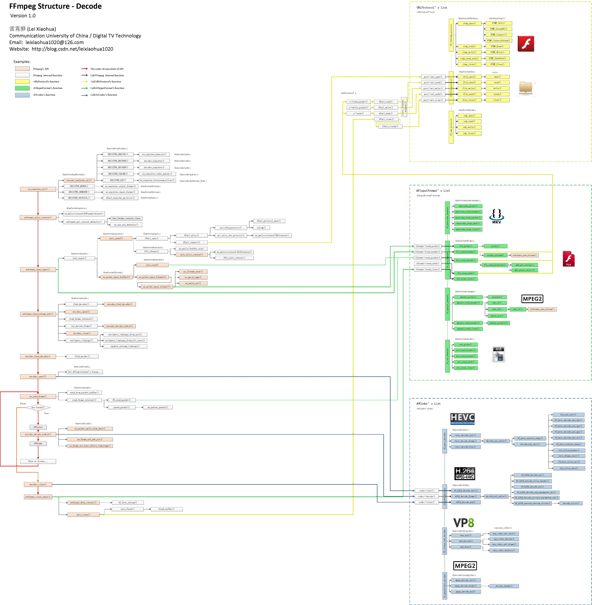
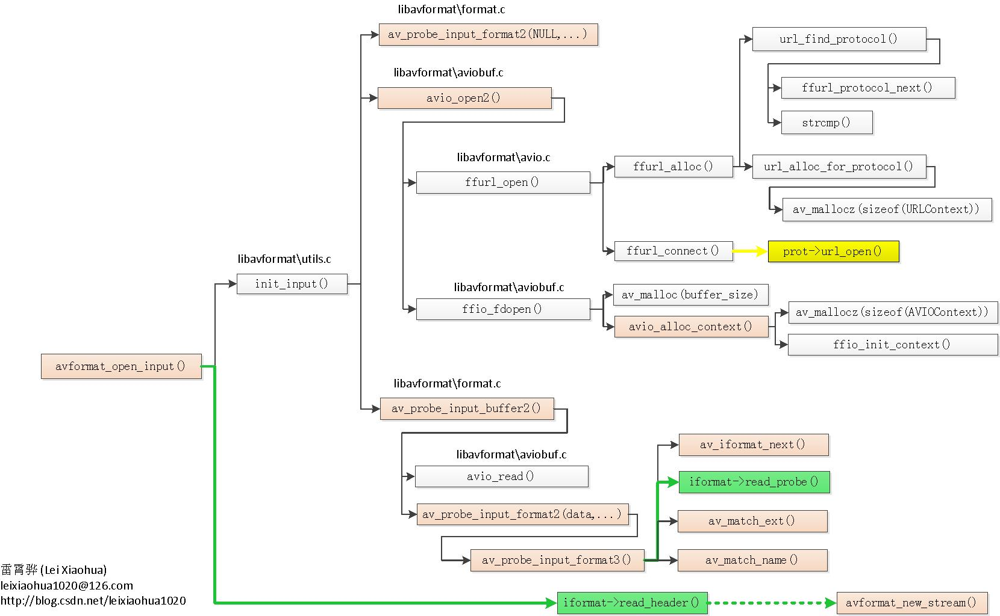

> 特别说明，此文参考至[雷神笔记](<https://blog.csdn.net/leixiaohua1020/article/details/44220151>)，做一个备忘录。

## 1. FFmpeg源代码结构图 - 解码

下图表明了 FFmpeg 在解码一个视频的时候的函数调用流程。为了保证结构清晰，其中仅列出了最关键的函数，剔除了其它不是特别重要的函数。

<!-- more -->



下面解释一下图中关键标记的含义。

### 1.1 函数背景色

函数在图中以方框的形式表现出来。不同的背景色标志了该函数不同的作用：

- 粉红色背景函数：FFmpeg 的 API函数。
- 白色背景的函数：FFmpeg 的内部函数。
- 黄色背景的函数：URLProtocol 结构体中的函数，包含处理协议（Protocol）的功能。
- 绿色背景的函数：AVInputFormat 结构体中的函数，包含处理封装格式（Format）的功能。
- 蓝色背景的函数：AVCodec 结构体中的函数，包含了编解码器（Codec）的功能。

> PS：URLProtocol，AVInputFormat，AVCodec在FFmpeg开始运行并且注册完组件之后，都会分别被连接成一个个的链表。因此实际上是有很多的URLProtocol，AVInputFormat，AVCodec的。图中画出了解码一个输入协议是“文件”（其实就是打开一个文件。“文件”也被当做是一种广义的协议），封装格式为FLV，视频编码格式是H.264的数据的函数调用关系。

### 1.2 区域

整个架构图可以分为以下几个区域：

- **左边区域——架构函数区域**：这些函数并不针对某一特定的视频格式。
- **右上方黄色区域——协议处理函数区域**：不同的协议（RTP，RTMP，FILE）会调用不同的协议处理函数。
- **右边中间绿色区域——封装格式处理函数区域**：不同的封装格式（MKV，FLV，MPEGTS，AVI）会调用不同的封装格式处理函数。
- **右边下方蓝色区域——编解码函数区域**：不同的编码标准（HEVC，H.264，MPEG2）会调用不同的编解码函数。

### 1.3 箭头线

为了把调用关系表示的更明显，图中的箭头线也使用了不同的颜色：

- 黑色箭头线：标志了函数之间的调用关系。

- 红色的箭头线：标志了解码的流程。

- 其他颜色的箭头线：标志了函数之间的调用关系。其中：
  - 调用 URLProtocol 结构体中的函数用**黄色箭头线**标识；
  - 调用 AVInputFormat 结构体中的函数用**绿色箭头线**标识；
  - 调用 AVCodec 结构体中的函数用**蓝色箭头线**标识。

### 1.4 函数所在的文件

每个函数旁边标识了它所在的文件的路径。

此外，还有一点需要注意的是，一些 API 函数内部也调用了另一些API函数。也就是说，API函数并不一定全部都调用FFmpeg的内部函数，他也有可能调用其他的API函数。例如从图中可以看出来， `avformat_close_input()` 调用了 `avformat_free_context()` 和 `avio_close()`。这些在内部代码中被调用的API函数也标记为粉红色。

### 1.5 函数调用关系

下面简单列出几个区域中函数之间的调用关系（函数之间的调用关系使用缩进的方式表现出来）。详细的函数分析可以参考相关的《FFmpeg源代码分析》系列文章。

#### 1.5.1 左边区域（FFmpeg架构函数）

**<font color=red>1.  av_register_all()【函数简单分析】</font>>**

- **<font color=red>1)  avcodec_register_all()</font>**
  - **(a) REGISTER_HWACCEL()**
  - **(b) REGISTER_ENCODER()**
  - **(c) REGISTER_DECODER()**
  - **(d) REGISTER_PARSER()**
  - **(e) REGISTER_BSF()**
- **2)  REGISTER_MUXER()**
- **3)  REGISTER_DEMUXER()**
- **4)  REGISTER_PROTOCOL()**

**<font color=red>2.  avformat_alloc_context()【函数简单分析】</font>**

- **1) av_malloc(sizeof(AVFormatContext))**

- **2) avformat_get_context_defaults()**
  - **(a) av_opt_set_defaults()**

**<font color=red>3.  avformat_open_input()【函数简单分析】</font>**

- **1) init_input()**
  - **<font color=red>(a) avio_open2()【函数简单分析】</font>**
    - **a) ffurl_open()**
      - **i. ffurl_alloc()**
        - **url_find_protocol()**
        - **url_alloc_for_protocol()**
      - **ii. ffurl_connect()**
        - **<font color=#FFC000>URLProtocol->url_open()</font>**
    - **b) ffio_fdopen()**
      - **i. av_malloc(buffer_size)**
      - **ii. <font color=red>avio_alloc_context()</font>**
        - **av_mallocz(sizeof(AVIOContext))**
        - **ffio_init_context()**
  - **<font color=red>(b) av_probe_input_buffer2()</font>**
    - **<font color=red>a) avio_read()</font>**
      - **i.  <font color=#009900>AVInputFormat->read_packet()</font>**
    - **<font color=red>b) av_probe_input_format2()</font>**
    - **<font color=red>c) av_probe_input_format3()</font>**
      - **i. <font color=red>av_iformat_next()</font>**
      - **ii. <font color=red>av_match_name()</font>**
      - **iii. <font color=red>av_match_ext()</font>**
      - **iv. <font color=#009900>AVInputFormat->read_probe()</font>**
- **2) <font color=#009900>AVInputFormat->read_header()</font>**

**<font color=red>4. avformat_find_stream_info()【函数简单分析】</font>**

- **1) find_decoder()**
  - **<font color=red>(a) avcodec_find_decoder()</font>**
- **<font color=red>2) avcodec_open2()</font>**
- **3) read_frame_internal()**
- **4) try_decode_frame()**
  - **<font color=red>(a) avcodec_decode_video2()</font>**
- **<font color=red>5) avcodec_close()</font>**
- **6) estimate_timings()**
  - **(a)  estimate_timings_from_pts()**
  - **(b)  estimate_timings_from_bit_rate()**
  - **(c)  update_stream_timings()**

**<font color=red>5. avcodec_find_decoder()【函数简单分析】</font>**

- **1) find_encdec()**

**<font color=red>6. avcodec_open2()【函数简单分析】</font>**

- **<font color=#3072C2>1) AVCodec->init()</font>**

**<font color=red>7. av_read_frame()【函数简单分析】</font>**

- **1) read_from_packet_buffer()**

- **2) read_frame_internal()**
  - **(a) ff_read_packet()**
    - **<font color=#009900>a) AVInputFormat->read_packet()</font>**
  - **(b) parse_packet()**
    - **a) av_parser_parse2()**

**<font color=red>8. avcodec_decode_video2()【函数简单分析】</font>**

- **1) av_packet_split_side_data()**

- **2) <font color=#3072C2>AVCodec</font>-> <font color=red>decode()</font>**

- **3) av_frame_set_pkt_pos()**

- **4) av_frame_set_best_effort_timestamp()**

**<font color=red>9. avcodec_close()【函数简单分析】</font>**

- **<font color=#3072C2>1) AVCodec->close()</font>**

**<font color=red>10. avformat_close_input()【函数简单分析】</font>**

- **<font color=#009900>1) AVInputFormat->read_close()</font>**

- **2) avformat_free_context()**
  - **(a) ff_free_stream()**
- **3) avio_close()**
  - **(a) avio_flush()**
    - **a) flush_buffer()**
  - **(b) ffurl_close()**
    - **a) ffurl_closep()**
      - **<font color=#FFC000>URLProtocol->url_close()</font>**

#### 1.5.2 右上区域（URLProtocol协议处理函数）

URLProtocol结构体包含如下协议处理函数指针：

- **<font color=#FFC000>url_open()：打开</font>**
- **<font color=#FFC000>url_read()：读取</font>**
- **<font color=#FFC000>url_write()：写入</font>**
- **<font color=#FFC000>url_seek()：调整进度</font>**
- **<font color=#FFC000>url_close()：关闭</font>**

【例子】不同的协议对应着上述接口有不同的实现函数，举几个例子：

**File协议（即文件）对应的URLProtocol结构体 `ff_file_protocol`：**

```c
url_open() -> file_open() -> open()
url_read() -> file_read() -> read()
url_write() -> file_write() -> write()
url_seek() -> file_seek() -> lseek()
url_close() -> file_close() -> close()
```

**RTMP协议（libRTMP）对应的URLProtocol结构体 `ff_librtmp_protocol`：**

```c
url_open() -> rtmp_open() -> RTMP_Init(), RTMP_SetupURL(), RTMP_Connect(), RTMP_ConnectStream()
url_read() -> rtmp_read() -> RTMP_Read()
url_write() -> rtmp_write() -> RTMP_Write()
url_seek() -> rtmp_read_seek() -> RTMP_SendSeek()
url_close() -> rtmp_close() -> RTMP_Close()
```

**UDP协议对应的URLProtocol结构体 `ff_udp_protocol`：**

```c
url_open() -> udp_open()
url_read() -> udp_read()
url_write() -> udp_write()
url_seek() -> udp_close()
url_close() -> udp_close()
```

#### 1.5.3 右中区域（AVInputFormat封装格式处理函数）

AVInputFormat包含如下封装格式处理函数指针：

- **<font color=#009900>read_probe()：检查格式</font>**
- **<font color=#009900>read_header()：读取文件头</font>**
- **<font color=#009900>read_packet()：读取一帧数据</font>**
- **<font color=#009900>read_seek()：调整进度</font>**
- **<font color=#009900>read_close()：关闭</font>**

【例子】不同的封装格式对应着上述接口有不同的实现函数，举几个例子：

**FLV封装格式对应的AVInputFormat结构体 `ff_flv_demuxer`：**

```c
read_probe() -> flv_probe() –> probe()
read_header() -> flv_read_header() -> create_stream() -> avformat_new_stream()
read_packet() -> flv_read_packet()
read_seek() -> flv_read_seek()
read_close() -> flv_read_close()
```

**MKV封装格式对应的AVInputFormat结构体 `ff_matroska_demuxer`：**

```c
read_probe() -> matroska_probe()
read_header() -> matroska_read_header()
read_packet() -> matroska_read_packet()
read_seek() -> matroska_read_seek()
read_close() -> matroska_read_close()
```

**MPEG2TS封装格式对应的AVInputFormat结构体 `ff_mpegts_demuxer`：**

```c
read_probe() -> mpegts_probe()
read_header() -> mpegts_read_header()
read_packet() -> mpegts_read_packet() 
read_close() -> mpegts_read_close()
```

**AVI封装格式对应的AVInputFormat结构体 `ff_avi_demuxer`：**

```c
read_probe() -> avi_probe()
read_header() -> avi_read_header()
read_packet() -> avi_read_packet()
read_seek() -> avi_read_seek()
read_close() -> avi_read_close()
```

#### 1.5.4 右下区域（AVCodec编解码函数）

AVCodec包含如下编解码函数指针：

- **<font color=#3072C2>init()：初始化</font>**
- **<font color=red>decode()</font>：解码一帧数据**
- **<font color=#3072C2>close()：关闭</font>**

【例子】不同的编解码器对应着上述接口有不同的实现函数，举几个例子：

**HEVC解码对应的AVCodec结构体 `ff_hevc_decoder`：**

```c
init() -> hevc_decode_init()
decode() -> hevc_decode_frame() -> decode_nal_units()
close() -> hevc_decode_free()
```

**H.264解码对应的AVCodec结构体 `ff_h264_decoder`：**

```c
init() -> ff_h264_decode_init()
decode() -> h264_decode_frame() -> decode_nal_units()
close() -> h264_decode_end()
```

**VP8解码（libVPX）对应的AVCodec结构体 `ff_libvpx_vp8_decoder`：**

```c
init() -> vpx_init() -> vpx_codec_dec_init()
decode() -> vp8_decode() -> vpx_codec_decode(), vpx_codec_get_frame()
close() -> vp8_free() -> vpx_codec_destroy()
```

**MPEG2解码对应的AVCodec结构体 `ff_mpeg2video_decoder`：**

```c
init() -> mpeg_decode_init()
decode() -> mpeg_decode_frame()
close() -> mpeg_decode_end()
```

### 1.6 avformat_open_input() 函数



## 2. FFmpeg源代码结构图 - 编码

### 2.1 函数调用关系图

下图表明了FFmpeg在编码一个视频的时候的函数调用流程。为了保证结构清晰，其中仅列出了最关键的函数，剔除了其它不是特别重要的函数。


下面解释一下图中关键标记的含义。

### 2.2 函数背景色

函数在图中以方框的形式表现出来。不同的背景色标志了该函数不同的作用：

- 粉红色背景函数：FFmpeg 的 API 函数。
- 白色背景的函数：FFmpeg 的内部函数。
- 黄色背景的函数：URLProtocol 结构体中的函数，包含了读写各种协议的功能。
- 绿色背景的函数：AVOutputFormat 结构体中的函数，包含了读写各种封装格式的功能。
- 蓝色背景的函数：AVCodec 结构体中的函数，包含了编解码的功能。

### 2.3 区域

整个关系图可以分为以下几个区域：

- **左边区域——架构函数区域**：这些函数并不针对某一特定的视频格式。
- **右上方黄色区域——协议处理函数区域**：不同的协议（RTP，RTMP，FILE）会调用不同的协议处理函数。
- **右边中间绿色区域——封装格式处理函数区域**：不同的封装格式（MKV，FLV，MPEG2TS，AVI）会调用不同的封装格式处理函数。
- **右边下方蓝色区域——编解码函数区域**：不同的编码标准（HEVC，H.264，MPEG2）会调用不同的编解码函数。

### 2.4 箭头线

为了把调用关系表示的更明显，图中的箭头线也使用了不同的颜色：

- 红色的箭头线：标志了编码的流程。

- 其他颜色的箭头线：标志了函数之间的调用关系。其中：
  - 调用 URLProtocol 结构体中的函数用**黄色箭头线**标识；
  - 调用 AVOutputFormat 结构体中的函数用**绿色箭头线**标识；
  - 调用 AVCodec 结构体中的函数用**蓝色箭头线**标识。

### 2.5 函数所在的文件

每个函数标识了它所在的文件路径。

### 2.6 函数功能简述

下面简单列出几个区域中函数之间的调用关系（函数之间的调用关系使用缩进的方式表现出来）。详细的函数分析可以参考相关的《FFmpeg源代码分析》系列文章。

#### 2.6.1 左边区域（架构函数）

**<font color=red>1. av_register_all()【函数简单分析】</font>**

- **<font color=red>1) avcodec_register_all()</font>**
  - **(a) REGISTER_HWACCEL()**
  - **(b) REGISTER_ENCODER()**
  - **(c) REGISTER_DECODER()**
  - **(d) REGISTER_PARSER()**
  - **(e) REGISTER_BSF()**

- **2) REGISTER_MUXER()**

- **3) REGISTER_DEMUXER()**

- **4) REGISTER_PROTOCOL()**

**<font color=red>2. avformat_alloc_output_context2()【函数简单分析】</font>**

- **<font color=red>1) avformat_alloc_context()</font>**

  - **(a) av_malloc(sizeof(AVFormatContext))**

  - **(b) avformat_get_context_defaults()**
    - **a) av_opt_set_defaults()**

- **<font color=red>2) av_guess_format()</font>**
  - **<font color=red>(a) av_oformat_next()</font>**
  - **<font color=red>(b) av_match_name()</font>**
  - **<font color=red>(c) av_match_ext()</font>**

**<font color=red>3. avio_open2()【函数简单分析】</font>**

- **1) ffurl_open()**
  - **(a) ffurl_alloc()**
    - **a) url_find_protocol()**
    - **b) url_alloc_for_protocol()**
  - **(b) ffurl_connect()**
    - **<font color=#FFC000>a) URLProtocol->url_open()</font>**

- **2) ffio_fdopen()**
  - **(a) av_malloc(buffer_size)**
  - **<font color=red>(b) avio_alloc_context()</font>**
    - **a) av_mallocz(sizeof(AVIOContext))**
    - **b) ffio_init_context()**

**<font color=red>4. avformat_new_stream()【函数简单分析】</font>**

- **1) av_mallocz(sizeof(AVStream))**

- **<font color=red>2) avcodec_alloc_context3()</font>**
  - **(a) av_malloc(sizeof(AVCodecContext))**
  - **(b) avcodec_get_context_defaults3()**

**<font color=red>5. avcodec_find_encoder()【函数简单分析】</font>**

- **1) find_encdec()**

**<font color=red>6. avcodec_open2()【函数简单分析】</font>**

- **1) AVCodec->init()**

**<font color=red>7. avformat_write_header()【函数简单分析】</font>**

- **1) init_muxer()**

- **<font color=#009900>2) AVOutputFormat->write_header()</font>**

- **3) init_pts()**

**<font color=red>8. avcodec_encode_video2()【函数简单分析】</font>**

- **<font color=#3072C2>1) AVCodec->encode2()</font>**

**<font color=red>9. av_write_frame()【函数简单分析】</font>**

- **1) check_packet()**

- **2) compute_pkt_fields2()**

- **3) write_packet()**
  - **<font color=#009900>(a) AVOutputFormat->write_packet()</font>**

**<font color=red>10. av_write_trailer()【函数简单分析】</font>**

- **1) write_packet()**

- **<font color=#009900>2) AVOutputFormat->write_trailer()</font>**

**<font color=red>11. avcodec_close()【函数简单分析】</font>**

- **<font color=#3072C2>1) AVCodec->close()</font>**

**<font color=red>12. avformat_free_context()【函数简单分析】</font>**

- **1) ff_free_stream()**

**<font color=red>13. avio_close()【函数简单分析】</font>**

- **1) avio_flush()**
  - **(a) flush_buffer()**
- **2) ffurl_close()**
  - **(a) ffurl_closep()**
    - **<font color=#FFC000>a) URLProtocol->url_close()</font>**

#### 2.6.2 右上区域（URLProtocol协议处理函数）

URLProtocol结构体包含如下协议处理函数指针：

- **<font color=#FFC000>url_open()：打开</font>**
- **<font color=#FFC000>url_read()：读取</font>**
- **<font color=#FFC000>url_write()：写入</font>**
- **<font color=#FFC000>url_seek()：调整进度</font>**
- **<font color=#FFC000>url_close()：关闭</font>**

【例子】不同的协议对应着上述接口有不同的实现函数，举几个例子：

**File协议（即文件）对应的URLProtocol结构体 `ff_file_protocol`：**

```c
url_open() -> file_open() -> open()
url_read() -> file_read() -> read()
url_write() -> file_write() -> write()
url_seek() -> file_seek() -> lseek()
url_close() -> file_close() -> close()
```

**RTMP协议（libRTMP）对应的URLProtocol结构体 `ff_librtmp_protocol`：**

```c
url_open() -> rtmp_open() -> RTMP_Init(), RTMP_SetupURL(), RTMP_Connect(), RTMP_ConnectStream()
url_read() -> rtmp_read() -> RTMP_Read()
url_write() -> rtmp_write() -> RTMP_Write()
url_seek() -> rtmp_read_seek() -> RTMP_SendSeek()
url_close() -> rtmp_close() -> RTMP_Close()
```

**UDP协议对应的URLProtocol结构体 `ff_udp_protocol`：**

```c
url_open() -> udp_open()
url_read() -> udp_read()
url_write() -> udp_write()
url_seek() -> udp_close()
url_close() -> udp_close()
```

#### 2.6.3 右中区域（AVOutputFormat封装格式处理函数）

AVOutputFormat包含如下封装格式处理函数指针：

- **<font color=#009900>write_header()：写文件头</font>**
- **<font color=#009900>write_packet()：写一帧数据</font>**
- **<font color=#009900>write_trailer()：写文件尾</font>**

【例子】不同的封装格式对应着上述接口有不同的实现函数，举几个例子：

**FLV封装格式对应的AVOutputFormat结构体 `ff_flv_muxer`：**

```c
write_header() -> flv_write_header()
write_packet() –> flv_write_packet()
write_trailer() -> flv_write_trailer()
```

**MKV封装格式对应的AVOutputFormat结构体 `ff_matroska_muxer`：**

```c
write_header() -> mkv_write_header()
write_packet() –> mkv_write_flush_packet()
write_trailer() -> mkv_write_trailer()
```

**MPEG2TS封装格式对应的AVOutputFormat结构体 `ff_mpegts_muxer`：**

```c
write_header() -> mpegts_write_header()
write_packet() –> mpegts_write_packet()
write_trailer() -> mpegts_write_end()
```

**AVI封装格式对应的AVOutputFormat结构体 `ff_avi_muxer`：**

```c
write_header() -> avi_write_header()
write_packet() –> avi_write_packet()
write_trailer() -> avi_write_trailer()
```

#### 2.6.4 右下区域（AVCodec编解码函数）

AVCodec包含如下编解码函数指针：

- **<font color=#3072C2>init()：初始化</font>**
- **<font color=#3072C2>encode2()：编码一帧数据</font>**
- **<font color=#3072C2>close()：关闭</font>**

【例子】不同的编解码器对应着上述接口有不同的实现函数，举几个例子：

**HEVC编码器对应的AVCodec结构体 `ff_libx265_encoder`：**

```c
init() -> libx265_encode_init() -> x265_param_alloc(), x265_param_default_preset(), x265_encoder_open()
encode2() -> libx265_encode_frame() -> x265_encoder_encode()
close() -> libx265_encode_close() -> x265_param_free(), x265_encoder_close()
```

**H.264编码器对应的AVCodec结构体 `ff_libx264_encoder`：**

```c
init() -> X264_init() -> x264_param_default(), x264_encoder_open(), x264_encoder_headers()
encode2() -> X264_frame() -> x264_encoder_encode()
close() -> X264_close() -> x264_encoder_close()
```

**VP8编码器（libVPX）对应的AVCodec结构体 `ff_libvpx_vp8_encoder`：**

```c
init() -> vpx_init() -> vpx_codec_enc_config_default()
encode2() -> vp8_encode() -> vpx_codec_enc_init(), vpx_codec_encode()
close() -> vp8_free() -> vpx_codec_destroy()
```

**MPEG2编码器对应的AVCodec结构体 `ff_mpeg2video_encoder`：**

```c
init() -> encode_init()
encode2() -> ff_mpv_encode_picture()
close() -> ff_mpv_encode_end()
```

