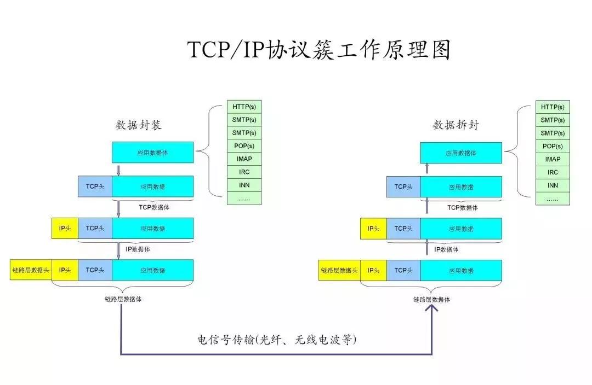
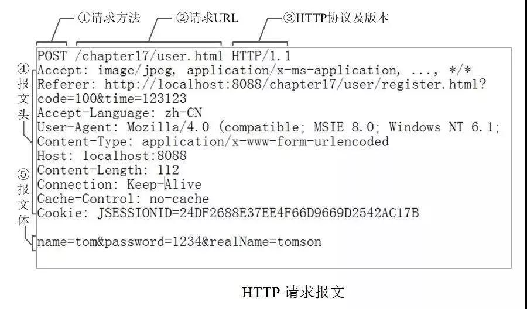
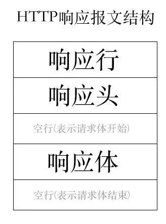
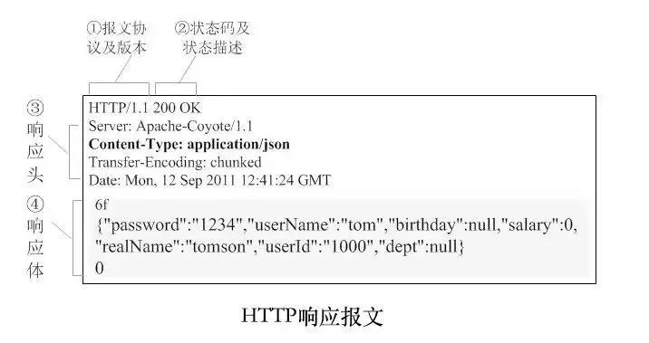

HTTP（HyperText Transfer Protocol 超文本传输协议)是互联网上应用最为广泛的一种网络协议，它是由万维网协会（World Wide Web Consortium）制定发布。

文章主要**以一次HTTP请求的整个过程来讲解**(DNS解析不讲)：HTTP 起源、TCP/IP 协议、建立 TCP 连接、客户端请求、服务端响应、断开 TCP 连接，文章最后还捎带讲了与 HTTP 相关知识。

<!-- more -->

## 1. 简介

### 1.1 起源

今天我们能够在网络中畅游，都得益于一位计算机科学家蒂姆·伯纳斯·李的构想。1991年8月6日，蒂姆·伯纳斯·李在位于欧洲粒子物理研究所（CERN）的NeXT计算机上，正式公开运行世界上第一个Web网站（http://info.cern.ch ），建立起基本的互联网基础概念和技术体系，由此开启了网络信息时代的序幕。

伯纳斯·李的提案包含了网络的基本概念并逐步建立了所有必要的工具：

- 提出**HTTP** (Hypertext Transfer Protocol) 超文本传输协议，允许用户通过单击超链接访问资源；

- 提出使用**HTML超文本标记语言**(Hypertext Markup Language)作为创建网页的标准；
- 创建了**统一资源定位器URL** (Uniform Resource Locator)作为网站地址系统，就是沿用至今的http://www URL格式；
- 创建第一个**Web浏览器**，称为万维网浏览器，这也是一个Web编辑器；
- 创建第一个**Web服务器**（http://info.cern.ch）以及描述项目本身的第一个Web页面。

### 1.2 特点

**HTTP 协议一共有五大特点：**

- 支持客户/服务器模式。
- 简单快速：客户向服务器请求服务时，只需传送请求方法和路径。
- 灵活：HTTP允许传输任意类型的数据对象。正在传输的类型由 Content-Type（Content-Type是HTTP包中用来表示内容类型的标识）加以标记。
- 无连接：**无连接的含义是限制每次连接只处理一个请求**。服务器处理完客户的请求，并收到客户的应答后，即断开连接。采用这种方式可以节省传输时间。
- 无状态：**无状态是指协议对于事务处理没有记忆能力，服务器不知道客户端是什么状态**。即我们给服务器发送 HTTP 请求之后，服务器根据请求，会给我们发送数据过来，但是，发送完，不会记录任何信息（**Cookie 和Session 孕育而生**，后期再讲）。

## 2. TCP/IP协议

我们经常听到一句话就是：**HTTP是一个基于TCP/IP协议簇来传递数据。**

如何理解上面那句话？我们来看看**TCP/IP四层模型**就明白了。

从上图我们可以清晰的看到HTTP使用的传输层协议为**TCP协议**，而网络层使用的是IP协议（当然还使用了很多其他协议），所以说HTTP是一个基于TCP/IP协议簇来传递数据。

> 同样我们可以看到 ping 走的 ICMP 协议，这也就是为什么有时候我们开 vps 可以上网，但是 ping google 却ping 不通的原因，因为走的是不同的协议。

那 TCP/IP 协议簇大致是如何工作的，我们再来看看下图：

我们可以看到在数据发送端是一层一层封装数据，数据接收端一层一层拆封，最后应用层获得数据。

## 3. 建立TCP连接

我们知道了TCP/IP协议簇大致的工作原理之后，我们来看看HTTP是如何建立连接的。

### 3.1 TCP包头信息

前面咱们讲过HTTP是一个基于TCP/IP协议簇来传递数据，所以这HTTP建立连接也就是建立TCP连接，TCP如何建立连接，一起来看看TCP包信息结构吧。

**TCP 报文包 = TCP 头信息 + TCP 数据体**，而在 TCP 头信息中包含了 6 种控制位（上图红色框中），这六种标志位就代表着 TCP 连接的状态：

- **URG**：紧急数据（urgent data）—这是一条紧急信息

- **ACK**：确认已收到

- **PSH**：提示接收端应用程序应该立即从tcp接受缓冲区中读走数据

- **RST**：表示要求对方重新建立连接

- **SYN**：表示请求建立一个连接

- **FIN**：表示通知对方本端要关闭连接了

### 3.2 建立连接过程

了解了TCP包头信息之后，我们就可以正式看看TCP建立连接的三次握手了。

**三次握手讲解：**

- 客户端发送位码为 `syn＝1` ,随机产生 `seq number=1234567` 的数据包到服务器，服务器由 `SYN=1` 知道客户端要求建立联机（客户端：我要连接你）
- 服务器收到请求后要确认联机信息，向 A 发送 `ack number=(客户端的seq+1)` , `syn=1` , `ack=1` , 随机产生`seq=7654321` 的包（服务器：好的，你来连吧）
- 客户端收到后检查 `ack number` 是否正确，即第一次发送的 `seq number+1` ,以及位码 `ack` 是否为 1，若正确，客户端会再发送 `ack number=(服务器的seq+1)` , `ack=1`，服务器收到后确认 `seq` 值与 `ack=1` 则连接建立成功。（客户端：好的，我来了）

> 面试官：为什么 http 建立连接需要三次握手，不是两次或四次
>
> 答：三次是最少的安全次数，两次不安全，四次浪费资源

## 4. 客户端请求

客户端与服务器连接上了之后，客户端就可以开始向服务器请求资源，就可以开始发送HTTP请求了。

### 4.1 HTTP请求报文结构

我们之前说过 **TCP 报文包 = TCP 头信息 + TCP 数据体**，TCP 头信息我们已经讲了，现在来讲 TCP 数据体，也就是我们的 HTTP 请求报文。

### 4.2 HTTP请求实例

来看看实际的HTTP请求例子：

① 是请求方法，HTTP/1.1 定义的请求方法有 8 种：**GET、POST、PUT、DELETE、PATCH、HEAD、OPTIONS、TRACE**, 最常的两种 GET 和 POST，**如果是 RESTful 接口的话一般会用到 GET、POST、DELETE、PUT**

② 为请求对应的URL地址，它和报文头的 Host 属性组成完整的请求 URL

③ 是协议名称及版本号

④ 是HTTP的报文头，报文头包含若干个属性，格式为 “**属性名 : 属性值**”，服务端据此获取客户端的信息

⑤ 是报文体，它将一个页面表单中的组件值通过 `param1=value1&param2=value2` 的键值对形式编码成一个格式化串，它承载多个请求参数的数据。不但报文体可以传递请求参数，请求 URL 也可以通过类似于 “`/chapter15/user.html? param1=value1&param2=value2`” 的方式传递请求参数。

请求头参数非常多，就不一一说明，只说明两个低级的反扒参数：

- User-Agent：客户端使用的操作系统和浏览器的名称和版本，有些网站会限制请求浏览器
- Referer：先前网页的地址，表示此请求来自哪里，有些网站会限制请求来源

## 5. 服务端响应

服务器在收到客户端请求处理完需要响应并返回给客户端，而HTTP响应报文结构与请求结构体一致。

### 5.1 HTTP响应报文结构

### 5.2 HTTP响应实例

### 5.3 响应状态码

响应报文中我们重点关注下：服务器的响应状态码，面试也很容易问到，下面只列出分类，详细状态码自行上网查找了解。

## 6. 断开连接

在服务器响应完毕后，一次会话就结束了，请问这时候连接会断开吗？

### 6.1 长短连接

是否断开我们需要区分 HTTP 版本：

- 在 HTTP/1.0 版本的时候，客户端与服务器完成一个请求/响应之后，会将之前建立的 TCP 连接断开，下次请求的时候又要重新建立 TCP 连接，这也被称为短连接
- 在 HTTP1.0 发布仅半年后（1997年1月） ，**HTTP/1.1** 版本发布并带来一个新的功能：在客户端与服务器完成一次请求/响应之后，允许不断开 TCP 连接，这意味着下次请求就直接使用这个TCP 连接而不再需要重新握手建立新连接，这也被称为长连接

**注意**：长连接是指一次 TCP 连接允许多次 HTTP 会话，HTTP 永远都是一次请求/响应，会话结束，HTTP 本身不存在长连接之说。

早在 1999 年 HTTP1.1 就推广普及，所以现在浏览器在请求时请求头中都会携带一个参数：`Connection:keep-alive`，这表示浏览器要求与服务器建立长连接，而服务器也可以设置是否愿意建立长连接。

### 6.2 长连接优缺点

对于服务器来说建立长连接有优点也有缺点：

- **优点**：当网站中有大量静态资源（图片、css、js等）就可以开启长连接，这也几张图片就可以通过一次TCP连接发送。
- **缺点**：当客户端请求一次时候不在请求，而服务器却开着长连接资源被占用着，这是严重浪费资源。

所以是否开启长连接，长连接时间都需要根据网站自身来合理设置。

ps：大家不要小看这一个 TCP 连接，在一次客户端 HTTP 完整的请求中（DNS寻址、建立TCP连接、请求、等待、解析网页、断开TCP连接）建立 TCP 连接占用的时间比还是很大的。

### 6.3 断开连接过程

**在建立TCP连接时是三次握手，而断开TCP连接是四次挥手！**

在前面讲 TCP/IP 协议时我们说过标志位：**FIN** 表示通知对方本端要关闭连接了，**那断开连接为何需要四次挥手呢？**

TODO

## 7. 题外话

### 7.1 面试必考题：http三次握手、四次挥手

> 面试官：为何建立连接需要三次握手而关闭连接却需要四次挥手。

TODO

### 7.2 http2.0

HTTP/1.1 已经为我们服务了20年，而 HTTP/2.0 其实在 2015 就发布了，但是还没有推广开来，关于 HTTP/2.0 新特性也可以去网上查阅相关资料.

### 7.3 http&rpc

因为 http 响应慢、请求头体积大等缺点，所以在微服务时代，大家都使用 rpc 来调用服务，rpc 相关概念感兴趣同学自行网上学习。

### 7.4 http&https

http还有两个很大的缺点就是明文且不能保证完整性，所以目前会渐渐被HTTPS代替。

