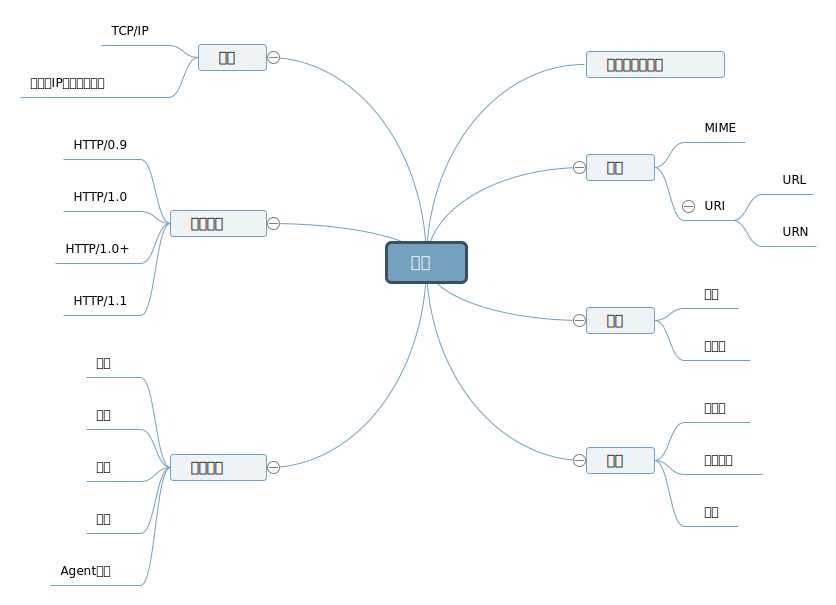
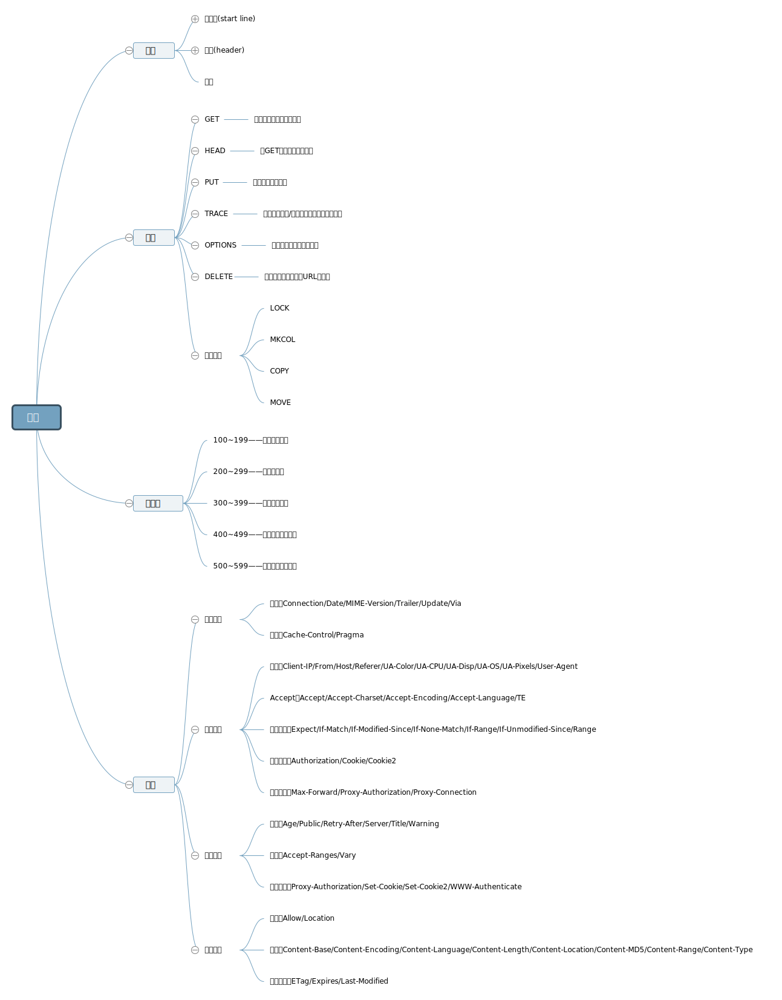
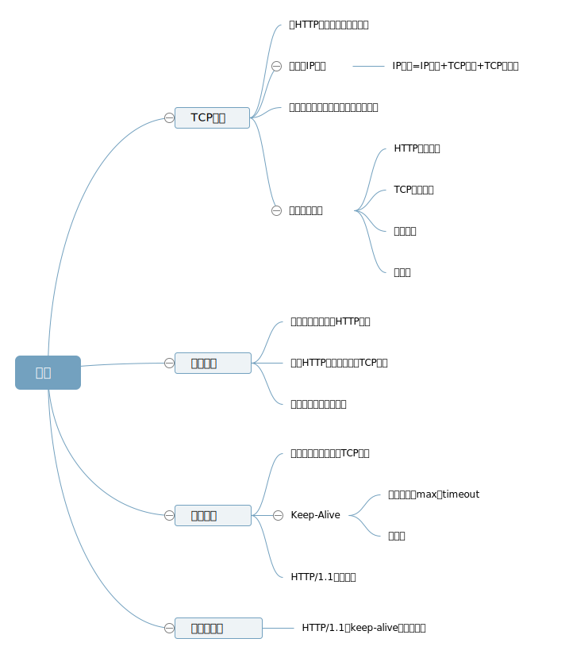
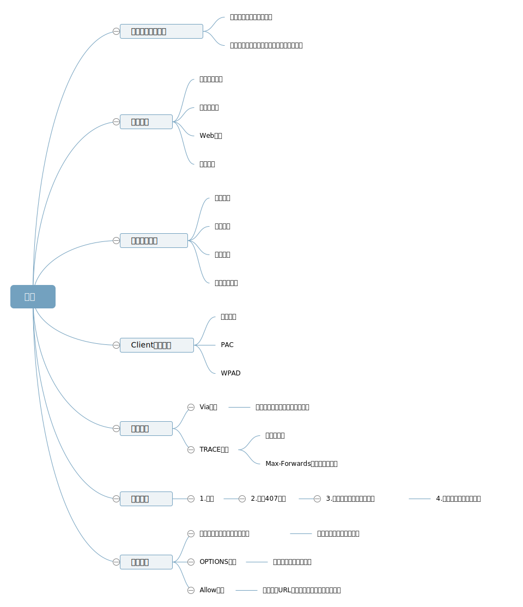
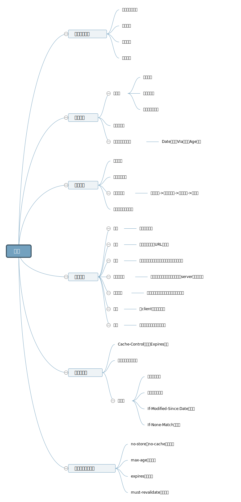
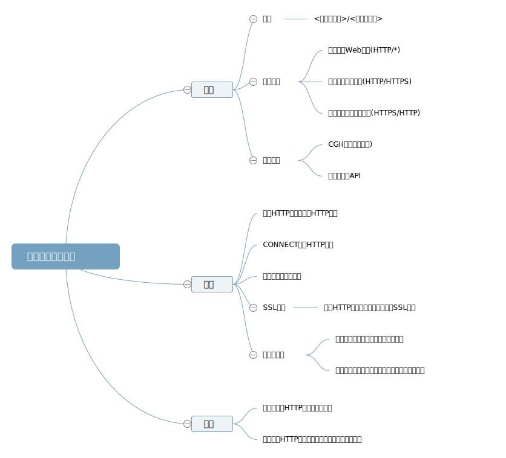
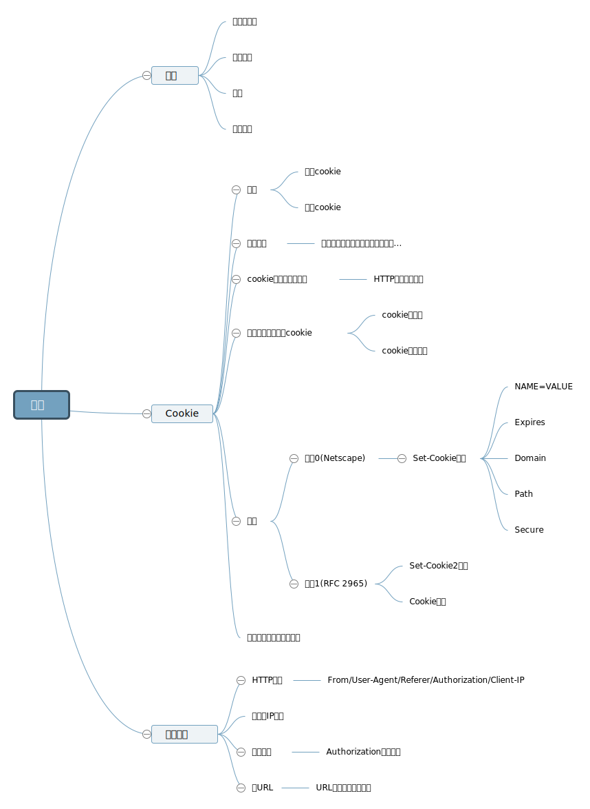
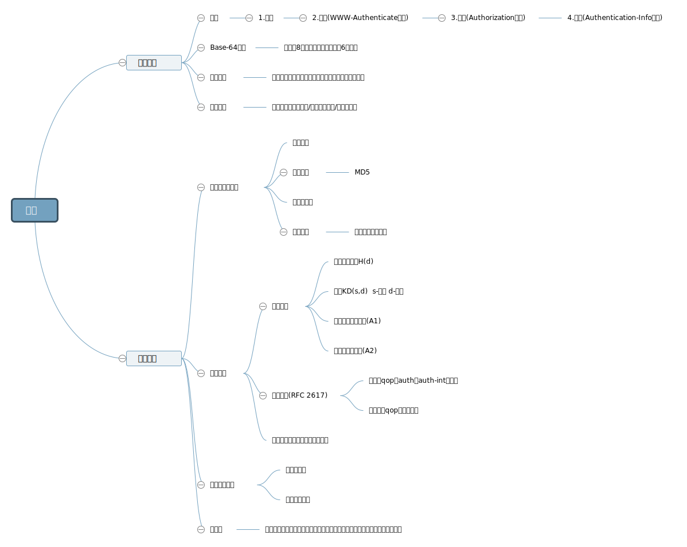
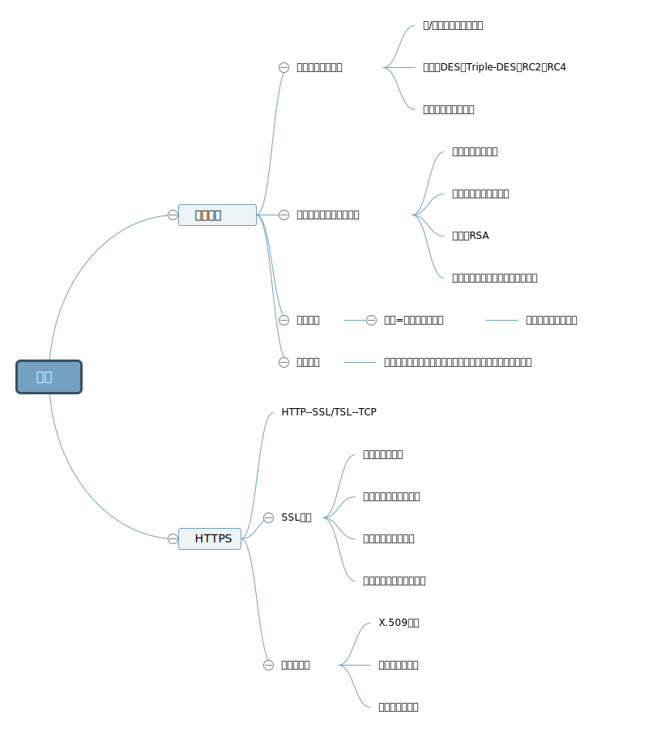
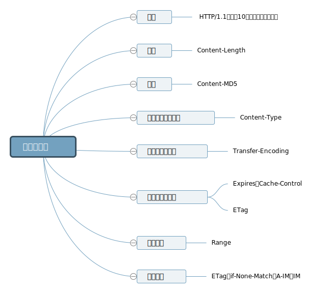

文章来自[HTTP思维导图](http://yrq110.me/2017/03/04/20170304-http-mindmap/)。

HTTP mindmap整理

source from 《HTTP权威指南》

<!-- more -->

### 1. 概述-Summary

### 2. 报文-Message

### 3. 连接-Connection

### 4. 代理-Proxy

### 5. 缓存-Cache

### 6. 网关、隧道与中继-Gateway、Tunnel and Relay

### 7. 识别-Identification

### 8. 认证-Authentication

### 9. 安全-Security

### 10. 实体与编码-Entity and Encoding

