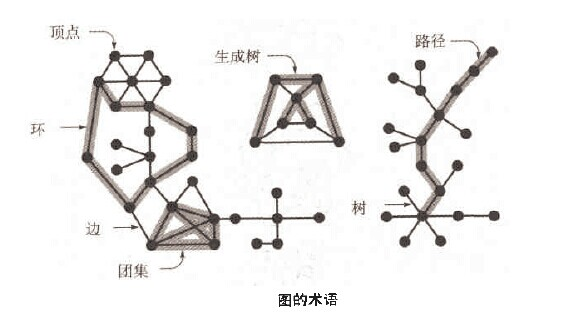
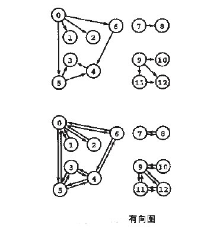
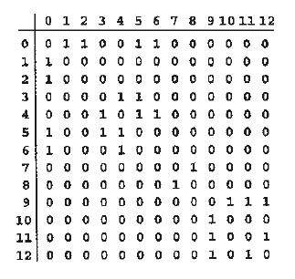
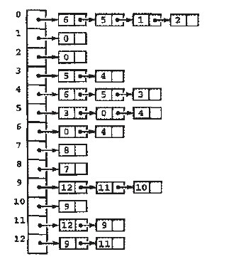
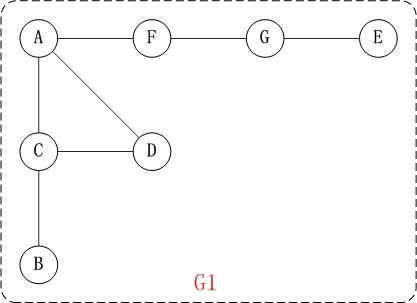
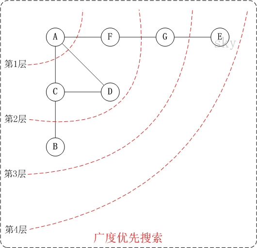
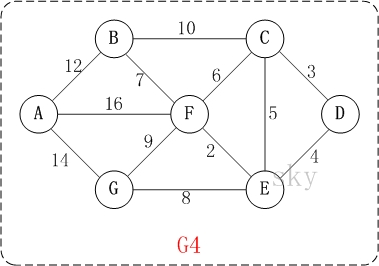
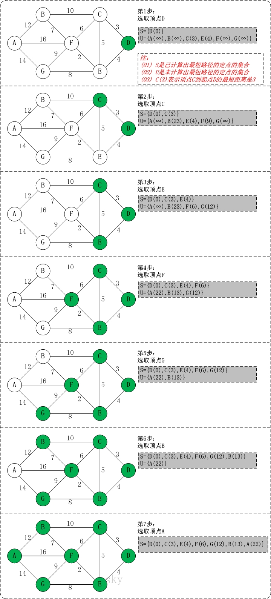

title: 计算机算法--图算法介绍
tags:  algorithm
reward: true
categories:  algorithm
toc: true
abbrlink: 61505
date: 2018-03-08 18:02:52

## 1. 图的定义：

图（graph）由顶点（vertex）和边（edge）的集合组成，每一条边就是一个点对（v,w)。

图的种类：地图，电路图，调度图，事物，网络，程序结构

图的属性：有V个顶点的图最多有V*（V-1）/2条边

<!-- more -->





### 1.1 邻接矩阵：

邻接矩阵是一个元素为bool值的V*V矩阵，若图中存在一条连接顶点V和W的边，折矩阵adj[v][w]=1,否则为0。占用的空间为V*V，当图是稠密时，邻接矩阵是比较合适的表达方法。



### 1.2 邻接表的表示

对于非稠密的图，使用邻接矩阵有点浪费存储空间，可以使用邻接表，我们维护一个链表向量，给定一个顶点时，可以立即访问其链表,占用的空间为O(V+E)。



----------

## 2. 深度优先搜索

### 2.1 深度优先搜索介绍

图的深度优先搜索(Depth First Search)，和树的先序遍历比较类似。

它的思想：假设初始状态是图中所有顶点均未被访问，则从某个顶点v出发，首先访问该顶点，然后依次从它的各个未被访问的邻接点出发深度优先搜索遍历图，直至图中所有和v有路径相通的顶点都被访问到。 若此时尚有其他顶点未被访问到，则另选一个未被访问的顶点作起始点，重复上述过程，直至图中所有顶点都被访问到为止。

显然，深度优先搜索是一个递归的过程。

### 2.2 深度优先搜索图解

#### 2.2.1 无向图的深度优先搜索

下面以"无向图"为例，来对深度优先搜索进行演示。



对上面的图G1进行深度优先遍历，从顶点A开始。


 - 第1步：访问A。
 - 第2步：访问(A的邻接点)C。

    在第1步访问A之后，接下来应该访问的是A的邻接点，即"C,D,F"中的一个。但在本文的实现中，顶点ABCDEFG是按照顺序存储，C在"D和F"的前面，因此，先访问C。 

 - 第3步：访问(C的邻接点)B。

    在第2步访问C之后，接下来应该访问C的邻接点，即"B和D"中一个(A已经被访问过，就不算在内)。而由于B在D之前，先访问B。 

 - 第4步：访问(C的邻接点)D。

    在第3步访问了C的邻接点B之后，B没有未被访问的邻接点；因此，返回到访问C的另一个邻接点D。 

 - 第5步：访问(A的邻接点)F。

    前面已经访问了A，并且访问完了"A的邻接点B的所有邻接点(包括递归的邻接点在内)"；因此，此时返回到访问A的另一个邻接点F。 

 - 第6步：访问(F的邻接点)G。

 - 第7步：访问(G的邻接点)E。

因此访问顺序是：A -> C -> B -> D -> F -> G -> E

#### 2.2.2 有向图的深度优先搜索

下面以"有向图"为例，来对深度优先搜索进行演示。


对上面的图G2进行深度优先遍历，从顶点A开始。


 - 第1步：访问A。

 - 第2步：访问B。

    在访问了A之后，接下来应该访问的是A的出边的另一个顶点，即顶点B。 

 - 第3步：访问C。

    在访问了B之后，接下来应该访问的是B的出边的另一个顶点，即顶点C,E,F。在本文实现的图中，顶点ABCDEFG按照顺序存储，因此先访问C。 

 - 第4步：访问E。

    接下来访问C的出边的另一个顶点，即顶点E。 

 - 第5步：访问D。

    接下来访问E的出边的另一个顶点，即顶点B,D。顶点B已经被访问过，因此访问顶点D。 

 - 第6步：访问F。

    接下应该回溯"访问A的出边的另一个顶点F"。 

 - 第7步：访问G。

因此访问顺序是：A -> B -> C -> E -> D -> F -> G

----------

## 3. 广度优先搜索

### 3.1 广度优先搜索介绍

广度优先搜索算法(Breadth First Search)，又称为"宽度优先搜索"或"横向优先搜索"，简称BFS。

它的思想是：从图中某顶点v出发，在访问了v之后依次访问v的各个未曾访问过的邻接点，然后分别从这些邻接点出发依次访问它们的邻接点，并使得“先被访问的顶点的邻接点先于后被访问的顶点的邻接点被访问，直至图中所有已被访问的顶点的邻接点都被访问到。如果此时图中尚有顶点未被访问，则需要另选一个未曾被访问过的顶点作为新的起始点，重复上述过程，直至图中所有顶点都被访问到为止。

换句话说，广度优先搜索遍历图的过程是以v为起点，由近至远，依次访问和v有路径相通且路径长度为1,2...的顶点。


### 3.2 广度优先搜索图解

#### 3.2.1 无向图的广度优先搜索

下面以"无向图"为例，来对广度优先搜索进行演示。还是以上面的图G1为例进行说明。



 - 第1步：访问A。
 - 第2步：依次访问C,D,F。

    在访问了A之后，接下来访问A的邻接点。前面已经说过，在本文实现中，顶点ABCDEFG按照顺序存储的，C在"D和F"的前面，因此，先访问C。再访问完C之后，再依次访问D,F。 

 - 第3步：依次访问B,G。

    在第2步访问完C,D,F之后，再依次访问它们的邻接点。首先访问C的邻接点B，再访问F的邻接点G。 

 - 第4步：访问E。

    在第3步访问完B,G之后，再依次访问它们的邻接点。只有G有邻接点E，因此访问G的邻接点E。

因此访问顺序是：A -> C -> D -> F -> B -> G -> E

#### 3.2.2 有向图的广度优先搜索

下面以"有向图"为例，来对广度优先搜索进行演示。还是以上面的图G2为例进行说明。


 - 第1步：访问A。

 - 第2步：访问B。

 - 第3步：依次访问C,E,F。

   在访问了B之后，接下来访问B的出边的另一个顶点，即C,E,F。前面已经说过，在本文实现中，顶点ABCDEFG按照顺序存储的，因此会先访问C，再依次访问E,F。 

 - 第4步：依次访问D,G。

    在访问完C,E,F之后，再依次访问它们的出边的另一个顶点。还是按照C,E,F的顺序访问，C的已经全部访问过了，那么就只剩下E,F；先访问E的邻接点D，再访问F的邻接点G。

因此访问顺序是：A -> B -> C -> E -> F -> D -> G

## 4. 搜索算法的源码

<details><summary>1. 邻接矩阵表示的"无向图</summary>


```c++
/**
* C++: 邻接矩阵表示的"无向图(Matrix Undirected Graph)"
*
* @author LippiOuYang
* @date 2013/04/19
*/

#include <iomanip>
#include <iostream>
#include <vector>
using namespace std;

#define MAX 100
class MatrixUDG {
private:
    char mVexs[MAX];    // 顶点集合
    int mVexNum;             // 顶点数
    int mEdgNum;             // 边数
    int mMatrix[MAX][MAX];   // 邻接矩阵

public:
    // 创建图(自己输入数据)
    MatrixUDG();
    // 创建图(用已提供的矩阵)
    MatrixUDG(char vexs[], int vlen, char edges[][2], int elen);
    ~MatrixUDG();

    // 深度优先搜索遍历图
    void DFS();
    // 广度优先搜索（类似于树的层次遍历）
    void BFS();
    // 打印矩阵队列图
    void print();

private:
    // 读取一个输入字符
    char readChar();
    // 返回ch在mMatrix矩阵中的位置
    int getPosition(char ch);
    // 返回顶点v的第一个邻接顶点的索引，失败则返回-1
    int firstVertex(int v);
    // 返回顶点v相对于w的下一个邻接顶点的索引，失败则返回-1
    int nextVertex(int v, int w);
    // 深度优先搜索遍历图的递归实现
    void DFS(int i, int *visited);
};

/* 
 * 创建图(自己输入数据)
 */
MatrixUDG::MatrixUDG()
{
    char c1, c2;
    int i, p1, p2;

    // 输入"顶点数"和"边数"
    cout << "input vertex number: ";
    cin >> mVexNum;
    cout << "input edge number: ";
    cin >> mEdgNum;
    if ( mVexNum < 1 || mEdgNum < 1 || (mEdgNum > (mVexNum * (mVexNum-1))))
    {
        cout << "input error: invalid parameters!" << endl;
        return ;
    }

    // 初始化"顶点"
    for (i = 0; i < mVexNum; i++)
    {
        cout << "vertex(" << i << "): ";
        mVexs[i] = readChar();
    }

    // 初始化"边"
    for (i = 0; i < mEdgNum; i++)
    {
        // 读取边的起始顶点和结束顶点
        cout << "edge(" << i << "): ";
        c1 = readChar();
        c2 = readChar();

        p1 = getPosition(c1);
        p2 = getPosition(c2);
        if (p1==-1 || p2==-1)
        {
            cout << "input error: invalid edge!" << endl;
            return ;
        }

        mMatrix[p1][p2] = 1;
        mMatrix[p2][p1] = 1;
    }
}

/*
 * 创建图(用已提供的矩阵)
 *
 * 参数说明：
 *     vexs  -- 顶点数组
 *     vlen  -- 顶点数组的长度
 *     edges -- 边数组
 *     elen  -- 边数组的长度
 */
MatrixUDG::MatrixUDG(char vexs[], int vlen, char edges[][2], int elen)
{
    int i, p1, p2;

    // 初始化"顶点数"和"边数"
    mVexNum = vlen;
    mEdgNum = elen;
    // 初始化"顶点"
    for (i = 0; i < mVexNum; i++)
        mVexs[i] = vexs[i];

    // 初始化"边"
    for (i = 0; i < mEdgNum; i++)
    {
        // 读取边的起始顶点和结束顶点
        p1 = getPosition(edges[i][0]);
        p2 = getPosition(edges[i][1]);

        mMatrix[p1][p2] = 1;
        mMatrix[p2][p1] = 1;
    }
}

/* 
 * 析构函数
 */
MatrixUDG::~MatrixUDG() 
{
}

/*
 * 返回ch在mMatrix矩阵中的位置
 */
int MatrixUDG::getPosition(char ch)
{
    int i;
    for(i=0; i<mVexNum; i++)
        if(mVexs[i]==ch)
            return i;
    return -1;
}

/*
 * 读取一个输入字符
 */
char MatrixUDG::readChar()
{
    char ch;
    do {
        cin >> ch;
    } while(!((ch>='a'&&ch<='z') || (ch>='A'&&ch<='Z')));

    return ch;
}

/*
* 返回顶点v的第一个邻接顶点的索引，失败则返回-1
*/
int MatrixUDG::firstVertex(int v)
{
    int i;
    if (v<0 || v>(mVexNum-1))
        return -1;

    for (i = 0; i < mVexNum; i++)
        if (mMatrix[v][i] == 1)
            return i;
    return -1;
}

/*
* 返回顶点v相对于w的下一个邻接顶点的索引，失败则返回-1
*/
int MatrixUDG::nextVertex(int v, int w)
{
    int i;
    if (v<0 || v>(mVexNum-1) || w<0 || w>(mVexNum-1))
        return -1;

    for (i = w + 1; i < mVexNum; i++)
        if (mMatrix[v][i] == 1)
            return i;

    return -1;
}

/*
 * 深度优先搜索遍历图的递归实现
 */
void MatrixUDG::DFS(int i, int *visited)
{
    int w;
    visited[i] = 1;
    cout << mVexs[i] << " ";
    // 遍历该顶点的所有邻接顶点。若是没有访问过，那么继续往下走
    for (w = firstVertex(i); w >= 0; w = nextVertex(i, w)) {
        if (!visited[w])
            DFS(w, visited);
    }
}

/*
 * 深度优先搜索遍历图
 */
void MatrixUDG::DFS()
{
    int i;
    int visited[MAX];       // 顶点访问标记

    // 初始化所有顶点都没有被访问
    for (i = 0; i < mVexNum; i++)
        visited[i] = 0;

    cout << "DFS: ";
    for (i = 0; i < mVexNum; i++) {
        //printf("\n== LOOP(%d)\n", i);
        if (!visited[i])
            DFS(i, visited);
    }
    cout << endl;
}

/*
 * 广度优先搜索（类似于树的层次遍历）
 */
void MatrixUDG::BFS()
{
    int head = 0;
    int rear = 0;
    int queue[MAX];     // 辅组队列
    int visited[MAX];   // 顶点访问标记
    int i, j, k;

    for (i = 0; i < mVexNum; i++)
        visited[i] = 0;

    cout << "BFS: ";
    for (i = 0; i < mVexNum; i++) {
        if (!visited[i]) {
            visited[i] = 1;
            cout << mVexs[i] << " ";
            queue[rear++] = i;  // 入队列
        }
        while (head != rear)  {
            j = queue[head++];  // 出队列
            for (k = firstVertex(j); k >= 0; k = nextVertex(j, k)) { //k是为访问的邻接顶点
                if (!visited[k]) {
                    visited[k] = 1;
                    cout << mVexs[k] << " ";
                    queue[rear++] = k;
                }
            }
        }
    }
    cout << endl;
}

/*
 * 打印矩阵队列图
 */
void MatrixUDG::print()
{
    int i,j;
    cout << "Martix Graph:" << endl;
    for (i = 0; i < mVexNum; i++) {
        for (j = 0; j < mVexNum; j++)
            cout << mMatrix[i][j] << " ";
        cout << endl;
    }
} 

int main()
{
    char vexs[] = {'A', 'B', 'C', 'D', 'E', 'F', 'G'};
    char edges[][2] = {
        {'A', 'C'}, 
        {'A', 'D'}, 
        {'A', 'F'}, 
        {'B', 'C'}, 
        {'C', 'D'}, 
        {'E', 'G'}, 
        {'F', 'G'}};
    int vlen = sizeof(vexs)/sizeof(vexs[0]);
    int elen = sizeof(edges)/sizeof(edges[0]);
    MatrixUDG* pG;

    // 自定义"图"(输入矩阵队列)
    // pG = new MatrixUDG();
    // 采用已有的"图"
    pG = new MatrixUDG(vexs, vlen, edges, elen);
    pG->print();   // 打印图
    pG->DFS();     // 深度优先遍历
    pG->BFS();     // 广度优先遍历
    
    return 0;
}
```

 </details>

<details><summary>2. 邻接表表示的"无向图</summary>

```c++
/**
 * C++: 邻接表表示的"无向图(List Undirected Graph)"
 *
 * @author LippiOuYang
 * @date 2013/04/19
 */

#include <iomanip>
#include <iostream>
#include <vector>
using namespace std;

#define MAX 100
// 邻接表
class ListUDG
{
private: // 内部类
    // 邻接表中表对应的链表的顶点
    class ENode
    {
        public:
        int ivex;           // 该边所指向的顶点的位置
        ENode *nextEdge;    // 指向下一条弧的指针
    };

    // 邻接表中表的顶点
    class VNode
    {
        public:
        char data;          // 顶点信息
        ENode *firstEdge;   // 指向第一条依附该顶点的弧
    };

private: // 私有成员
    int mVexNum;             // 图的顶点的数目
    int mEdgNum;             // 图的边的数目
    VNode mVexs[MAX];

public:
    // 创建邻接表对应的图(自己输入)
    ListUDG();
    // 创建邻接表对应的图(用已提供的数据)
    ListUDG(char vexs[], int vlen, char edges[][2], int elen);
    ~ListUDG();

    // 深度优先搜索遍历图
    void DFS();
    // 广度优先搜索（类似于树的层次遍历）
    void BFS();
    // 打印邻接表图
    void print();

private:
    // 读取一个输入字符
    char readChar();
    // 返回ch的位置
    int getPosition(char ch);
    // 深度优先搜索遍历图的递归实现
    void DFS(int i, int *visited);
    // 将node节点链接到list的最后
    void linkLast(ENode *list, ENode *node);
};

/*
 * 创建邻接表对应的图(自己输入)
 */
ListUDG::ListUDG()
{
    char c1, c2;
    int v, e;
    int i, p1, p2;
    ENode *node1, *node2;

    // 输入"顶点数"和"边数"
    cout << "input vertex number: ";
    cin >> mVexNum;
    cout << "input edge number: ";
    cin >> mEdgNum;
    if ( mVexNum < 1 || mEdgNum < 1 || (mEdgNum > (mVexNum * (mVexNum-1))))
    {
        cout << "input error: invalid parameters!" << endl;
        return ;
    }

    // 初始化"邻接表"的顶点
    for(i=0; i<mVexNum; i++)
    {
        cout << "vertex(" << i << "): ";
        mVexs[i].data = readChar();
        mVexs[i].firstEdge = NULL;
    }

    // 初始化"邻接表"的边
    for(i=0; i<mEdgNum; i++)
    {
        // 读取边的起始顶点和结束顶点
        cout << "edge(" << i << "): ";
        c1 = readChar();
        c2 = readChar();

        p1 = getPosition(c1);
        p2 = getPosition(c2);
        // 初始化node1
        node1 = new ENode();
        node1->ivex = p2;
        // 将node1链接到"p1所在链表的末尾"
        if(mVexs[p1].firstEdge == NULL)
            mVexs[p1].firstEdge = node1;
        else
            linkLast(mVexs[p1].firstEdge, node1);
        // 初始化node2
        node2 = new ENode();
        node2->ivex = p1;
        // 将node2链接到"p2所在链表的末尾"
        if(mVexs[p2].firstEdge == NULL)
            mVexs[p2].firstEdge = node2;
        else
            linkLast(mVexs[p2].firstEdge, node2);
    }
}

/*
 * 创建邻接表对应的图(用已提供的数据)
 */
ListUDG::ListUDG(char vexs[], int vlen, char edges[][2], int elen)
{
    char c1, c2;
    int i, p1, p2;
    ENode *node1, *node2;

    // 初始化"顶点数"和"边数"
    mVexNum = vlen;
    mEdgNum = elen;
    // 初始化"邻接表"的顶点
    for(i=0; i<mVexNum; i++)
    {
        mVexs[i].data = vexs[i];
        mVexs[i].firstEdge = NULL;
    }

    // 初始化"邻接表"的边
    for(i=0; i<mEdgNum; i++)
    {
        // 读取边的起始顶点和结束顶点
        c1 = edges[i][0];
        c2 = edges[i][1];

        p1 = getPosition(c1);
        p2 = getPosition(c2);
        // 初始化node1
        node1 = new ENode();
        node1->ivex = p2;
        // 将node1链接到"p1所在链表的末尾"
        if(mVexs[p1].firstEdge == NULL)
            mVexs[p1].firstEdge = node1;
        else
            linkLast(mVexs[p1].firstEdge, node1);
        // 初始化node2
        node2 = new ENode();
        node2->ivex = p1;
        // 将node2链接到"p2所在链表的末尾"
        if(mVexs[p2].firstEdge == NULL)
            mVexs[p2].firstEdge = node2;
        else
            linkLast(mVexs[p2].firstEdge, node2);
    }
}

/* 
 * 析构函数
 */
ListUDG::~ListUDG() 
{
}

/*
 * 将node节点链接到list的最后
 */
void ListUDG::linkLast(ENode *list, ENode *node)
{
    ENode *p = list;

    while(p->nextEdge)
        p = p->nextEdge;
    p->nextEdge = node;
}

/*
 * 返回ch的位置
 */
int ListUDG::getPosition(char ch)
{
    int i;
    for(i=0; i<mVexNum; i++)
        if(mVexs[i].data==ch)
            return i;
    return -1;
}

/*
 * 读取一个输入字符
 */
char ListUDG::readChar()
{
    char ch;
    do {
        cin >> ch;
    } while(!((ch>='a'&&ch<='z') || (ch>='A'&&ch<='Z')));

    return ch;
}

/*
 * 深度优先搜索遍历图的递归实现
 */
void ListUDG::DFS(int i, int *visited)
{
    ENode *node;

    visited[i] = 1;
    cout << mVexs[i].data << " ";
    node = mVexs[i].firstEdge;
    while (node != NULL)
    {
        if (!visited[node->ivex])
            DFS(node->ivex, visited);
        node = node->nextEdge;
    }
}

/*
 * 深度优先搜索遍历图
 */
void ListUDG::DFS()
{
    int i;
    int visited[MAX];       // 顶点访问标记

    // 初始化所有顶点都没有被访问
    for (i = 0; i < mVexNum; i++)
        visited[i] = 0;

    cout << "DFS: ";
    for (i = 0; i < mVexNum; i++)
    {
        if (!visited[i])
            DFS(i, visited);
    }
    cout << endl;
}
   
/*
 * 广度优先搜索（类似于树的层次遍历）
 */
void ListUDG::BFS()
{
    int head = 0;
    int rear = 0;
    int queue[MAX];     // 辅组队列
    int visited[MAX];   // 顶点访问标记
    int i, j, k;
    ENode *node;

    for (i = 0; i < mVexNum; i++)
        visited[i] = 0;

    cout << "BFS: ";
    for (i = 0; i < mVexNum; i++)
    {
        if (!visited[i])
        {
            visited[i] = 1;
            cout << mVexs[i].data << " ";
            queue[rear++] = i;  // 入队列
        }
        while (head != rear) 
        {
            j = queue[head++];  // 出队列
            node = mVexs[j].firstEdge;
            while (node != NULL)
            {
                k = node->ivex;
                if (!visited[k])
                {
                    visited[k] = 1;
                    cout << mVexs[k].data << " ";
                    queue[rear++] = k;
                }
                node = node->nextEdge;
            }
        }
    }
    cout << endl;
}

/*
 * 打印邻接表图
 */
void ListUDG::print()
{
    int i,j;
    ENode *node;

    cout << "List Graph:" << endl;
    for (i = 0; i < mVexNum; i++)
    {
        cout << i << "(" << mVexs[i].data << "): ";
        node = mVexs[i].firstEdge;
        while (node != NULL)
        {
            cout << node->ivex << "(" << mVexs[node->ivex].data << ") ";
            node = node->nextEdge;
        }
        cout << endl;
    }
}

int main()
{
    char vexs[] = {'A', 'B', 'C', 'D', 'E', 'F', 'G'};
    char edges[][2] = {
        {'A', 'C'}, 
        {'A', 'D'}, 
        {'A', 'F'}, 
        {'B', 'C'}, 
        {'C', 'D'}, 
        {'E', 'G'}, 
        {'F', 'G'}};
    int vlen = sizeof(vexs)/sizeof(vexs[0]);
    int elen = sizeof(edges)/sizeof(edges[0]);
    ListUDG* pG;

    // 自定义"图"(输入矩阵队列)
    //pG = new ListUDG();
    // 采用已有的"图"
    pG = new ListUDG(vexs, vlen, edges, elen);

    pG->print();   // 打印图
    pG->DFS();     // 深度优先遍历
    pG->BFS();     // 广度优先遍历

    return 0;
}
```

</details>

----------

## 5. 迪杰斯特拉算法

迪杰斯特拉(Dijkstra)算法是典型最短路径算法，用于计算一个节点到其他节点的最短路径。 
它的主要特点是以起始点为中心向外层层扩展(广度优先搜索思想)，直到扩展到终点为止。

### 5.1 基本思想

通过Dijkstra计算图G中的最短路径时，需要指定起点s(即从顶点s开始计算)。

此外，引进两个集合S和U。S的作用是记录已求出最短路径的顶点(以及相应的最短路径长度)，而U则是记录还未求出最短路径的顶点(以及该顶点到起点s的距离)。

初始时，S中只有起点s；U中是除s之外的顶点，并且U中顶点的路径是"起点s到该顶点的路径"。然后，从U中找出路径最短的顶点，并将其加入到S中；接着，更新U中的顶点和顶点对应的路径。 然后，再从U中找出路径最短的顶点，并将其加入到S中；接着，更新U中的顶点和顶点对应的路径。 ... 重复该操作，直到遍历完所有顶点。

### 5.2 操作步骤


 - (1)
   
   初始时，S只包含起点s；U包含除s外的其他顶点，且U中顶点的距离为"起点s到该顶点的距离"[例如，U中顶点v的距离为(s,v)的长度，然后s和v不相邻，则v的距离为∞]。
   
 - (2) 从U中选出"距离最短的顶点k"，并将顶点k加入到S中；同时，从U中移除顶点k。

 - (3)
   
   更新U中各个顶点到起点s的距离。之所以更新U中顶点的距离，是由于上一步中确定了k是求出最短路径的顶点，从而可以利用k来更新其它顶点的距离；例如，(s,v)的距离可能大于(s,k)+(k,v)的距离。
   
 - (4) 重复步骤(2)和(3)，直到遍历完所有顶点。

单纯的看上面的理论可能比较难以理解，下面通过实例来对该算法进行说明。

5.3迪杰斯特拉算法图解



以上图G4为例，来对迪杰斯特拉进行算法演示(以第4个顶点D为起点)。



 - 初始状态：S是已计算出最短路径的顶点集合，U是未计算除最短路径的顶点的集合！

 - 第1步：将顶点D加入到S中。

    此时，S={D(0)}, U={A(∞),B(∞),C(3),E(4),F(∞),G(∞)}。     注:C(3)表示C到起点D的距离是3。

 - 第2步：将顶点C加入到S中。

    上一步操作之后，U中顶点C到起点D的距离最短；因此，将C加入到S中，同时更新U中顶点的距离。以顶点F为例，之前F到D的距离为∞；但是将C加入到S之后，F到D的距离为9=(F,C)+(C,D)。 
    此时，S={D(0),C(3)}, U={A(∞),B(23),E(4),F(9),G(∞)}。

 - 第3步：将顶点E加入到S中。

    上一步操作之后，U中顶点E到起点D的距离最短；因此，将E加入到S中，同时更新U中顶点的距离。还是以顶点F为例，之前F到D的距离为9；但是将E加入到S之后，F到D的距离为6=(F,E)+(E,D)。 

    此时，S={D(0),C(3),E(4)}, U={A(∞),B(23),F(6),G(12)}。

 - 第4步：将顶点F加入到S中。

    此时，S={D(0),C(3),E(4),F(6)}, U={A(22),B(13),G(12)}。

 - 第5步：将顶点G加入到S中。

    此时，S={D(0),C(3),E(4),F(6),G(12)}, U={A(22),B(13)}。

 - 第6步：将顶点B加入到S中。

    此时，S={D(0),C(3),E(4),F(6),G(12),B(13)}, U={A(22)}。

 - 第7步：将顶点A加入到S中。

    此时，S={D(0),C(3),E(4),F(6),G(12),B(13),A(22)}。

此时，起点D到各个顶点的最短距离就计算出来了：A(22) B(13) C(3) D(0) E(4) F(6) G(12)。

----------

6. 代码
-----

本文以"邻接矩阵"为例对迪杰斯特拉算法进行说明，

### 6.1 基本定义


```c
// 邻接矩阵
typedef struct _graph
{
    char vexs[MAX];       // 顶点集合
    int vexnum;           // 顶点数
    int edgnum;           // 边数
    int matrix[MAX][MAX]; // 邻接矩阵
}Graph, *PGraph;

// 边的结构体
typedef struct _EdgeData
{
    char start; // 边的起点
    char end;   // 边的终点
    int weight; // 边的权重
}EData;
```

Graph是邻接矩阵对应的结构体。 

vexs用于保存顶点，vexnum是顶点数，edgnum是边数；matrix则是用于保存矩阵信息的二维数组。例如，matrix[i][j]=1，则表示"顶点i(即vexs[i])"和"顶点j(即vexs[j])"是邻接点；matrix[i][j]=0，则表示它们不是邻接点。 

EData是邻接矩阵边对应的结构体。

### 6.2 迪杰斯特拉算法

<details><summary>代码：</summary>


```c++
/*
 * Dijkstra最短路径。
 * 即，统计图(G)中"顶点vs"到其它各个顶点的最短路径。
 *
 * 参数说明：
 *     G -- 图
 *     vs -- 起始顶点(start vertex)。即计算"顶点vs"到其它顶点的最短路径。
 *     prev -- 前驱顶点数组。即，prev[i]的值是"顶点vs"到"顶点i"的最短路径所经历的全部顶点中，位于"顶点i"之前的那个顶点。
 *     dist -- 长度数组。即，dist[i]是"顶点vs"到"顶点i"的最短路径的长度。
 */

void dijkstra(Graph G, int vs, int prev[], int dist[])
{
    int i,j,k;
    int min;
    int tmp;
    int flag[MAX];      // flag[i]=1表示"顶点vs"到"顶点i"的最短路径已成功获取。

    // 初始化
    for (i = 0; i < G.vexnum; i++)
    {
        flag[i] = 0;              // 顶点i的最短路径还没获取到。
        prev[i] = 0;              // 顶点i的前驱顶点为0。
        dist[i] = G.matrix[vs][i];// 顶点i的最短路径为"顶点vs"到"顶点i"的权。
    }

    // 对"顶点vs"自身进行
    // 初始化
    flag[vs] = 1;
    dist[vs] = 0;

    // 遍历G.vexnum-1次；每次找出一个顶点的最短路径。
    for (i = 1; i < G.vexnum; i++)
    {
        // 寻找当前最小的路径；
        // 即，在未获取最短路径的顶点中，找到离vs最近的顶点(k)。
        min = INF;
        for (j = 0; j < G.vexnum; j++)
        {
            if (flag[j]==0 && dist[j]<min)
            {
                min = dist[j];
                k = j;
            }
        }
        // 标记"顶点k"为已经获取到最短路径
        flag[k] = 1;

        // 修正当前最短路径和前驱顶点
        // 即，当已经"顶点k的最短路径"之后，更新"未获取最短路径的顶点的最短路径和前驱顶点"。
        for (j = 0; j < G.vexnum; j++)
        {
            tmp = (G.matrix[k][j]==INF ? INF : (min + G.matrix[k][j])); // 防止溢出
            if (flag[j] == 0 && (tmp  < dist[j]) )
            {
                dist[j] = tmp;
                prev[j] = k;
            }
        }
    }

    // 打印dijkstra最短路径的结果
    printf("dijkstra(%c): \n", G.vexs[vs]);
    for (i = 0; i < G.vexnum; i++)
        printf("  shortest(%c, %c)=%d\n", G.vexs[vs], G.vexs[i], dist[i]);
}
```

</details>

