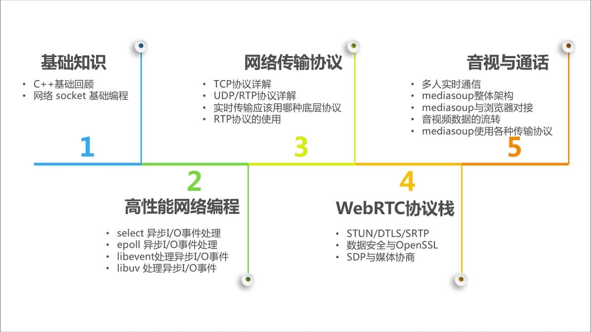
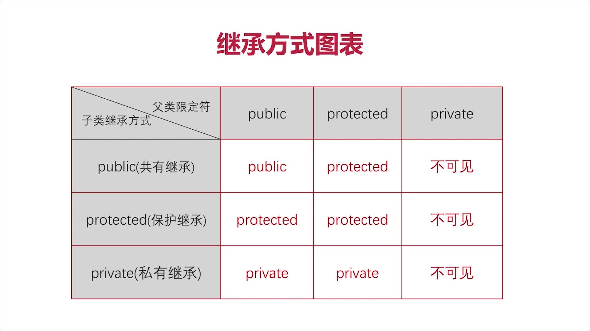
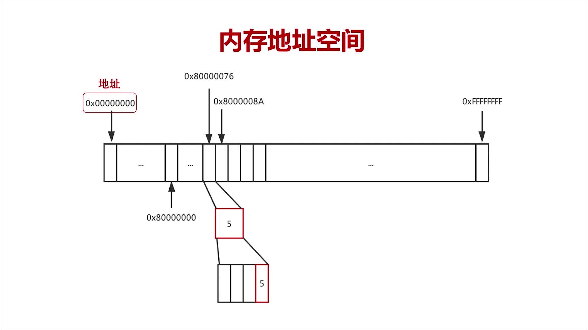
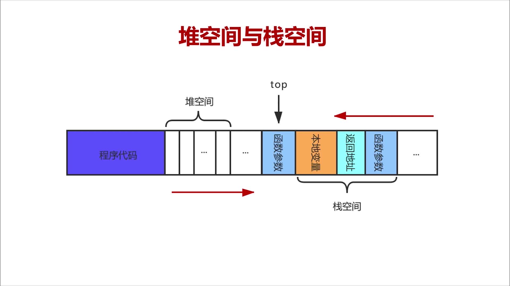
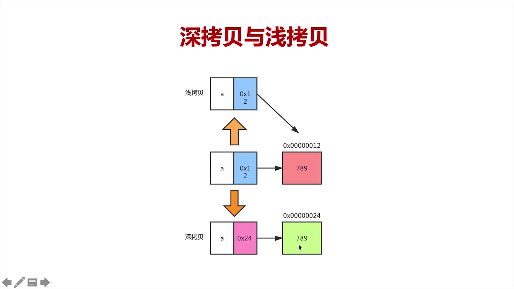
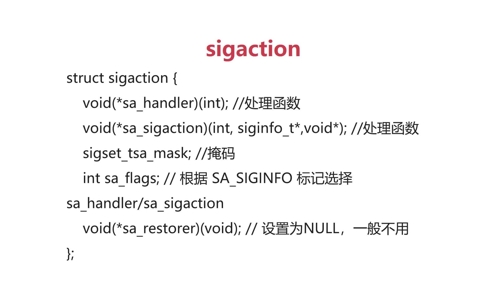
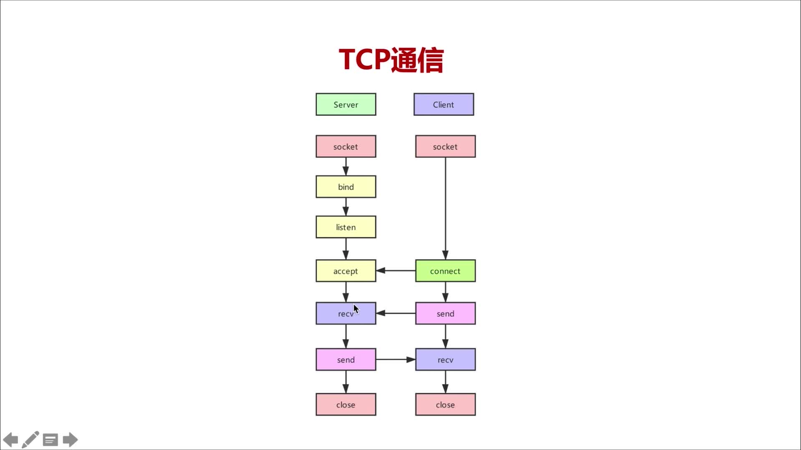
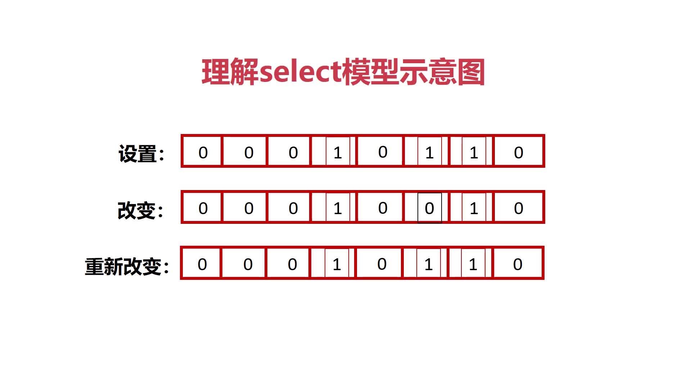
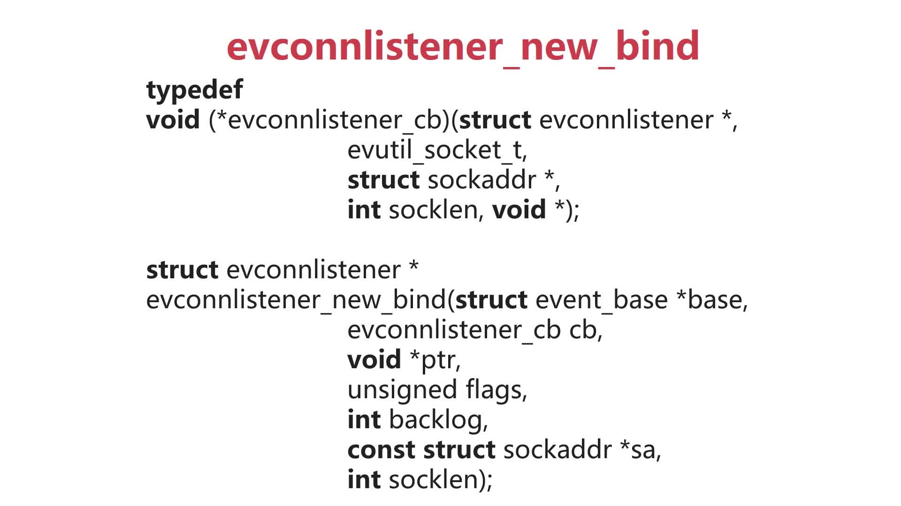

## WebRTC 流媒体服务器

百万级高并发WebRTC流媒体服务器设计与开发

<!-- more -->

## 1. 导学





## 2. C++ 知识回顾

```shell
# macos 下编译 c++
$ clang++ -std=c++11 -g -o hello helloworld.cpp
```

### 2.1 类的定义和实现

**C++基础**

- 类
- 继承
- 多态

**类**

- 构造函数
- 析构函数
- 成员变量
- 成员函数


### 2.2 类的使用


### 2.3 命名空间

命名空间格式：

```c++
namespace avdance
{
    ...
}
```

例子：

<details><summary>Human.h</summary>

```c++
#ifndef __HUMAN_H__
#define __HUMAN_H__
#include <iostream>

namespace avdance {
    
class Human {
public:
    Human(){
        std::cout << "construct human..." << std::endl;
        age = 0;
        sex = 0;
    };

    ~Human(){
        std::cout << "destruct human..."  << std::endl;
    }
public:
    void setAge(int a);
    int getAge();

    void setSex(int s);
    int getSex(); 
private:
    int age; //
    int sex; // 0:male 1:fmale
};
    
} // namespace avdance

#endif // __HUMAN_H__
```

</details>

<details><summary>Human.cpp</summary>


```c++
// Human.cpp
#include <iostream>
#include "Human.h"

namespace avdance {
    
void Human::setAge(int a){
    age = a;
}

int Human::getAge(){
    return age;
}

void Human::setSex(int s){
    sex = s;
}

int Human::getSex(){
    return sex;
}
    
} // namespace avdance
```

</details>

<details><summary>class.cpp</summary>


```c++
// class.cpp
/**
 * for testing class and use it
 * 
 * @author xxx
 * @date 2019-08-10
 * @copyleft GPL 2.0
 */
#include <iostream>
#include "Human.h"

using namespace avdance;

int main(int argc, char* argv[])
{
#if 0
	Human human; 
    human.setAge(28);
    human.setSex(1);

    std::cout << "human:" << human.getAge() << ", " << human.getSex() << std::endl;
#endif
    
    Human* human = new Human(); 
    // avdance::Human* human = new avdance::Human(); 
    human->setAge(28);
    human->setSex(1);

    std::cout << "human:" << human->getAge() << ", " << human->getSex() << std::endl;
}
```

</details>


```shell
$ clang++ -std=c++11 -g -o class Human.cpp class.cpp
```

### 2.4 继承





### 2.5 多态


析构函数一般都是多态的

### 2.6 内存地址空间与指针




### 2.7 堆空间与栈空间



内存的申请与释放：

- new
- delete/delete[]

### 2.8 深拷贝与浅拷贝



## 3. 服务器基础编程

### 3.1 Linux系统下的信号

<details><summary>server.h</summary>

```c++
/**
 * Server Class 
 *
 * @author 
 * @date 2019-08-07
 * @copyleft GPL 2.0
 */

#ifndef __SERVER_H__
#define __SERVER_H__

namespace avdance {

class Server {
public:
    Server();  //consrtuct
    ~Server(); //destruct
public:
    void run();
};

} //namespace avdance

#endif //__SERVER_H__
```

</details>

<details><summary>server.cpp</summary>

```c++
/**
 * the implement of Server Class 
 *
 * @author 
 * @date 2019-08-07
 * @copyleft GPL 2.0
 */

#include <iostream>
#include <unistd.h>

#include "server.h"

namespace avdance {

Server::Server(){
  std::cout << "Server construct..." << std::endl;
}

Server::~Server(){
  std::cout << "Server destruct..." << std::endl;
}

void Server::run(){
  while(1){  
    std::cout << "the server is runing..." << std::endl;
    ::usleep(1000000); //us sleep 1 second 
  }
}

} // namesapce avdance
```

</details>

<details><summary>main.cpp</summary>

```c++
/**
 * a server
 *
 * @author lichao
 * @date 2019-08-07
 * @copyleft GPL 2.0
 * g++ -std=c++11 -g -o server main.cpp server.cpp
 */

#include <iostream>
#include "server.h"

int main(int argc, char* argv[])
{
  avdance::Server* server = new avdance::Server();

  if(server){
    server->run();
  }

  return 0;
}
```

</details>

信号：

- 什么是信号
- 信号的处理方式：忽略、捕获、默认处理
- 都有哪些信号：man 7 signal

安装man中文手册：

- 安装依赖库和工具
- 下载、编译、安装man中文手册
- 修改配置文件
- 解决乱码问题

```shell
# Ubuntu 下查看中文man手册方法：
# 1. 打开终端，输入以下命令安装中文 man 手册
$ sudo apt-get install manpages-zh
# 2. 查看 man 手册安装到哪里
$ dpkg -L manpages-zh | less
# 查看到安装在 /usr/share/man/zh_CN
# 3. 设一个中文man别名
# 修改 ~/.bashrc 添加一个alias :
$ alias cman='man -M /usr/share/man/zh_CN'
# 4. 重启一个终端就可以用cman查看中文man手册了，当然查英文手册还是用man。
```

> [Mac 10.13 安装中文版 man 命令](https://blog.csdn.net/FungLeo/article/details/78522691)
>
> [[转]Mac 配置中文man手册](https://www.jianshu.com/p/307216b119c7)

### 3.2 几个重要的信号

- `SIGPIPE` 管道终止，当写入无人读取的管道时产生该信号，默认终止进程
- `SIGCHLD` 子进程结束或停止时发送
- `SIGALRM` 定时器信号，以秒为单位，默认终止进程
- `SIGUSR1/SIGUSR2` 自定义，默认终止进程
- `SIGINT` 键盘输入的退出信号
- `SIGQUIT` 键盘输入的退出信号
- `SIGHUP` 控制终端的挂起信号

**SIGPIPE：**

- 网络程序必须要处理 `SIGPIPE` 信号，否则当客户端退出后，服务器仍然向改 SOCKET 发送数据时，则会引起 Crash

**SIGCHLD：**

- 僵尸进程是一个早已死亡的进程，但在进程表中仍占有位置
- Linux 中当子进程结束的时候，他并没有完全销毁，因为父进程还要用它的信息
- 父进程没有处理 `SIGCHLD` 信号 或 调用 `wait/waitpid()` 等待子进程结束，就会出现僵尸进程

### 3.3 信号的发送与处理

发送信号：

- 硬件方式
  - 如 `ctrl + c`、`ctrl + \` 等
- 软件方式
  - `kill pid`


### 3.4 通过 sigaction 安装信号



<details><summary>testsig.cpp</summary>

```c++
#include <iostream>

#include <unistd.h>
#include <signal.h>

void sighandle(int sig) {
    std::cout << "sighup received :" 
              << sig
              << std::endl;
}
int main(int argc,char **argv)
{
    signal(SIGHUP, sighandle);
    signal(SIGINT, sighandle);
    signal(SIGQUIT, sighandle);
    pause();
    return 0;
}
```

</details>

<details><summary>server.h</summary>

```c++
#include <iostream>

#include <unistd.h>
#include <signal.h>

void sighandler(int sig){
  std::cout << "received signal: "
            << sig
            << std::endl;
}

int main(int argc, char *argv[])
{
  struct sigaction act, oact;

  act.sa_handler = sighandler;
  sigfillset(&act.sa_mask);
  act.sa_flags = 0;

  sigaction(SIGINT, &act, &oact);
  pause();

  return 0;
}
```

</details>

### 3.5 以 fork 的方式创建后台进程

后台进程：

- `fork` 方式
- 调用系统的 `daemon API`

Fork 方式：

- `fork` 一个子进程，父进程退出，子进程成为孤儿进程，被 `init` 进程接管
- 调用 setsid 建立新的进程会话
- 将当前工作目录切换到根目录
- 将标注输入、输出、出错重定向到 `/dev/null`

<details><summary>daemon.cpp</summary>

```c++
#include <stdio.h>
#include <syslog.h>
#include <fcntl.h>
#include <unistd.h>
#include <stdlib.h>
#include <sys/resource.h>

/**
 * 注释1：因为我们从shell创建的daemon子进程，所以daemon子进程会继承shell的umask，如果不清除的话，会导致daemon进程创建文件时屏蔽某些权限。
 * 注释2：fork后让父进程退出，子进程获得新的pid，肯定不为进程组组长，这是setsid前提。
 * 注释3：调用setsid来创建新的进程会话。这使得daemon进程成为会话首进程，脱离和terminal的关联。
 * 注释4：最好在这里再次fork。这样使得daemon进程不再是会话首进程，那么永远没有机会获得控制终端。如果这里不fork的话，会话首进程依然可能打开控制终端。
 * 注释5：将当前工作目录切换到根目录。父进程继承过来的当前目录可能mount在一个文件系统上，如果不切换到根目录，那么这个文件系统不允许unmount。
 * 注释6：在子进程中关闭从父进程中继承过来的那些不需要的文件描述符。可以通过_SC_OPEN_MAX来判断最高文件描述符(不是很必须).
 * 注释7：打开/dev/null复制到0,1,2，因为dameon进程已经和terminal脱离了，所以需要重新定向标准输入，标准输出和标准错误(不是很必须).
 */
void daemonize(const char *cmd){
  int i, fd0, fd1, fd2;
  pid_t pid;
  //struct rlimit rl;
  //struct sigaction sa;

  /* * Clear file creation mask. */
  //umask(0);//注释1

  /* * Get maximum number of file descriptors. */
  //if (getrlimit(RLIMIT_NOFILE, &rl) < 0)
  //  err_quit("%s: can't get file limit", cmd);

  /* * Become a session leader to lose controlling TTY. */
  if ((pid = fork()) < 0) {//注释2
    printf("%s: can't fork", cmd);
    exit(-1);
  }
  else if (pid != 0) /* parent */
    exit(0);

  setsid();//注释3

  /* * Ensure future opens won't allocate controlling TTYs. */
  /*
  sa.sa_handler = SIG_IGN;
  sigemptyset(&sa.sa_mask);
  sa.sa_flags = 0;

  if (sigaction(SIGHUP, &sa, NULL) < 0)
    err_quit("%s: can't ignore SIGHUP", cmd);
  if ((pid = fork()) < 0)//注释4
    err_quit("%s: can't fork", cmd);
  */
  /*else if (pid != 0) *//* parent */
  /*
    exit(0);
  */

  /* * Change the current working directory to the root so * we won't prevent file systems from being unmounted. */
  if (chdir("/") < 0) {//注释5
    printf("%s: can't change directory to /", cmd);
    exit(-1);
  }

  /* * Close all open file descriptors. */
  /*
  if (rl.rlim_max == RLIM_INFINITY)
    rl.rlim_max = 1024;

  for (i = 0; i < rl.rlim_max; i++)
    close(i);//注释6
  */

  /* * Attach file descriptors 0, 1, and 2 to /dev/null. */
  fd0 = open("/dev/null", O_RDWR);//注释7
  //fd1 = dup(0);//注释7
  //fd2 = dup(0);//注释7
  dup2(fd0, STDIN_FILENO);
  dup2(fd0, STDOUT_FILENO);
  dup2(fd0, STDERR_FILENO);

  /* * Initialize the log file. */
  /*
  openlog(cmd, LOG_CONS, LOG_DAEMON);
  if (fd0 != 0 || fd1 != 1 || fd2 != 2) {
    syslog(LOG_ERR, "unexpected file descriptors %d %d %d",fd0, fd1, fd2);
    exit(1);
  }
  */
}

int main(int argc, char* argv[])
{
  daemonize("test");

  while(1)  {
    sleep(60);
  }
  return 0;
}
```

</details>

<details><summary>daemon_api.cpp</summary>

```c++
#include <unistd.h>
#include <stdlib.h>

int main(void)
{
    if(daemon(0,0) == -1)
        exit(EXIT_FAILURE);
    
    while(1) {
        sleep(60);
    }
    return 0;
}
```

</details>

## 4. 进程间通信方式

- 管道( pipe )：管道是一种半双工的通信方式，数据只能单向流动，而且只能在具有亲缘关系的进程间使用。进程的亲缘关系通常是指父子进程关系。

- 信号量( semophore ) ： 信号量是一个计数器，可以用来控制多个进程对共享资源的访问。它常作为一种锁机制，防止某进程正在访问共享资源时，其他进程也访问该资源。因此，主要作为进程间以及同一进程内不同线程之间的同步手段。

- 消息队列( message queue ) ： 消息队列是由消息的链表，存放在内核中并由消息队列标识符标识。消息队列克服了信号传递信息少、管道只能承载无格式字节流以及缓冲区大小受限等缺点。

- 共享内存( shared memory ) ：共享内存就是映射一段能被其他进程所访问的内存，这段共享内存由一个进程创建，但多个进程都可以访问。共享内存是最快的 IPC 方式，它是针对其他进程间通信方式运行效率低而专门设计的。它往往与其他通信机制，如信号两，配合使用，来实现进程间的同步和通信。

- 套接字( socket ) ： 套解口也是一种进程间通信机制，与其他通信机制不同的是，它可用于不同及其间的进程通信。 

### 4.1 线程间通信方式

\#全局变量；

\#Messages消息机制；

\#CEvent对象（MFC中的一种线程通信对象，通过其触发状态的改变实现同步与通信）。

## 5. 网络编程基础

### 5.1 TCPSerever 实现原理

**TCP Server 网络编程基本步骤：**

- 创建 socket，指定使用 TCP 协议
- 将 socket 与 地址和端口绑定
- 侦听端口
- 创建新的 socket
- 使用 recv 接收数据
- 使用 send 发送数据
- 使用 close 关闭连接

**TCP 常见套接字选项：**

- SO_REUSEADDR 端口处于 WAIT_TIME 仍然可以启动
- SO_RCVBUG -- 一般设置为4M或者8M
- SO_SNDBUF



<details><summary>重要结构体</summary>

```c++
struct sockaddr_in
{
    sa_family_t		sin_family;
    uint16_t		sin_port;
    struct in_addr	sin_addr;
    char			sin_zero[8];
}

struct in_addr
{
    in_addr_t		s_addr;
}

struct sockaddr
{
    sa_family_t		sin_family;
    char 			sin_zero[14];
}
```

</details>

<details><summary>tcp_server.c</summary>

```c++
#include <stdio.h>
#include <unistd.h>
#include <stdlib.h>
#include <string.h>
#include <sys/socket.h>
#include <netinet/in.h>

#define PORT 8444
#define MESSAGE_SIZE 1024

int main(){
    int ret = -1;
    int socket_fd = -1;
    int accept_fd = -1;

    int curpos = 0;
    int backlog = 10;
    int flag = 1;

    char in_buf[MESSAGE_SIZE] = {0,};
    struct sockaddr_in local_addr, remote_addr;

    //create a tcp socket
    socket_fd = socket(AF_INET, SOCK_STREAM, 0);
    if ( socket_fd == -1 ){
        perror("create socket error");
        exit(1);
    }

    //set option of socket
    ret = setsockopt(socket_fd, SOL_SOCKET, SO_REUSEADDR, &flag, sizeof(flag));
    if ( ret == -1 ){
        perror("setsockopt error");
    }

    //set local address
    local_addr.sin_family = AF_INET;
    local_addr.sin_port = htons(PORT);
    local_addr.sin_addr.s_addr = INADDR_ANY;
    bzero(&(local_addr.sin_zero), 8);

    //bind socket
    ret = bind(socket_fd, (struct sockaddr *)&local_addr, sizeof(struct sockaddr_in));
    if(ret == -1 ) {
        perror("bind error");
        exit(1);
    }

    ret = listen(socket_fd, backlog);
    if ( ret == -1 ){
        perror("listen error");
        exit(1);
    }

    //loop
    for(;;){
        int addr_len = sizeof( struct sockaddr_in );
        //accept an new connection
        accept_fd = accept( socket_fd, (struct sockaddr *)&remote_addr, &addr_len );
        for(;;){
            memset(in_buf, 0, MESSAGE_SIZE);

            //receive network data and print it
            ret = recv( accept_fd ,(void*)in_buf ,MESSAGE_SIZE ,0 );
            if(ret == 0 ){
                break; 
            } 
            printf( "receive message:%s\n", in_buf );
            send(accept_fd, (void*)in_buf, MESSAGE_SIZE, 0); 
        }
        printf("close client connection...\n");
        close(accept_fd);
    }

    printf("quit server...\n");
    close(socket_fd);

    return 0;
}
```

</details>

### 5.2 TCPClient实现

TCP Client 网络编程基本步骤：

- 创建 socket，指定使用TCP协议
- 使用 connect 连接服务器
- 使用 recv/send 接收/发送 数据
- 关闭 socket

<details><summary>tcp_client.c</summary>

```c++
#include <stdio.h>
#include <string.h>
#include <stdlib.h>
#include <unistd.h>

#include <fcntl.h>
#include <errno.h>
#include <netdb.h>
#include <sys/stat.h>
#include <sys/types.h>
#include <sys/socket.h>
#include <netinet/in.h>
#include <arpa/inet.h>

#define SERVER_PORT 8111
#define MESSAGE_LENGTH 1024

int main()
{
    int ret = -1;
    int socket_fd;
    
    //server addr
    struct sockaddr_in serverAddr;

    char sendbuf[MESSAGE_LENGTH];
    char recvbuf[MESSAGE_LENGTH];

    int data_len;

    if((socket_fd = socket(AF_INET, SOCK_STREAM, 0)) < 0){
        perror("socket");
        return 1;
    }

    serverAddr.sin_family = AF_INET;
    serverAddr.sin_port = htons(SERVER_PORT);
    //inet_addr()函数，将点分十进制IP转换成网络字节序IP
    serverAddr.sin_addr.s_addr = inet_addr("127.0.0.1");

    if(connect(socket_fd, (struct sockaddr *)&serverAddr, sizeof(serverAddr)) < 0){
        perror("connect");
        return 1;
    }
    printf("success to connect server...\n");

    while(1){
        memset(sendbuf, 0, MESSAGE_LENGTH);
        printf("<<<<send message:");
        gets(sendbuf);
        ret = send(socket_fd, sendbuf, strlen(sendbuf), 0);
        if(ret <= 0 ){
            printf("the connection is disconnection!\n"); 
            break;
        }

        if(strcmp(sendbuf, "quit") == 0){
            break;
        }

        printf(">>> echo message:");
        recvbuf[0] = '\0';
        data_len = recv(socket_fd, recvbuf, MESSAGE_LENGTH, 0);
        recvbuf[data_len] = '\0';
        printf("%s\n", recvbuf);
    }

    close(socket_fd);
    return 0;
}
```

</details>

### 5.3 UDP服务端与客户端实现

UDP Server 网络编程基本步骤：

- 创建 socket，指定使用 UDP 协议
- 将 socket 与 地址和端口绑定
- 使用 recv/send 接收/发送数据
- 使用 close 关闭连接


<details><summary>udp_server.c</summary>

```c++
#include <sys/types.h>
#include <sys/socket.h>
#include <pthread.h>
#include <netinet/in.h>
#include <stdio.h>
#include <string.h>
#include <unistd.h>
#include <stdlib.h>
#include <arpa/inet.h>

int main(int argc, char * *argv)
{
    struct sockaddr_in addr;
    addr.sin_family     = AF_INET;
    addr.sin_port       = htons(9876);
    addr.sin_addr.s_addr = htonl(INADDR_ANY);

    char buff_recv[512] = {0};
    char buff_send[512] = "world";

    struct sockaddr_in clientAddr;
    int n;
    int len = sizeof(clientAddr);

    int sock;   

    printf("Welcome! This is a UDP server.\n");
    if ((sock = socket(AF_INET, SOCK_DGRAM, 0)) < 0) {
        printf("socket error.\n");
        exit(1);
    }

    if (bind(sock, (struct sockaddr *) &addr, sizeof(addr)) < 0) {
        printf("bind error.\n");
        exit(1);
    }

    while (1){
        n = recvfrom(sock, buff_recv, 511, 0, (struct sockaddr *) &clientAddr, &len);
        if (n > 0) {
            buff_recv[n] = 0;
            printf("recv data from client:%s %u says: %s\n", inet_ntoa(clientAddr.sin_addr), ntohs(clientAddr.sin_port), buff_recv);

            n = sendto(sock, buff_send, n, 0, (struct sockaddr *) &clientAddr, sizeof(clientAddr));
            if (n < 0){
                printf("sendto error.\n");
                break;
            }else {
                printf("recv error.\n");
                break;
            }
        }
    }
    return 0;
}
```

</details>

<details><summary>udp_client.c</summary>

```c++
#include <sys/types.h>
#include <sys/socket.h>
#include <pthread.h>
#include <netinet/in.h>
#include <stdio.h>
#include <string.h>
#include <unistd.h>
#include <stdlib.h>

int main(int argc, char * *argv)
{   
    struct sockaddr_in addr;
    int sock;

    addr.sin_family     = AF_INET;
    addr.sin_port       = htons(9876);
    addr.sin_addr.s_addr = inet_addr("111.231.68.13");

    char buff_send[512] = "Hello";
    char buff_recv[512] = {0};
    int len = sizeof(addr);

    int n = 0;

    printf("This is a UDP client\n");
    if ((sock = socket(AF_INET, SOCK_DGRAM, 0)) < 0){
        printf("socket error.\n");
        exit(1);
    }

    if (addr.sin_addr.s_addr == INADDR_NONE){
        printf("Incorrect ip address!");
        close(sock);
        exit(1);
    }

    n = sendto(sock, buff_send, strlen(buff_send), 0, (struct sockaddr *) &addr, sizeof(addr));
    if (n < 0){
        printf("sendto error.\n");
        close(sock);
    }

    n = recvfrom(sock, buff_recv, 512, 0, (struct sockaddr *) &addr, &len);
    if (n > 0){
        buff_recv[n] = 0;
        printf("received from sever:");
        puts(buff_recv);
    }
    else if (n == 0)
        printf("server closed.\n");
    else if (n == -1)
        printf("recvfrom error.\n");

    close(sock);
    return 0;
}
```

</details>

## 6. 异步 I/O 事件处理

### 6.1 通过fork的方式实现高性能网络服务器

高性能网络服务器：

- 通过 fork 实现高性能网络服务器
- 通过 select 实现高性能网络服务器
- 通过 epoll 实现高性能网络服务器
- 利用 I/O 事件处理库来实现高性能网络服务器

以 fork 方式实现高性能网络服务器：

- 每收到一个连接就创建一个子进程
- 父进程负责接收连接
- 通过 fork 创建子进程

<details><summary>fork_tcp_server.c</summary>

```c++
#include <stdio.h>
#include <unistd.h>
#include <stdlib.h>
#include <string.h>
#include <sys/socket.h>
#include <netinet/in.h>

#define PORT 8888
#define MESSAGE_SIZE 1024

int main(){
    int ret = -1;
    int pid;
    int socket_fd = -1;
    int accept_fd = -1;

    int curpos = 0;
    int backlog = 10;
    int flag;

    struct sockaddr_in local_addr, remote_addr;
    
    char in_buf[MESSAGE_SIZE] = {0,};

    //create a tcp socket
    socket_fd = socket(AF_INET, SOCK_STREAM, 0);
    if ( socket_fd == -1 ){
        perror("create socket error");
        exit(1);
    }

    //set option of socket
    ret = setsockopt(socket_fd, SOL_SOCKET, SO_REUSEADDR, (char *)&flag, sizeof(flag));
    if ( ret == -1 ){
        perror("setsockopt error");
    }

    //set local address
    local_addr.sin_family = AF_INET;
    local_addr.sin_port = htons(PORT);
    local_addr.sin_addr.s_addr = INADDR_ANY;
    bzero(&(local_addr.sin_zero), 8);

    //bind socket
    ret = bind(socket_fd, (struct sockaddr *)&local_addr, sizeof(struct sockaddr_in));
    if(ret == -1 ) {
        perror("bind error");
        exit(1);
    }

    ret = listen(socket_fd, backlog);
    if ( ret == -1 ){
        perror("listen error");
        exit(1);
    }

    for(;;){
        int addr_len = sizeof( struct sockaddr_in );
        //accept an new connection
        accept_fd = accept( socket_fd, (struct sockaddr *)&remote_addr, &addr_len );

        //create a sub process
        pid = fork();
        //子进程
        if( pid == 0 ){
            for(;;){
                memset(in_buf, 0, MESSAGE_SIZE);
                ret = recv(accept_fd ,&in_buf, MESSAGE_SIZE, 0);
                if(ret == 0){
                    break; 
                } 

                printf( "receive message:%s\n", in_buf );
                send(accept_fd, (void*)in_buf, MESSAGE_SIZE, 0);
            }

            printf("close client connection...\n");
            close(accept_fd);
        } 
        //parent process
        //sleep(1000);
    }

    if(pid != 0 ){
        printf("quit server...\n");
        close(socket_fd);
    }

    return 0;
}
```

</details>

**fork 方式带来的问题：**

- 资源被长期占用
- 分配子进程花费时间长

### 6.2 通过select实现高性能服务器

**什么是异步 I/O：**

> 所谓异步 I/O，是指以事件触发的机制来对 I/O 操作进行处理。
>
> 与多进程和多线程技术相比，异步 I/O 技术的最大优势是系统开销小，系统不必创建进程/线程，也不必维护这些进程/线程，从而大大减小了系统的开销。

以 select 方式实现高性能网络服务器：

- 遍历文件描述符集中的所有描述符，找出有变化的描述符
- 对于侦听的 socket 和 数据处理的 socket 要区别对待
- socket 必须设置为非阻塞方式工作

**重要 API：**

- `FD_ZERO`、`FD_SET`、`FD_ISSET`
- `flag fcntl(fd, F_SETFL/F_GETFL, flag)`
- `events select(nfds, readfds, writefds, exceptfds, timeout)`

<details><summary>select_tcp_server.c</summary>

```c++
#include <stdio.h>
#include <unistd.h>
#include <stdlib.h>
#include <string.h>
#include <fcntl.h>
#include <sys/socket.h>
#include <netinet/in.h>

#define PORT 8888
#define FD_SIZE 1024
#define MESSAGE_SIZE 1024

int main(){
    int ret = -1;

    int pid;
    int accept_fd = -1;
    int socket_fd = -1;
    int accept_fds[FD_SIZE] = {-1, };

    int curpos = -1;
    int maxpos = 0;
    int backlog = 10;
    int flags = 1; //open REUSEADDR option

    int max_fd = -1;
    fd_set fd_sets;
    int events=0;

    struct sockaddr_in local_addr, remote_addr;

    //create a tcp socket
    socket_fd = socket(AF_INET, SOCK_STREAM, 0);
    if ( socket_fd == -1 ){
        perror("create socket error");
        exit(1);
    }

    //set option of socket
    ret = setsockopt(socket_fd, SOL_SOCKET, SO_REUSEADDR, &flags, sizeof(flags));
    if ( ret == -1 ){
        perror("setsockopt error");
    }

    //NONBLOCK
    flags = fcntl(socket_fd, F_GETFL, 0);
    fcntl(socket_fd, F_SETFL, flags | O_NONBLOCK);

    //set local address
    local_addr.sin_family = AF_INET;
    local_addr.sin_port = htons(PORT);
    local_addr.sin_addr.s_addr = INADDR_ANY;
    bzero(&(local_addr.sin_zero), 8);

    //bind socket
    ret = bind(socket_fd, (struct sockaddr *)&local_addr, sizeof(struct sockaddr_in));
    if(ret == -1 ) {
        perror("bind error");
        exit(1);
    }

    ret = listen(socket_fd, backlog);
    if ( ret == -1 ){
        perror("listen error");
        exit(1);
    }

    max_fd = socket_fd; //每次都重新设置 max_fd
    for(int i=0; i< FD_SIZE; i++){
        accept_fds[i] = -1; 
    }

    for(;;) {
        FD_ZERO(&fd_sets); //清空sets
        FD_SET(socket_fd, &fd_sets); //将socket_fd 添加到sets

        for(int k=0; k < maxpos; k++){
            if(accept_fds[k] != -1){
                if(accept_fds[k] > max_fd){
                    max_fd = accept_fds[k]; 
                }
                printf("fd:%d, k:%d, max_fd:%d\n", accept_fds[k], k, max_fd);
                FD_SET(accept_fds[k], &fd_sets); //继续向sets添加fd
            }
        }

        //遍历所有的fd
        events = select( max_fd + 1, &fd_sets, NULL, NULL, NULL );
        if(events < 0) {
            perror("select");
            break;
        }else if(events == 0){
            printf("select time out ......");
            continue;
        }else if( events ){
            printf("events:%d\n", events);
            if( FD_ISSET(socket_fd, &fd_sets)){ // 如果来的是新连接
                printf("listen event :1\n");
                for( int a=0; a < FD_SIZE; a++){
                    if(accept_fds[a] == -1){
                        curpos = a;
                        break;
                    }
                }

                if(a == FD_SIZE){
                    printf("the connection is full!\n");
                    continue;
                }

                int addr_len = sizeof( struct sockaddr_in );
                accept_fd = accept(socket_fd, (struct sockaddr *)&remote_addr, &addr_len); //创建一个新连接的fd

                int flags = fcntl(accept_fd, F_GETFL, 0); //取出新连接的 fd 的相关选项
                fcntl(accept_fd, F_SETFL, flags | O_NONBLOCK); //设置为非阻塞

                accept_fds[curpos] = accept_fd;

                if(curpos+1 > maxpos){
                    maxpos = curpos + 1; 
                }

                if(accept_fd > max_fd){
                    max_fd = accept_fd; 
                }
                printf("new connection fd:%d, curpos = %d \n",accept_fd, curpos);
            }

            for(int j=0; j < maxpos; j++ ){
                if( (accept_fds[j] != -1) && FD_ISSET(accept_fds[j], &fd_sets)){ //有事件时
                    printf("accept event :%d, accept_fd: %d\n",j, accept_fds[j]);
                    char in_buf[MESSAGE_SIZE];
                    memset(in_buf, 0, MESSAGE_SIZE);
                    int ret = recv(accept_fds[j], &in_buf, MESSAGE_SIZE, 0);
                    if(ret == 0){
                        close(accept_fds[j]);
                        accept_fds[j] = -1;
                    } 

                    printf( "receive message:%s\n", in_buf );
                    send(accept_fds[j], (void*)in_buf, MESSAGE_SIZE, 0);
                }
            }
        }
    }

    printf("quit server...\n");
    close(socket_fd);
    return 0;
}
```

</details>

设置 select 超时时间（一般情况想设置成500毫秒）：

```c++
struct timeval {
    long tv_sec; /*秒*/
    long tv_usec; /*微妙*/
}
```

select 函数输入参数的意义：

- 我们关心的文件描述符
- 对每个文件描述符我们关心的状态（读，写，异常）
- 我们要等待的时间（永远（`NULL`），一段时间（`timeval`），不等待（`0`））

从 select 函数得到的信息：

- 已经做好准备的文件描述符的个数
- 对于读、写、异常，那些文件描述符准备好了

理解 select 模型：

- 理解 select 模型的关键在于理解 `fd_set` 类型
- `fd_set` 就是多个整型字的集合，每个 bit 代表一个文件描述符
- `FD_ZERO` 表示将说有的位置 0 
- `FD_SET` 是将 `fd_set` 中的某一位置 1
- select 函数执行后，系统会修改 `fd_set` 中的内容
- select 函数执行后，应用层要重新设置 `fd_set` 中的内容



## 7. epoll实现高性能服务器

### 7.1 epoll基本知识

使用 Epoll 的好处：

- 没有文件描述符的限制
- 工作效率不会随着文件描述符的增加而下降
- Epoll 经过系统优化更高效

Epoll 事件的触发模式（默认是水平触发模式）：

- `Level Trigger` （水平触发）没有处理反复发送
- `Edge Trigger` （边缘触发）只发送一次

Epoll 重要的 API ：

- `int epoll_create()` 参数无意义，可忽略
- `int epoll_ctl(epfd, op, fd, struct epoll_event *event)`
- `int epoll_wait(epfd, events, maxevents, timeout)`

Epoll 的事件：

- `EPOLLET`  -- 可以设置边缘触发模式
- `EPOLLIN`
- `EPOLLOUT`
- `EPOLLPRI`  -- 出现中断的时候
- `EPOLLERR`
- `EPOLLHUB` -- 程序挂起的时候出现

`epoll_ctl` 相关操作：

- `EPOLL_CTL_ADD` 
- `EPOLL_CTL_MOD`  -- 修改
- `EPOLL_CTL_DEL`

Epoll 重要的结构体：

```c++
typedef union epoll_data {
    void		*ptr;
    int 		fd;
    uint32_t	u32;
    uint64_t	u64;
} epoll_data_t;

struct epoll_event {
    uint32_t 	events;  /*Epoll events*/
    epoll_data_t data;  /*User data variable*/
}
```

<details><summary>epoll_tcp_server.c</summary>

```c++
#include <stdio.h>
#include <unistd.h>
#include <stdlib.h>
#include <string.h>
#include <fcntl.h>
#include <errno.h>

#include <sys/epoll.h>
#include <sys/types.h>
#include <sys/socket.h>
#include <netinet/in.h>

#define PORT 8888

#define FD_SIZE 20
#define MAX_EVENTS 20
#define TIME_OUT 500

#define MESSAGE_SIZE 1024

int main(){
    int ret = -1;

    int socket_fd = -1;
    int accept_fd = -1;

    int flags = 1;
    int backlog = 10;

    struct sockaddr_in local_addr, remote_addr;

    struct epoll_event ev, events[FD_SIZE];
    int epoll_fd = -1; 
    int event_number = 0;

    //creat a tcp socket
    socket_fd = socket(AF_INET, SOCK_STREAM, 0);
    if ( socket_fd  == -1 ){
        perror("create socket error");
        exit(1);
    }

    //set REUSERADDR
    ret = setsockopt(socket_fd, SOL_SOCKET, SO_REUSEADDR, (char *)&flags, sizeof(flags)); 
    if ( ret == -1 ){
        perror("setsockopt error");
    }

    //set NONBLOCK
    flags = fcntl(socket_fd, F_GETFL, 0);
    fcntl(socket_fd, F_SETFL, flags|O_NONBLOCK);

    //set address
    local_addr.sin_family = AF_INET;
    local_addr.sin_port = htons(PORT);
    local_addr.sin_addr.s_addr = INADDR_ANY;
    bzero(&(local_addr.sin_zero),8);

    //bind addr
    ret = bind(socket_fd, (struct sockaddr *)&local_addr, sizeof(struct sockaddr_in));
    if( ret == -1 ) {
        perror("bind error");
        exit(1);
    }

    if (listen(socket_fd, backlog) == -1 ){
        perror("listen error");
        exit(1);
    }

    //create epoll
    epoll_fd = epoll_create(256);//the size argument is ignored
    ev.data.fd=socket_fd;
    ev.events=EPOLLIN;
    epoll_ctl(epoll_fd, EPOLL_CTL_ADD, socket_fd, &ev); //将socket_fd 添加到epoll中
    for(;;){
        //events 表示一共有多少事件被侦听
        //MAX_EVENTS 表示在 events 个事件中，本次调用最多能返回多少个被触发的事件
        //TIME_OUT 表示本次调用最多等多长时间
        //event_number 表示本次调用真正有多少事件被解发
        event_number = epoll_wait(epoll_fd, events, MAX_EVENTS, TIME_OUT);
        for(int i=0; i < event_number; i++){
            if(events[i].data.fd == socket_fd){ // 如果是侦听端口的事件
                printf("listen event... \n");
                int addr_len = sizeof( struct sockaddr_in );
                accept_fd = accept(socket_fd, (struct sockaddr *)&remote_addr, &addr_len);

                //将新创建的socket设置为 NONBLOCK 模式
                flags = fcntl(accept_fd, F_GETFL, 0);
                fcntl(accept_fd, F_SETFL, flags|O_NONBLOCK);

                ev.data.fd=accept_fd;
                ev.events=EPOLLIN | EPOLLET;
                epoll_ctl(epoll_fd, EPOLL_CTL_ADD, accept_fd, &ev);

                printf("new accept fd:%d\n",accept_fd);
            } else if(events[i].events & EPOLLIN){
                //printf("accept event :%d\n",i);
                char in_buf[MESSAGE_SIZE];
                
                memset(in_buf, 0, MESSAGE_SIZE);

                //receive data
                ret = recv( events[i].data.fd, &in_buf, MESSAGE_SIZE, 0 );
                if(ret == MESSAGE_SIZE ){
                    printf("maybe have data....");
                }

                if(ret <= 0){
                    switch (errno){
                        case EAGAIN: //说明暂时已经没有数据了，要等通知
                            break;
                        case EINTR: //被终断了，再来一次
                            printf("recv EINTR... \n");
                            ret = recv(events[i].data.fd, &in_buf, MESSAGE_SIZE, 0);
                            break;
                        default:
                            printf("the client is closed, fd:%d\n", events[i].data.fd);
                            epoll_ctl(epoll_fd, EPOLL_CTL_DEL, events[i].data.fd, &ev); 
                            close(events[i].data.fd);
                    }
                }

                printf(">>>receive message:%s\n", in_buf);
                send(events[i].data.fd, &in_buf, ret, 0);
            }
        }
    }
    return 0;
}
```

</details>

### 7.2 epoll+fork实现高性能网络服务器

<details><summary>epoll_fork_tcp_server.c</summary>

```c++
#include <stdio.h>
#include <unistd.h>
#include <stdlib.h>
#include <string.h>
#include <fcntl.h>
#include <errno.h>

#include <sys/epoll.h>
#include <sys/types.h>
#include <sys/wait.h>
#include <sys/socket.h>
#include <netinet/in.h>

#define PORT 8111

#define FD_SIZE 20
#define MAX_EVENTS 20
#define TIME_OUT 500

#define MESSAGE_SIZE 1024
#define NB_PROCESS 4

int main(){
    int ret = -1;

    int socket_fd = -1;
    int accept_fd = -1;

    int flags = 1;
    int backlog = 10;

    struct sockaddr_in local_addr,remote_addr;

    struct epoll_event ev, events[FD_SIZE];
    int epoll_fd = -1; 
    int event_number = 0;

    int pid;
    int status;
    int max_subprocess = NB_PROCESS;

    //creat a tcp socket
    socket_fd = socket(AF_INET, SOCK_STREAM, 0);
    if ( socket_fd  == -1 ){
        perror("create socket error");
        exit(1);
    }

    //set REUSERADDR
    ret = setsockopt(socket_fd, SOL_SOCKET, SO_REUSEADDR, (char *)&flags, sizeof(flags)); 
    if ( ret == -1 ){
        perror("setsockopt error");
    }

    //set NONBLOCK
    flags = fcntl(socket_fd, F_GETFL, 0);
    fcntl(socket_fd, F_SETFL, flags|O_NONBLOCK);

    //set address
    local_addr.sin_family = AF_INET;
    local_addr.sin_port = htons(PORT);
    local_addr.sin_addr.s_addr = INADDR_ANY;
    bzero(&(local_addr.sin_zero),8);

    //bind addr
    ret = bind(socket_fd, (struct sockaddr *)&local_addr, sizeof(struct sockaddr_in));
    if( ret == -1 ) {
        perror("bind error");
        exit(1);
    }

    if (listen(socket_fd, backlog) == -1 ){
        perror("listen error");
        exit(1);
    }

    //fork some subprocess
    for(int a=0; a < max_subprocess; a++){
        if(pid !=0){
            pid = fork(); 
        }
    }

    //child process
    if(pid == 0) {
        printf("create an new child process...");
        //create epoll
        epoll_fd = epoll_create(256);//the size argument is ignored
        ev.data.fd=socket_fd; // 多个子进程使用一个监听 fd 会有一些问题
        ev.events=EPOLLIN;
        epoll_ctl(epoll_fd, EPOLL_CTL_ADD, socket_fd, &ev); //将socket_fd 添加到epoll中
        for(;;){
            //events 表示一共有多少事件被侦听
            //MAX_EVENTS 表示在events个事件中，本次调用最多能返回多少个被解发的事件
            //TIME_OUT 表示本次调用最多等多长时间
            //event_number 表示本次调用真正有多少事件被解发
            event_number = epoll_wait(epoll_fd, events, MAX_EVENTS, TIME_OUT);
            for(int i=0; i < event_number; i++){
                if(events[i].data.fd == socket_fd){ // 如果是侦听端口的事件
                    printf("listen event... \n");

                    int addr_len = sizeof( struct sockaddr_in );
                    accept_fd = accept(socket_fd, (struct sockaddr *)&remote_addr, &addr_len);

                    //将新创建的socket设置为 NONBLOCK 模式
                    flags = fcntl(accept_fd, F_GETFL, 0);
                    fcntl(accept_fd, F_SETFL, flags|O_NONBLOCK);

                    ev.data.fd=accept_fd;
                    ev.events=EPOLLIN | EPOLLET;
                    epoll_ctl(epoll_fd, EPOLL_CTL_ADD, accept_fd, &ev);

                    printf("new accept fd:%d\n",accept_fd);
                } else if(events[i].events & EPOLLIN){
                    //printf("accept event :%d\n",i);
                    char in_buf[MESSAGE_SIZE];
                    memset(in_buf, 0, MESSAGE_SIZE);

                    //receive data
                    ret = recv( events[i].data.fd, &in_buf, MESSAGE_SIZE, 0 );
                    if(ret == MESSAGE_SIZE ){
                        printf("maybe have data....");
                    }

                    if(ret <= 0){
                        switch (errno){
                            case EAGAIN:
                                ret = recv(events[i].data.fd, &in_buf, MESSAGE_SIZE, 0);
                                break;
                            case EINTR:
                                printf("recv EINTR... \n");
                                break;
                            default:
                                printf("the client is closed, fd:%d\n", events[i].data.fd);
                                epoll_ctl(epoll_fd, EPOLL_CTL_DEL, events[i].data.fd, &ev); 
                                close(events[i].data.fd);
                                ;
                        }
                    }
                    printf(">>>receive message:%s\n", in_buf);
                    send(events[i].data.fd, &in_buf, ret, 0);
                }
            }
        }

    }else {// pid != 0
        //wait child process to quit 
        wait(&status);
        #if 0
        do {
            pid = waitpid(-1, NULL, 0);  // -1 表示所有等待所有子进程退出
        } while(pid != -1);
        #endif
    }
    return 0;
}
```

</details>

**epoll + fork 异步事件的惊群现象：**

- 解决方法：
  - 将侦听的套接字只放在一个进程里边处理，这个进程专门处理连接或者其他一些事务。缺点：大并发连接的时候负担比较大
  - 还是负载，分担出去，在某一个时刻只有一个epoll来管理侦听
  - 加锁

## 8. libevent实现高性能网络服务器

### 8.1 比较有名的异步 IO 处理库的介绍

比较有名的异步事件处理库：

- `libevent` -- 跨平台
- `libevthp` -- 底层使用的是libevent，处理http比较高效
- `libuv`  -- nodejs 底层使用的库
- `libev` -- 只支持linux

libevent 重要的函数：

- `event_base_new`
- `event_base_dispatch`  -- 事件处理
- `event_new`
- `event_add`
- `event_del`
- `event_free`



libevent编译与安装：

- [libevent](http://libevent.org)
- `wget -c addr --no-check-certificate`
- `./configure --prefix=/usr/local/libevent`
- `make && sudo make install`

bufferevent 的作用：

- 从外面看它就是一个缓冲区，可以与socket绑定
- 内部由输入和输出缓冲区组成
- 每一个socket对应一个 bufferevent
- 当socket有事件触发时，可以设置回调函数

<details><summary>libevent_tcp_server.cpp</summary>

```c++
#include <iostream>

#include <event2/listener.h>
#include <event2/bufferevent.h>
#include <event2/buffer.h>

#include <arpa/inet.h>

#define PORT 8111

void on_read_cb(struct bufferevent *bev, void* ctx)
{
    struct evbuffer *input = NULL;
    struct evbuffer *output = NULL;
    
    input = bufferevent_get_input(bev);
    output = bufferevent_get_output(bev);
    evbuffer_add_buffer(output, input);  // 将input数据拷贝到output
}

void on_accept_cb(struct evconnlistener *listener,
                  evutil_socket_t fd,
                  struct sockaddr *addr,
                  int socklen,
                  void* ctx)
{
    struct event_base *base = NULL;
    struct bufferevent *bev = NULL;
    
    base = evconnlistener_get_base(listener);
    bev = bufferevent_socket_new(base, fd, 0);
    bufferevent_enable(bev, EV_READ | EV_WRITE);
    bufferevent_setcb(bev, on_read_cb, NULL, NULL, NULL);
}

int main(int argc, char* argv[])
{
    struct sockaddr_in serveraddr;
    struct event_base *base = NULL;
    struct evconnlistener *listener = NULL;
    
    base = event_base_new();
    
    serveraddr.sin_family = AF_INET;
    serveraddr.sin_port = htons(PORT);
    serveraddr.sin_addr.s_addr = INADDR_ANY;
    
    listener = evconnlistener_new_bind(base, 
                            		   on_accept_cb,
                                       NULL,
                                       LEV_OPT_REUSEABLE,
                                       10,
                                       (struct sockaddr*)&serveraddr,
                                       sizeof(serveraddr));
    event_base_dispath(base);
    
    return 0;
}
```

</details>

```shell
# 编译完设置 libevent 环境变量
$ vi ~/.bashrc
unset PKG_CONFIG_LIB
export PKG_CONFIG_PATH=/usr/local/libevent/lib/pkgconfig:$PKG_CONFIG_PATH
export LD_LIBRARY_PATH=/usr/local/libevent/lib:$LD_LIBRARY_PATH
# 查看库路径、头文件路径，以及要引用的库名字
$ pkg-config --libs --cflags libevent
-I/usr/local/libevent/include -L/usr/local/libevent/lib -levent
$ evn | grep LD
LD_LIBRARY_PATH=/usr/local/libevent/lib:
$ g++ -g -o libevent_tcp_server libevent_tcp_server.cpp `pkg-config --libs --cflags libevent`
$ netstat -ntpl | grep 8111
```

### 8.2 libevent实现对UDP的处理


### 8.3 libuv实现对UDP的处理

